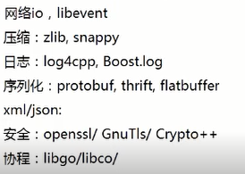

# Effective C++

## 条款02 尽量以const、enum、inline替换#define

- 对于纯常量，最好以`const`对象或`enums`替换`#define`
- 对于形似函数的宏`macros`，最好改用`inline`函数替换`#define`

该条款也可以说是“宁可以编译器替换预处理器”。

### const常量

```c++
#define ASPECT_RATIO 1.653
```

`#define`只是提供一个别名，如果运用此常量但编译出现错误，错误信息可能提到的是1.653而不是`ASPECT_RATIO`.如果`ASPECT_RATIO`定义位置不清晰，需要花费额外时间追踪它。

一个更优的方法是以一个常量替换上述宏：

```C++
const double AspectRatio = 1.653; //大写名称通常用于宏
```

另外使用常量可能比使用`#define`导致较小的代码量，因为预处理器可能导致目标码`object code`出现多份1.653.

对于两种特殊情况：

- 定义常量指针`constant pointers`

  - 由于常量定义通常放在头文件内，因此有必要将指针(而不是指针所属之物)声明为const。

- `class`专属常量

  - 为了将常量的作用域scope限制于class内，必须让它成为class的一个成员；而为确保此常量常量至多只有一份实体，必须让它成为一个`static`成员

  - ```C++
    class GamePlayer{
    private:
        static const int NumTurns = 5; 	//常量声明式
        int scores[NumTurns];			//使用该常量
    };
    ```

上面的`NumTurns`是一个声明式而非定义式。通常C++要求对所使用的东西提供一个定义式，但如果它是个class专属常量又是static且为整数类型`(integral type, 例如ints,chars,bools)`，则需特殊处理。只要不取它的地址，你可以声明并使用它们而无需提供定义式。但如果取某个class专属常量的地址，就必须提供定义式：

```C++
const int GamePlayer::NumTurns; // NumTurns定义，不需要给予数值
```

由于class常量已在声明时获得初值，因此定义时不可以再设初值。

所谓的“in-class 初值设定”只允许对整型常量进行。否则需要将初值放在定义式。

```C++
class CostEstimate{
private:
    static const double FudgeFactor; 	//static class常量声明
};
const double CostEstimate::FudgeFactor = 1.35; // static class常量定义位于实现文件内
```

### enum hack

如果编译器不允许“static 整型数class常量”完成“in class初值设定”，可以改用所谓的“the enum hack”补偿做法。其理论基础是“一个属于枚举类型的数值可权充ints使用”，于是GamePlayer可以定为：

```C++
class GamePlayer{
private:
    enum { NumTurns = 5}; 			//"the enum hack" —— 令NumTurns成为5的一个记号名称
    
    int scores[NumTurns];			//使用该常量
};
```

enum hack:

- enum hack的行为某方面说比较像#define而不像const，取const的地址是合法的，但取enum地址就不合法。如果不想让别人获得一个pointer或reference指向某个整数常量，enum就可以实现整个约束。也就是不会导致非必要的内存分配。
- enum hack是template metaprogramming模板元编程的基础技术

### inline函数

#define常见的使用是以它实现宏，宏看起来像函数，但不会导致函数调用带来的额外开销。下面市县宏夹带着宏参数，调用函数f。

但宏有着许多缺点：

```C++
#define CALL_WITH_MAX(a, b) f((a) > (b) ? (a) : (b)) //记住为宏汇总所有实参架上小括号

int a = 5, b = 0;
CALL_WITH_MAX(++a, b);		//a被累加两次
CALL_WITH_MAX(++a, b+10);	//a被累加一次
//a的递增次数竟然取决于“它被拿来和谁比较”！
```

而inline提供了一个很好的解答。可以获得宏带来的效率以及一般函数所有可预料行为和类型安全性——使用template inline：

```C++
template<typename T>
inline void callWithMax(const T& a, const T& b){
    f(a > b? a : b);
}
```

## 条款03  尽可能使用const

const意味着“只读”即指定一个“不该被改动”的对象。它允许你告诉编译器和其他程序员某值应该保持不变。

### const修饰变量

const可以在classes外部修饰global或namespace作用域中的常量，或修饰文件、函数或区块作用域中被声明为static的对象。也可以用它修饰classes内部的static和non-static成员变量。面对指针，也可以指出指针自身、指针所指物，或二者都为const。

```C++
char greeting[] = "hello";
char* p = greeting;				//非const指针，非const常量
const char* p = greeting;		//非const指针，const常量	与char const * p = greeting;相同
char* const p = greeting;		//const指针，非const常量
const char* const p = greeting;	//const指针，const 常量
//如果关键字const出现在*左边，表示被指物是常量
//如果出现在*右边，表示指针自身是常量
//如果出现*两边，表示被指物和指针都是常量
```

对于STL迭代器而言：

```c++
std::vector<int> vec;
const std::vector<int>::iterator iter = vec.begin(); //iter作用类似一个T* const
*iter = 10;				//改变iter所指物,正确
++iter; 				//错误！iter是个const
std::vector<int>::const_iterator cIter = vec.begin();//cIter作用像const T*
*cTter = 10;			//错误！*cIter是const
++cIter;				//正确, 改变cIter
```

### const修饰函数

const最具威力的用法是面对函数声明时的应用。在一个函数声明式内，const可以和函数返回值、各参数、函数自身(如果是成员函数)产生关联。

令数返回一个常量值，往往可以减低因客户错误而造成的意外，而又不至于放弃安全性和高效性。

### const成员函数

将const实施于函数的目的，是为了确认该成员函数可作用于const对象。

- 它们是class接口比较容易被理解。这是因为，得知那个函数可以改动对象内容而哪个函数不行。
- 它们使“操作const对象”成为可能。这对编写高效代码是个关键，因为改善C++程序效率的一个根本办法是`pass by reference-to-const`方式传递函数，而此技术可行的前提是，有const成员函数可用来处理取得（并经修饰而成）的const对象。

两个成员函数如果只是常量性不同，可以被重载。可以令const和non-const对象获得不同的处理。

**关键字mutable**

可变的，mutable释放掉non-statoc陈古雅UN变量的bitwise constness约束。

## 条款04 确定对象被使用前已被初始化

关于“将对象初始化”，C++在不同场景下情况不一样。对于`int x = 0`，在某些语境下x保证被初始化为0，但其他语境不保证。

读取未初始化的值会导致不明确的行为。有些平台，仅仅只是读取未初始化的值就会导致程序终止。更可能的情况是读入一些“半随机”bits，污染了正在进行读取动作的对象，最终导致不可测的程序行为，以及许多令人不愉快的调试过程。

- 为内置类型对象进行手工初始化，因为C++不保证初始化
- 构造函数最好用成员初始化列表初始化，而不要在构造函数本体内使用赋值操作。初始化列表列出的成员变量，其排列次序应该和它们在class中声明的次序相同
- 为免除“跨编译单元至初始化次序”问题，请以local static 对象（函数内的static对象）替换non-local static对象

## 条款05 C++默认编写并调用的函数

若未定义，编译器会为类声明（编译器版本）一个`default`默认构造函数、一个`copy`复制构造函数、一个`copy assignment`赋值操作符和一个析构函数

```c++
class Empty {};
==>
class Empty{
public:
    Empty(){ ... }
    Empty(const Empty& rhs) { ... }
    ~Empty() { ... }
    
    Empty& operator=(const Empty& rhs) { ... }
};
```

默认析构函数是个`non-virtual`，除非这个`class`是`base class`自身声明有`virtual`析构函数。

如果打算在一个“内含reference成员”的class内支持赋值操作，必须自己定一个copy assignment操作符。

## 条款06 


## 条款07 为多态基类声明`virtual`析构函数

- polymorphic(带多态性质的)base classes应该声明一个virtual析构函数。如果class带有任何virtual函数，它就应该有一个virtual析构函数
- classes的设计目的如果不是作为base classes使用，或不是为了具备多态性（polymorphically），就不应该声明virtual析构函数

当derived class对象经由一个base class指针被删除，而该base class带着一个non-virtual析构函数，其结果未有定义——实际执行时通常发送的是对象的derived成分没被销毁。会造成base class成分被销毁，但derived class部分未被销毁。

这会造成资源泄露。消除这个问题的做法，就是给base class一个virtual析构函数。

任何class只要带有virtual函数都几乎确定应该也有一个virtual析构函数。

析构函数的运作方式是，最深层派生（most derived）的那个class其析构函数最先被调用，然后是其每一个base   class的析构函数被调用。

## 条款08 别让异常逃离虚构函数

- 析构函数绝不要吐出异常。如果一个被析构函数调用的函数可能抛出异常，析构函数应该捕捉任何异常，然后吞下它们（不传播）或结束程序
- 如果客户需要对某个操作函数运行期间抛出的异常做出反应，那么class应该提供一个普通函数（而非在析构函数中）执行该操作。即把可能跑出异常的行为移除析构函数

C++并不禁止析构函数抛出异常，但并不鼓励这样做。这有可能会导致不明确的行为。

但如果析构函数必须执行一个动作，而该动作可能会在失败时抛出异常怎么办？

如果允许异常离开析构函数，那就回抛出难以驾驭的麻烦。两种方法可以避免：

- 如果抛出异常就结束程序。通常通过abort完成。这样可以抢先制止“不明确行为”。
- 吞下因调用close而发生的异常。但这压制了“某些动作失败”的重要信息。虽然这样可以让程序继续可靠地执行。

如果某个操作可能存在失败时跑出异常，而又存在某种需要必须处理该异常，那么该异常必须来自析构函数意外的某个函数。因为析构函数吐出异常就是危险，总会带来“过早结束程序”或“发生不明确行为”的风险。

## 条款09 绝不在构造和析构过程中调用virtual函数

- 在构造和析构函数期间不要调用virtual函数，因为这类调用从不下降至derived class（比起当前执行构造函数和析构函数那层）

不应该在构造函数和析构函数期间调用virtual函数，因为这样的调用不会带来预想的结果。

base class构造期间virtual函数绝不会下降到derived classes阶层。取而代之的是，对象就像隶属于base类型一样。或者说：在base classes构造期间，virtual函数不是virtual函数。

由于base class构造函数的执行早于derived class 函数，当base class构造函数执行时derived class的成员变量尚未初始化。同道理也适用于析构函数。

## 条款10 令operator= 返回一个reference to *this

关于赋值，有趣的是可以写成连锁形式：

```c++
int x,y,z;
x = y = z = 15;
//赋值采用右结合律
x = (y = (z = 15));
```

为了实现“连锁赋值”，赋值操作符必须返回一个reference指向操作符左侧的实参。这是为classes实现赋值操作符应该遵循的规定：

```C++
class Widge{
public:
    ...
    Widge& operator=(const Widge* rhs){ //返回类型是个reference，指向当前对象
        ...
        return* this; //返回左侧对象
    }
}
```

这个协议不仅适用于以上的标准赋值形式，也适用于所有赋值相关运算`+=/-=/*=`等。

## 条款11 在operator= 中处理“自我赋值”

- 确保当对象自我赋值时operator=有良好行为。其中技术包括“来源对象”和“目标对象”的地址、精心周到的语句顺序、以及copy-and-swap。
- 确定任何函数如果操作一个以上的对象，而其中多个对象是同一个对象时，其行为仍然正确

**设计赋值运算函数注意点** 设计operator=()函数

> a.把返回值的类型声明为该类型的引用, 并在函数结束返回实例自身的引用(*this)。
>
> ​	只有返回一个引用, 才允许连续赋值
>
> b.把传入的参数的类型声明为常量引用。(见1)
>
> c.释放实例自身已有的内存。否则会导致内存泄漏
>
> d.判断传入的参数和当前的实例(*this)是否为同一个实例, 若是, 直接返回。否则进行赋值, 释放自身内存, 传入的参数的内存也被释放了。

## 条款12 复制对象时勿忘其每一个成分

- coping函数应该确保复制“对象内的所有成员变量”及“所有base class成分“。
- 不要尝试以某个copying函数实现另一个copying函数。应该将共同机能放进第三个函数中，并由两个copying函数共同调用。

当编写一个copying函数，请确保（1）复制所有local成员变量，（2）调用所有base classes内的适当的copying函数


## 条款13 以对象管理资源

- 为防止资源泄露，请使用RAII对象，他们在构造函数获得资源，在析构函数中释放资源
- 两个常备使用的RAII classes分别是shared_ptr和auto_ptr。前者通常是较佳选择，因为copying行为比较直观。auto_ptr复制动作会使它（被复制物）指向null

> RAII, Resolution Acquisition Is Initialization 资源获取的时机就是初始化的时机

**获取资源后立刻放进管理对象内。**“以对象管理资源”的观念即RAII。

**管理对象运营析构函数确保资源被释放。**不论控制流如何离开区块，一旦对象被销毁（例如当对象离开作用域）其析构函数自然会被自动调用，于是资源被释放。如果资源释放动作可能导致抛出异常，则由条款8解决。

## 条款14 在资源管理类中小心copying行为

- 复制RAII对象必须一并复制它所管理的资源，所以资源的copying行为决定RAII对象的copying行为
- 普遍而常见的RAII class 的copying行为是：抑制copying、施行引用计数法reference counting。不过其他行为也都可以能被实现

每一位RAII class作者需要面对这样一个问题：当一个RAII对象被复制，会发生什么事？大多数有以下两种选择：

- **禁止复制。**许多时候允许RAII对象被复制并不合理。可以将copying操作声明为private。
- **对底层资源祭出“引用计数法”reference-count**。有时候希望保有资源，直到它记得最后一个使用者（某对象）被销毁。这种情况下复制RAII对象时，应该将资源的“引用计数”递增。

copying函数（包括copying构造函数和copy assignment操作符）有可能被编译器自动创建出来。除非编译器所生成的版本做了你想做的事，否则需要自己编写它们。




熟悉C/C++开发、STL标准模板库、C++11标准

掌握常用数据结构与算法，理解常用设计模式

熟悉TCP/IP等网络协议，掌握Linux网络编程及服务器编程相关方法

熟悉Linux操作系统内核架构，对进程管理、内存管理、文件系统有一定的了解

熟悉UNIX/Linux环境，熟悉常用操作命令

熟悉Linux系统裁剪与制作，能够基于u-boot与内核源码制作Linux系统


本项目的目的是研发一套远程管理指定平台软件的系统，完成包括服务端和客户端的开发。系统基于Linux平台，通过网络通信实现对连入的客户端软件进程管理与升级。已完成系统开发并在实验室指定平台完成了测试与验证。

基于Reactor模型+线程池+多线程的并发方案；

客户端基于状态模式的状态管理；

自定义用户层协议，实现对TCP流的封包与解包；


后端/前端/大数据/算法
我的内推码 BXTQUX8

；


使用多线程充分利用CPU，并使用线程池避免线程频繁创建销毁的开销

基于socket的

基于Reactor模型的时间分发模型，