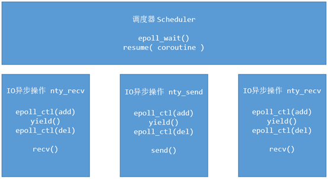
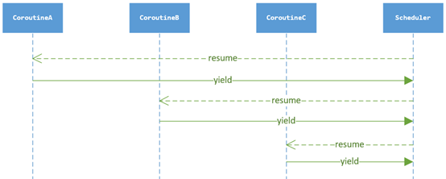
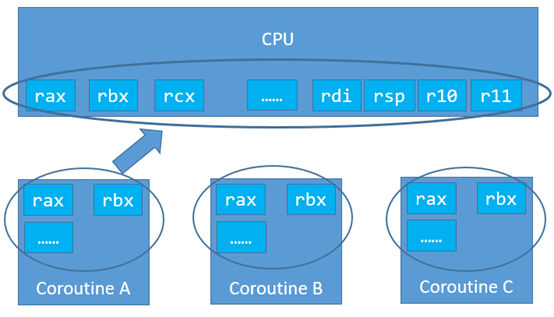
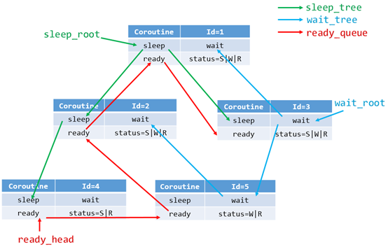
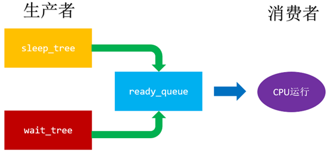
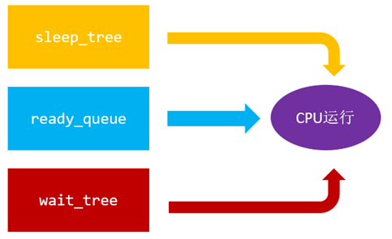

# 协程

## 什么是协程？

> A coroutine is a **function** that can **suspend** its execution (yield) until the given given **YieldInstruction** finishes.		

​	wikipedia 的定义：协程是一个无优先级的子程序调度组件，允许子程序在特定的地方挂起恢复。

​		线程包含于进程，协程包含于线程。只要内存足够，一个线程中可以有任意多个协程，但某一时刻只能有一个协程在运行，多个协程分享该线程分配到的计算机资源。


## 为什么需要引入协程？

简单来讲协程的好处：

- 跨平台
- 跨体系架构
- 无需线程上下文切换的开销
- 无需原子操作锁定及同步的开销
- 方便切换控制流，简化编程模型
- 高并发+高扩展性+低成本：一个CPU支持上万的协程都不是问题。所以很适合用于高并发处理。

### 开销

协程不是被操作系统内核所管理，而完全是由程序所控制（也就是在用户态执行）。这样带来的好处就是性能得到了很大的提升，不会像线程那样需要上下文切换来消耗资源，因此**协程的开销远远小于线程的开销**。

### 综合同步与异步的优点

就实际使用理解来讲，协程允许我们写同步代码的逻辑，却做着异步的事，避免了回调嵌套，使得代码逻辑清晰。协程综合和同步和异步的优点。

​		起初人们喜欢同步编程，然后发现有一堆线程因为I/O卡在那里,并发上不去，资源严重浪费。

​		然后出了异步（select,epoll,kqueue,etc）,将I/O操作交给内核线程,自己注册一个回调函数处理最终结果。然而项目大了之后代码结构变得不清晰。

​		简单来说协程就是写着同步的代码，同时又享受着异步带来的性能优势。

<center>
<div style="color:orange; border-bottom: 1px solid #d9d9d9;
display: inline-block;
color: #999;
padding: 2px;">IO异步操作与IO同步操作</div>
</center>

| **对比项** | **IO同步操作**     | **IO异步操作**     |
| ---------- | ------------------ | ------------------ |
| Sockfd管理 | 管理方便           | 多个线程共同管理   |
| 代码逻辑   | 程序整体逻辑清晰   | 子模块逻辑清晰     |
| 程序性能   | 响应时间长，性能差 | 响应时间短，性能好 |

## 开源协程库

### `golang`语言自带协程

`Golang`的协程是对称协程，调度器使用了`GMP`模型。使用go语言写一个并发程序极其简单，例如`go func(x，y)`即可并发执行一个函数f(x,y)。

`Golang`还有一个通道的概念，不同的协程可以往通道中写内容读内容。

当然，重点还是`GMP`模型，其中G代表的是`goroutine`协程，`Go1.11`中协程栈默认是2KB。M代表的是`machine`，对应的是一个线程。P代表的是`processor`，当P有任务时需要创建或者唤醒一个系统线程来执行它队列里的任务。所以P/M需要进行绑定，构成一个执行单元。

首先创建一个G对象，G对象保存到P本地队列或者是全局队列。P此时去唤醒一个M。P继续执行它的执行序。M寻找是否有空闲的P，如果有则将该G对象移动到它本身。接下来M执行一个调度循环(调用G对象->执行->清理线程→继续找新的`Goroutine`执行)。

M执行过程中，随时会发生上下文切换。当发生上下文切换时，需要对执行现场进行保护，以便下次被调度执行时进行现场恢复。Go调度器M的栈保存在G对象上，只需要将M所需要的寄存器(SP、PC等)保存到G对象上就可以实现现场保护。当这些寄存器数据被保护起来，就随时可以做上下文切换了，在中断之前把现场保存起来。如果此时G任务还没有执行完，M可以将任务重新丢到P的任务队列，等待下一次被调度执行。

### 云风的`coroutine`协程库

https://github.com/theanarkh/read-coroutine-code

coroutine是云风大佬写的一个携程库，是使用C语言实现的使用共享栈的一个非对称协程库，即调用者和被调用者的关系是固定的，协程A调用B，则B完成后必定返回到A。因为云风不希望使用他的协程库的人太考虑栈的大小，并且认为，进行上下文切换的大多时候，栈的使用实际并不大，所以使用共享栈每次进行上下文切换时拷贝的开销其实可以接受。另外，该库的上下文切换使用的是`glibc`的`ucontext`。

### 腾讯的`libco`协程库

腾讯的`libco`协程库是一个非对称的协程库，结合了`epoll`机制，其接口风格类似`pthread`，使用起来实际上已经有了使用线程的感觉。其栈空间`Separate coroutine stacks`的固定大小为128K，也可以使用共享栈`Copying the stack`，但默认还是使用固定的栈空间。`libco`结合`epoll`和`hook`系统调用的技术，有些叹为观止。另外，该库是自己使用汇编写的上下文切换方法。

### 魅族的`libgo`协程库

`libgo`是一个go风格的c++11对称协程库，它的命名结构分为`Scheduler`，`Processer`和`Task`（协程），`schedule` 负责整个系统的协程调度，协程的运行依赖于执行器 `Processer`（简称 P），因此在调度器初始化的时候会选择创建 P 的数量（支持动态增长），所有的执行器会添加到双端队列中。另外，该库使用的是`boost`库的上下文切换方法。

### `ntyco`

https://github.com/wangbojing/NtyCo

### `netco`

https://github.com/YukangLiu/netco 

网友开源的一个线程风格的纯C++11对称协程库，并且可以用于高并发网络编程。在使用上，受`golang`的影响很大，所以尽可能地减少使用接口，让使用更加轻便简洁。目前和协程相关的接口只有三个：`co_go(func)`,运行一个协程，`co_wait(time)`等待`time`毫秒后继续执行当前协程，`co_join()`等待协程运行结束。

## C/C++协程实现

在C++里面实现协程要解决的问题有如下几个：

- 何时挂起协程？何时唤醒协程？
- 如何挂起、唤醒协程，如何保护协程运行时的上下文？
- 如何封装异步操作？

### 前期准备

> 1. 现代操作系统是分时操作系统，资源分配的基本单位是进程，CPU调度的基本单位是线程。
> 2. C++程序运行时会有一个运行时栈，一次函数调用就会在栈上生成一个record
> 3. 运行时内存空间分为全局变量区（存放函数，全局变量）,栈区，堆区。栈区内存分配从高地址往低地址分配，堆区从低地址往高地址分配。
> 4. 下一条指令地址存在于指令寄存器IP，ESP寄存值指向当前栈顶地址，EBP指向当前活动栈帧的基地址。
> 5. 发生函数调用时操作为：将参数从右往左依次压栈，将返回地址压栈，将当前EBP寄存器的值压栈，在栈区分配当前函数局部变量所需的空间，表现为修改ESP寄存器的值。
> 6. 协程的上下文包含属于他的栈区和寄存器里面存放的值。

**何时挂起，唤醒协程？**

如开始介绍时所说，协程是为了使用异步的优势，异步操作是为了避免IO操作阻塞线程。那么协程挂起的时刻应该是当前协程发起异步操作的时候，而唤醒应该在其他协程退出，并且他的异步操作完成时。

**如何挂起、唤醒协程，如何保护协程运行时的上下文？**

协程发起异步操作的时刻是该挂起协程的时刻，为了保证唤醒时能正常运行，需要正确保存并恢复其运行时的上下文。

所以这里的操作步骤为：

- 保存当前协程的上下文（运行栈，返回地址，寄存器状态）
- 设置将要唤醒的协程的入口指令地址到IP寄存器
- 恢复将要唤醒的协程的上下文

### 工作流程

分别讨论三个协程的比较晦涩的工作流程。第一个协程的创建；第二个IO异步操作；第三个协程子过程回调。

#### 创建协程

​		当我们需要异步调用的时候，我们会创建一个协程。比如accept返回一个新的sockfd，创建一个客户端处理的子过程。再比如需要监听多个端口的时候，创建一个server的子过程，这样多个端口同时工作的，是符合微服务的架构的。

创建协程API如下:

```C
int nty_coroutine_create(nty_coroutine **new_co, proc_coroutine func, void *arg);
//nty_coroutine **new_co，需要传入空的协程的对象，这个对象是由内部创建的，并且在函数返回的时候，会返回一个内部创建的协程对象。
//proc_coroutine func，协程的子过程。当协程被调度的时候，就会执行该函数。
//void *arg，需要传入到新协程中的参数。
```

协程不存在亲属关系，都是一致的调度关系，接受调度器的调度。调用create API就会创建一个新协程，新协程就会加入到调度器的就绪队列中。

#### 实现IO异步操作

调度器与协程的上下文切换如下图所示



在协程的上下文IO异步操作（nty_recv，nty_send）函数，步骤如下：

1. 将sockfd 添加到epoll管理中。

2. 进行上下文环境切换，由协程上下文yield到调度器的上下文。

3. 调度器获取下一个协程上下文。Resume新的协程

IO异步操作的上下文切换的时序图如下：



#### 回调协程的子过程

在create协程后，何时回调子过程？何种方式回调子过程？

CPU有一个非常重要的寄存器叫做EIP，用来存储CPU运行下一条指令的地址。我们可以把回调函数的地址存储到EIP中，将相应的参数存储到相应的参数寄存器中。实现子过程调用的逻辑代码如下：

```C
void _exec(nty_coroutine *co) {
	co->func(co->arg); //子过程的回调函数
}

void nty_coroutine_init(nty_coroutine *co) {
    //ctx 就是协程的上下文
    co->ctx.edi = (void*)co; //设置参数
    co->ctx.eip = (void*)_exec; //设置回调函数入口
    //当实现上下文切换的时候，就会执行入口函数_exec , _exec 调用子过程func
}
```

### 原语操作

​		协程的核心原语操作：**create, resume, yield**。协程的原语操作有create怎么没有exit？这里实现，协程一旦创建就不能有用户自己销毁，必须得以子过程执行结束，就会自动销毁协程的上下文数据。以_exec执行入口函数返回而销毁协程的上下文与相关信息。co->func(co->arg) 是子过程，若用户需要长久运行协程，就必须要在func函数里面写入循环等操作。所以NtyCo里面没有实现exit的原语操作。

#### create：创建一个协程

1. 调度器是否存在，不存在也创建。调度器作为全局的单例。将调度器的实例存储在线程的私有空间`pthread_setspecific`。

2. 分配一个coroutine的内存空间，分别设置coroutine的数据项，栈空间，栈大小，初始状态，创建时间，子过程回调函数，子过程的调用参数。

3. 将新分配协程添加到就绪队列 ready_queue中

实现代码如下：

```C
int nty_coroutine_create(nty_coroutine **new_co, proc_coroutine func, void *arg) {

	assert(pthread_once(&sched_key_once, nty_coroutine_sched_key_creator) == 0);
	nty_schedule *sched = nty_coroutine_get_sched();

	if (sched == NULL) {
		nty_schedule_create(0);
		sched = nty_coroutine_get_sched();

		if (sched == NULL) {
			printf("Failed to create scheduler\n");
			return -1;
		}
	}

	nty_coroutine *co = calloc(1, sizeof(nty_coroutine));
	if (co == NULL) {
		printf("Failed to allocate memory for new coroutine\n");
		return -2;
	}
    //
    int ret = posix_memalign(&co->stack, getpagesize(), sched->stack_size);
    if (ret) {
        printf("Failed to allocate stack for new coroutine\n");
        free(co);
        return -3;
    }

    co->sched = sched;
    co->stack_size = sched->stack_size;
    co->status = BIT(NTY_COROUTINE_STATUS_NEW); //
    co->id = sched->spawned_coroutines ++;
    co->func = func;

    co->fd = -1;
    co->events = 0;

    co->arg = arg;
    co->birth = nty_coroutine_usec_now();
    
    *new_co = co;
    TAILQ_INSERT_TAIL(&co->sched->ready, co, ready_next);
    return 0;
}
```

#### yield： 让出CPU

```C
void nty_coroutine_yield(nty_coroutine *co);
//co 当前运行的协程实例
```

调用后该函数不会立即返回，而是切换到最近执行resume的上下文。该函数返回是在执行resume的时候，会有调度器统一选择resume的，然后再次调用yield的。resume与yield是两个可逆过程的原子操作。

#### resume：恢复协程的运行权

```C
int nty_coroutine_resume(nty_coroutine *co);
// co 需要恢复运行的协程实例
```

调用后该函数也不会立即返回，而是切换到运行协程实例的yield的位置。返回是在等协程相应事务处理完成后，主动yield会返回到resume的地方。

### 协程切换

首先来回顾一下x86_64寄存器的相关知识。

x86_64 的寄存器有16个64位寄存器，分别是：%rax, %rbx, %rcx, %esi, %edi, %rbp, %rsp, %r8, %r9, %r10, %r11, %r12,%r13, %r14, %r15。

%rax 作为函数返回值使用的。

%rsp 栈指针寄存器，指向栈顶

%rdi, %rsi, %rdx, %rcx, %r8, %r9 用作函数参数，依次对应第1参数，第2参数。。。

%rbx, %rbp, %r12, %r13, %r14, %r15 用作数据存储，遵循调用者使用规则，换句话说，就是随便用。调用子函数之前要备份它，以防它被修改

%r10, %r11 用作数据存储，就是使用前要先保存原值。

 

上下文切换，就是将CPU的寄存器暂时保存，再将即将运行的协程的上下文寄存器，分别mov到相对应的寄存器上。此时上下文完成切换。如下图所示：



切换_switch函数定义：

```C
int _switch(nty_cpu_ctx *new_ctx, nty_cpu_ctx *cur_ctx);
//参数1：即将运行协程的上下文，寄存器列表
//参数2：正在运行协程的上下文，寄存器列表
```

`nty_cpu_ctx`结构体的定义，为了兼容x86，结构体项命令采用的是x86的寄存器名字命名。

```C
ypedef struct _nty_cpu_ctx {
    void *esp; //
    void *ebp;
    void *eip;
    void *edi;
    void *esi;
    void *ebx;
    void *r1;
    void *r2;
    void *r3;
    void *r4;
    void *r5;
} nty_cpu_ctx;
```

`_switch`返回后，执行即将运行协程的上下文。是实现上下文的切换

`_switch`的实现代码：

```C
 __asm__ (
 "    .text                                  \n"
 "       .p2align 4,,15                                   \n"
 ".globl _switch                                          \n"
 ".globl __switch                                         \n"
 "_switch:                                                \n"
 "__switch:                                               \n"
 "       movq %rsp, 0(%rsi)      # save stack_pointer     \n"
 "       movq %rbp, 8(%rsi)      # save frame_pointer     \n"
 "       movq (%rsp), %rax       # save insn_pointer      \n"
 "       movq %rax, 16(%rsi)                              \n"
 "       movq %rbx, 24(%rsi)     # save rbx,r12-r15       \n"
 "       movq %r12, 32(%rsi)                              \n"
 "       movq %r13, 40(%rsi)                              \n"
 "       movq %r14, 48(%rsi)                              \n"
 "       movq %r15, 56(%rsi)                              \n"
 "       movq 56(%rdi), %r15                              \n"
 "       movq 48(%rdi), %r14                              \n"
 "       movq 40(%rdi), %r13     # restore rbx,r12-r15    \n"
 "       movq 32(%rdi), %r12                              \n"
 "       movq 24(%rdi), %rbx                              \n"
 "       movq 8(%rdi), %rbp      # restore frame_pointer  \n"
 "       movq 0(%rdi), %rsp      # restore stack_pointer  \n"
 "       movq 16(%rdi), %rax     # restore insn_pointer   \n"
 "       movq %rax, (%rsp)                                \n"
 "       ret                                              \n"
 );

```

按照x86_64的寄存器定义，`%rdi`保存第一个参数的值，即`new_ctx`的值，`%rsi`保存第二个参数的值，即保存`cur_ctx`的值。X86_64每个寄存器是64bit，8byte。

`movq %rsp, 0(%rsi)` 	#保存在栈指针到cur_ctx实例的rsp项

`movq %rbp, 8(%rsi)` 

`movq (%rsp), %rax`  	   #将栈顶地址里面的值存储到rax寄存器中。Ret后出栈，执行栈顶

`movq %rbp, 8(%rsi)` 	  #后续的指令都是用来保存CPU的寄存器到new_ctx的每一项中

`movq 8(%rdi), %rbp` 	  #将new_ctx的值

`movq 16(%rdi), %rax` 	#将指令指针rip的值存储到rax中

`movq %rax, (%rsp)`  	   # 将存储的rip值的rax寄存器赋值给栈指针的地址的值。

`ret` 								# 出栈，回到栈指针，执行rip指向的指令。

上下文环境的切换完成。

### 协程定义

设计一个协程的运行体R与运行体调度器S的结构体

- 运行体R：包含运行状态{就绪，睡眠，等待}，运行体回调函数，回调参数，栈指针，栈大小，当前运行体
- 调度器S：包含执行集合{就绪，睡眠，等待}

  这个问题可以拆分两个个问题，一个运行体如何高效地在多种状态集合更换。调度器与运行体的功能界限。

#### 运行体如何高效地在多种状态集合更换

新创建的协程，创建完成后，加入到就绪集合，等待调度器的调度；协程在运行完成后，进行IO操作，此时IO并未准备好，进入等待状态集合；IO准备就绪，协程开始运行，后续进行sleep操作，此时进入到睡眠状态集合。

就绪(ready)，睡眠(sleep)，等待(wait)集合该采用如何数据结构来存储？

**就绪(ready)**集合并不没有设置优先级的选型，所有在协程优先级一致，所以可以使用队列来存储就绪的协程，简称为就绪队列（ready_queue）。

 **睡眠(sleep)**集合需要按照睡眠时长进行排序，采用红黑树来存储，简称睡眠树(sleep_tree)红黑树在工程实用为<key, value>, key为睡眠时长，value为对应的协程结点。

**等待(wait)**集合，其功能是在等待IO准备就绪，等待IO也是有时长的，所以等待(wait)集合采用红黑树的来存储，简称等待树(wait_tree)，此处借鉴`nginx`的设计。

数据结构如下图所示：



`Coroutine`就是协程的相应属性，`status`表示协程的运行状态。`sleep`与`wait`两颗红黑树，`ready`使用的队列，比如某协程调用`sleep`函数，加入睡眠树(`sleep_tree`)，`status |= S`即可。比如某协程在等待树(`wait_tree`)中，而`IO`准备就绪放入`ready`队列中，只需要移出等待树(`wait_tree`)，状态更改`status &= ~W`即可。有一个前提条件就是不管何种运行状态的协程，都在就绪队列中，只是同时包含有其他的运行状态。

#### 调度器与协程的功能界限

**每一协程都需要使用的而且可能会不同属性的，就是协程属性。每一协程都需要的而且数据一致的，就是调度器的属性。**比如栈大小的数值，每个协程都一样的后不做更改可以作为调度器的属性，如果每个协程大小不一致，则可以作为协程的属性。

**用来管理所有协程的属性，作为调度器的属性。**比如epoll用来管理每一个协程对应的IO，是需要作为调度器属性。

按照前面的描述，定义一个协程结构体需要多少域，为了描述了每一个协程有自己的上下文环境，需要保存CPU的寄存器ctx；需要有子过程的回调函数func；需要有子过程回调函数的参数 arg；需要定义自己的栈空间 stack；需要有自己栈空间的大小 stack_size；需要定义协程的创建时间 birth；需要定义协程当前的运行状态 status；需要定当前运行状态的结点（ready_next, wait_node, sleep_node）；需要定义协程id；需要定义调度器的全局对象 sched。

协程的核心结构体如下：

```C
typedef struct _nty_coroutine {

    nty_cpu_ctx ctx;
    proc_coroutine func;
    void *arg;
    size_t stack_size;

    nty_coroutine_status status;
    nty_schedule *sched;

    uint64_t birth;
    uint64_t id;

    void *stack;

    RB_ENTRY(_nty_coroutine) sleep_node;
    RB_ENTRY(_nty_coroutine) wait_node;

    TAILQ_ENTRY(_nty_coroutine) ready_next;
    TAILQ_ENTRY(_nty_coroutine) defer_next;

} nty_coroutine;
```

调度器是管理所有协程运行的组件，协程与调度器的运行关系。


调度器的属性，需要有保存CPU的寄存器上下文 ctx，可以从协程运行状态yield到调度器运行的。从协程到调度器用yield，从调度器到协程用resume

以下为协程的定义。

```c 
typedef struct _nty_coroutine_queue nty_coroutine_queue;

typedef struct _nty_coroutine_rbtree_sleep nty_coroutine_rbtree_sleep;
typedef struct _nty_coroutine_rbtree_wait nty_coroutine_rbtree_wait;

typedef struct _nty_schedule {
    uint64_t birth;
nty_cpu_ctx ctx;

    struct _nty_coroutine *curr_thread;
    int page_size;

    int poller_fd;
    int eventfd;
    struct epoll_event eventlist[NTY_CO_MAX_EVENTS];
    int nevents;

    int num_new_events;

    nty_coroutine_queue ready;
    nty_coroutine_rbtree_sleep sleeping;
    nty_coroutine_rbtree_wait waiting;

} nty_schedule;
```

### 协程调度器

**调度器的实现，有两种方案，一种是生产者消费者模式，另一种多状态运行。**

#### 生产者消费者模型



```c
while (1) {

        //遍历睡眠集合，将满足条件的加入到ready
        nty_coroutine *expired = NULL;
        while ((expired = sleep_tree_expired(sched)) != ) {
            TAILQ_ADD(&sched->ready, expired);
        }

        //遍历等待集合，将满足添加的加入到ready
        nty_coroutine *wait = NULL;
        int nready = epoll_wait(sched->epfd, events, EVENT_MAX, 1);
        for (i = 0;i < nready;i ++) {
            wait = wait_tree_search(events[i].data.fd);
            TAILQ_ADD(&sched->ready, wait);
        }

        // 使用resume回复ready的协程运行权
        while (!TAILQ_EMPTY(&sched->ready)) {
            nty_coroutine *ready = TAILQ_POP(sched->ready);
            resume(ready);
        }
    }
```


#### 多状态运行



```C
while (1) {

        //遍历睡眠集合，使用resume恢复expired的协程运行权
        nty_coroutine *expired = NULL;
        while ((expired = sleep_tree_expired(sched)) != ) {
            resume(expired);
        }

        //遍历等待集合，使用resume恢复wait的协程运行权
        nty_coroutine *wait = NULL;
        int nready = epoll_wait(sched->epfd, events, EVENT_MAX, 1);
        for (i = 0;i < nready;i ++) {
            wait = wait_tree_search(events[i].data.fd);
            resume(wait);
        }

        // 使用resume恢复ready的协程运行权
        while (!TAILQ_EMPTY(sched->ready)) {
            nty_coroutine *ready = TAILQ_POP(sched->ready);
            resume(ready);
        }
    }
```

