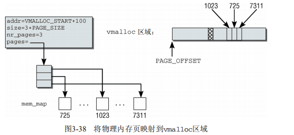

# 操作系统—内存管理

## 内存管理考察点

- **虚拟内存的概念：能描述清楚虚拟内存的优点、原理等**
- **缺页异常**：何时发生，过程
- **页面置换**：何时发生，过程，常见的页面置换算法
- 物理内存与虚拟内存如何对应
- 内存分配与虚拟内存的关系：内存分配过程中虚拟内存如何工作
- 操作系统内存布局：用户空间与内核空间；用户空间内存布局
- **页表**的机制与作用
- 物理内存的管理：buddy算法与slab缓存
- *内核空间地址与物理地址的映射关系：线性映射区与高端内存*
- *内存相关关键结构体： mm_struct、vm_area_stuct*


## Linux虚拟内存——为什么这样设计

**操作系统稀缺资源**

​		CPU、主内存 --> 操作系统中的进程会共享系统中的CPU和内存资源：使用CPU调度器分配CPU时间、引入虚拟内存系统以管理内存。

**虚拟内存概念**

​		操作系统物理内存和进程之间的中间层; 为进程隐藏物理内存的概念, 为进程提供了简洁易用且同意的接口以及更复杂的功能。屏蔽I/O与内存之间的差异。


**内存访问方式**

​		早期——让系统中的进程直接访问主内存中的物理地址, 进程使用目标内存的物理地址直接访问内存中的内容
​		现代操作系统——引入虚拟内存, 进程持有的虚拟地址会经过内存管理单元(MMU)转换为物理地址, 再通过物理地址访问内存。
**内存与磁盘性能差异**

​		顺序读取——比磁盘快一个数量级; 
​		随机访问——是磁盘的100 000倍 ==> 充分利用内存的随机访问速度是改善程序执行效率的有效方式。	

**虚拟内存作为抽象层的关键作用**
	·虚拟内存可以利用磁盘起到缓存的作用, 提高进程访问指定内存的速度;
	·虚拟内存可以为进程提供独立的内存空间, 简化程序的链接、加载过程, 并通过动态库共享内存;
	·虚拟内存可以控制进程对物理内存的访问, 隔离不同进程的访问权限, 提高系统的安全性;


​	

### **缓存**

​	将虚拟内存看做是磁盘上的一片空间, 当这片空间的一部分访问比较频繁时, 该部分数据会以页为单位被缓存到主存中, 以加速CPU访问数据的能力。
​	虚拟内存利用空间较大的磁盘存储作为“内存”，并使用主存存储缓存进行加速，让上层以为操作系统的内存很大而且很缺，然而区域很大的磁盘并不是很快，而很快的内存也并不大。

​		虚拟内存中的虚拟页可能处于三种情况：未分配(Unallocated)、未缓存(Uncached)和已缓存(Cached)，其中未分配的内存也是没有被进程申请使用的，也就是空闲的虚拟内存，不占用虚拟内存磁盘的任何空间，未缓存和已缓存的内存页分别表示已经加载到主存中的内存页和仅加载到磁盘中的内存页。

​		当用户程序访问未被缓存的虚拟页时，硬件就会触发缺页中断(Page Fault，PF)，在部分情况下，被访问的页面已经加载到了物理内存中，但是用户程序的页表(Page Table)并不存在该对一个关系，这时只需要建立虚拟内存到物理内存的映射关系；在其他情况下，操作系统需要将磁盘上未被缓存的虚拟页加载到物理内存中。


**缓存淘汰/页面置换算法**

​		由于物理内存空间有限，当主存中无可用空间时，操作系统会选择合适的物理内存页驱逐回磁盘，腾出空闲空间，该过程称为页面替换(Page Replacement)。

​		常见的页面置换算法包括：先来先服务FIFO、最不常使用算法LFU、最近最少使用算法LRU、最近最常使用算法MRU、自适应缓存替换算法ARC、随机Random。

​		缺页中断和页面置换算法都是操作系统调页算法(Pagin)的一部分，该算法的目的是充分利用内存资源作为此判断缓存以提高程序的运行效率。


### 内存管理

​		虚拟内存为每个正在运行的进程提供独立的内存空间，制造一种每个进程的内存都是独立的假象。


​		虚拟内存空间只是操作系统中的逻辑结构，虚拟内存地址即逻辑地址(CPU操作的地址)，应用程序最终需要访问物理内存或磁盘上的内容。

​		操作系统增加一个虚拟内存的中间层，对此也需要为进程实现地址翻译，实现从虚拟地址到物理地址的转换。页表是虚拟内存中的重要数据结构，每个进程的页表都存储有从虚拟内存到物理内存页的映射关系，为了存储64位操作系统中128TiB虚拟内存的映射数据，Linux在2.6.10中引入了四层页表辅助虚拟地址的转换，在4.11引入了五层的页表结构。


**写时复制**

因为有多层的页表结构可以用来转换虚拟地址，所以多个进程可以通过虚拟内存共享物理内存。写时复制利用了虚拟内存的这一特性，当调用`fork`创建子进程时，实际上只是复制了父进程的页表。只有当发生了数据更改时，才将该部分数据进行更新。


​		虚拟内存不仅可以在 `fork` 时用于共享进程的物理内存，提供写时复制的机制，还能共享一些常见的动态库减少物理内存的占用，所有的进程都可能调用相同的操作系统内核代码，而 C 语言程序也会调用相同的标准库。

### 内存保护

​		如果每一个进程都持有独立的虚拟内存空间，那么虚拟内存中页表可以理解成进程和物理页的『连接表』，其中可以存储进程和物理页之间的访问关系，包括读权限、写权限和执行权限：

​		如果每一个进程都持有独立的虚拟内存空间，那么虚拟内存中页表可以理解成进程和物理页的『连接表』，其中可以存储进程和物理页之间的访问关系，包括读权限、写权限和执行权限：

### 总结：为什么需要虚拟内存

- 虚拟内存可以结合磁盘内存大和物理内存读取速度快的优势为进程提供看起来速度足够快并且容量足够大的存储；
- 虚拟内存可以为进程提供独立的内存空间并引入多层的页表结构将虚拟内存翻译成物理内存，进程之间可以共享物理内存减少开销，也能简化程序的链接、装载以及内存分配过程；
- 虚拟内存可以控制进程对物理内存的访问，隔离不同进程的访问权限，提高系统的安全性；

## 内存管理

内存管理实现包括：

- 内存中的物理内存页的管理
- 分配大块内存的伙伴系统
- 分配较小内存块的slab、slub和slob分配器
- 分配非连续内存块的vmalloc机制
- 进程的地址空间

Linux内核一般将处理器的虚拟地址空间划分为两部分：用户空间与内核空间。

可用的物理内存将映射到内核的地址空间中。访问内存时，如果所用的虚拟地址与内核区域的起始地址之间的偏移量不超过可用物理内存的长度，那么该虚拟地址会自动关联到物理页帧。

有两种类型计算机，分别以不同的方法管理物理内存：

- UMA计算机（一致内存访问，uniform memory access）将可用内存以连续页方式组织起来。SMP系统中的每个处理器访问各个内存区都是同样块
- NUMA计算机（非一致内存访问，non-uniform memory access）总是多处理器计算机。系统各个CPU都有本地内存，可支持特别快速的访问。各个处理器之间通过总线连接起来，以支持对其他CPU的本地内存的访问，当然比访问本地内存慢。


### 页表

用来将虚拟地址空间映射到物理地址空间的数据结构称之为页表。因为虚拟地址空间的大部分区域都没有使用，因而也没有关联到页帧，那么久可以使用功能相同但内存用量少得多的模型：多机分页。

为减少页表的大小并容许忽略不需要的区域，计算机体系结构的设计会将虚拟地址划分为多个部分。

页表的一个特色在于对虚拟地址空间中不需要的区域，不必创建中间页目录或页表。与使用单个数组方法相比，多级页表节省了大量内存。当然，缺点就是，每次访问内存时，必须逐级访问多个数组才能完成地址转换。CPU试图用两个方法加速该过程：

- CPU专门有一个部分MMU(Memory Management Unit，内存管理单元)，该单元优化了内存访问操作
- 地址转换中出现最频繁的地址，保存到TLB(Translation Lookaside Buffer, 地址转换后备缓冲器)的CPU高速缓存中。无需访问内存中的页表即可从高速缓存直接获得地址数据，因而大大加速了地址转换。

层次化的页表用于支持对大地址空间的快速、高效的管理。页表用于建立用户进程的虚拟地址空间和系统物理内存（内存、页帧）之间的关联。页表用于向每一个进程提供一致的虚拟地址空间。用户空间看到的事一个连续的内存页。

内核内存管理总是假定使用四级页表。页表管理分为两个部分，第一部分依赖于体系结构，第二部分是体系结构无关的。第三四级页表必须由特定于体系结构的代码模拟

#### 数据结构

C语言中，void *数据类型用于定义可能指向内存中任何字节位置的指针。

内核源码假定void *和unsigned long类型所需的比特位数相同。假定`sizeof(void *) == sizeof(unsigned long)`。

**内存地址分解**

根据四级页表结构的需要，虚拟内存地址分为5部分（4个表项用于选择页，1个索引表用于表示页内位置）。

各体系结构不仅地址字长度不同，而且地址拆分的方式也不同。内核有相关定义宏。下图说明了如何用比特位移来定义地址字各分量的位置。BITS_PER_LONG定义用于unsigned long变量的比特位数，故也适用于void *指针。


每个指针末端的几个比特位，用于指定所选页帧内部的位置。位数由PAGE_SHIFT指定。

>  `PGD, page global directory` 全局页目录
>
>  `PUD, page upper directory` 顶层页目录
>
>  `PMD, page middledirectory` 中间页目录
>
>  `PTE, page table entry` 页表数组
>
>  **`TLB, Translation Lookaside Buffer` 地址转换后备缓冲器**

在各级页表目录/页表中所能存储的指针数目，也可以通过宏定义确定。`PTRS_PER_PGD`指定的全局页目录中的项的数目，`PTRS_PER_PMD`对应中间页目录，`PTRS_PER_PUD`对应于上层页，`PTRS_PER_PTE`对应页表。

`PTRS_PER_XXX`指定了给定目录项能够代表多少指针。内核通过掩码来从给定地址中提取各个分类。

**页表的格式**

内核提供了4个数据结构来表示页表项的结构

- pgd_t用于全局页目录项
- pud_t用于上层页目录项
- pmd_t用于中间页目录项
- pte_t用于直接页表项

PAGE_ALIGN是另一个每种体系结构都必须定义的标准宏（page.h）。它需要一个地址作为参数，并将该地址“舍入”到下一页的起始处。假设页大小4kB，该宏总返回其倍数。PAGE_ALIGN(6000) = 8192。为用好处理器的高速缓存资源，将地址对齐到页边界是很重要的。

**特定于PTE的信息**

最后一级页表中的项不仅包含了指向页的内存位置的指针，还在上述的多余比特位包含了与页有关的附加信息。尽管这些数据是特定于CPU的，它们至少提供了有关页访问控制的一些信息。

#### 页表项的创建和操作


所有体系结构都必须实现表中的函数，以便内存管理代码创建和销毁页表。

### 初始化内存管理

在内存管理上下文中，初始化可以有多种含义。在许多CPU上，必须显式设置适于Linux内核的内存模型。例如IA-32系统上需要切换到保护模式，然后内核才能检测可用内存和寄存器。在初始化过程中，还必须建立内存管理的数据结构，以及其他很多事务。因为内核在内存管理完全初始化之前就需要使用内存，在系统启动过程期间，使用了一个额外的简化形式的内存管理模块，然后又弃用。

相关数据结构的初始化是从全局启动例程`start_kernel`中开始的。下图为`start_kernel`的代码流程图。其中只包括与内存管理相关的系统初始化函数。


在启动过程期间，尽管内存管理尚未初始化，但内核仍然需要分配内存以创建各种数据结构。bootmem分配器用于在启动阶段早期分配内存。

### 物理内存的管理

内核初始化完成后，内存管理的职责由伙伴系统承担。伙伴系统基于一种简单而令人吃惊的强大算法。它结合了优秀内存分配器的两个关键特征：速度和效率。

#### 概述

内核分配内存时，必须记录页帧的已分配或空闲状态，以免两个进程使用同样的内存区域。由于内存分配和释放非常频繁，必须尽快完成相关操作。内核只分配完整的页帧。将内存划分为更小的工作部分则委托给用户空间的标准库。标准库将来源于内核的页帧拆分为小的区域，并为进程分配内存。

##### 伙伴系统

内核中很多时候都要求分配连续页。为快速检测内存中的连续区域，内核采用了一种古老而历经检验的技术：伙伴系统。

系统中的空闲内存块总是两两分组，每组中的两个内存块称为伙伴。伙伴的分配可以是彼此独立的。但如果两个伙伴都是空闲的，内核会将其合并为一个更大的内存开，作为下一层的某个内存块的伙伴。


##### slab缓存

内核本身经常需要比完整页帧小得多的内存块。由于内核无法使用标准库的函数，因而必须在伙伴系统基础上自定义额外的内存管理层，将伙伴系统提供的页划分为更小的部分。该方法不仅可以分配内存，还为频繁使用的小对象实现了一个一般性的缓存——slab缓存。它可以用两种方法分配内存。

(1) 对频繁使用的对象，内核定义了只包含了所需类型对象实例的缓存。每次需要某种对象时，可以从对应的缓存快速分配（使用后释放到缓存）。slab缓存自动维护与伙伴系统的交互，在缓存用尽时会请求新的页帧。

(2) 对通常情况下小内存块的分配，内核针对不同大小的对象定义了一组slab缓存，可以像用户空间编程一样，用相同的函数访问这些缓存。不同之处是这些函数都增加了前缀k，表明是与内核相关联的：kmalloc和kfree。

##### 页面交换和页面回收

页面交换通过利用磁盘空间作为扩展内存，从而增大了可用的内存。在内核需要更多内存时，不经常使用的页可以写入硬盘。如果再需要访问相关数据，内核会将相应的页切换会内存。通过缺页异常机制，这种切换操作对程序是透明的。换出的页可以通过特别的页表标识。在进程试图访问此类页帧的时候，就会触发缺页异常。此时内核可以将硬盘上的数据切换到内存中。

页面回收用于将内存映射被修改的内容与底层的块设备同步，为此有时也简称为数据回写。数据刷出后，内核即可将页帧用于其他用途（类似于页面交换）。内核的数据结构包含了与此相关的所有信息，当再次需要该数据时，可根据相关信息从硬盘找到相应的数据并加载。

#### 伙伴系统的结构

系统内存中的每个物理内存页（页帧），都对应于一个struct page实例。每个内存域都关联了一个struct zone的实例，其中保存了用于管理伙伴数据的主要数组。

```C
<mmzone.h>
struct zone{
    ...
        /*
        *不同长度的空闲区域
        */
        struct free_area free_area[MAX_ORDER];
    ...
};

//free_area是一个辅助数据结构
struct free_area{
    struct list_head free_list[MIGRATE_TYPES]; //用于连接空闲页的链表
    unsigned long nr_free;    //指定当前内存页中空闲页块的数目
    //对0阶内存逐页计算，对1阶区计算页对的数目，对2阶内存计算4页集合的数目，依次类推
};
```

阶是伙伴系统中一个非常重要的术语。它描述了内存分配的数量单位。内存块的长度是2^order，其中order的范围从0到MAX_ORDER。

```C
<mmzone.h>
#ifndef CONFIG_FORCE_MAX_ZONEORDER
#define MAX_ORDER 11
#else
#define MAX_ORDER CONFIG_FORCE_MAX_ZONEORDER
#endif
#define MAX_ORDER_NR_PAGES (1 << (MAX_ORDER -1))
```

该常数通常设置为11，这意味着一次分配可以请求的页数最大是211=2 048。但如果特定于体系结构的代码设置了FORCE_MAX_ZONEORDER配置选项，该值也可以手工改变。

free_area[]数组中的各个元素的索引也解释为阶，用于指定对应链表中的连续内存区包含多少个页帧。第0个链表包含的内存区为单页(2^0 = 1)，第1个链表管理的内存区为两页，第3个管理的内存区为4页，依次类推。

内存页如何连接？内存区中第1页内的链表元素，可用于将内存区维持在链表中。因此，也不必引入新的数据结构来管理物理上的连续页，否则这些页不可能在同一内存区中。


伙伴是不必彼此连接的。如果一个内存区在分配期间分解为两半，内核会自动将未用的一般加入到对应的链表中。如果未来某个时刻，由于内存释放的缘故，两个内存区都处于空闲状态，可通过其地址判断是否为伙伴。管理工作较少，是伙伴系统的一个主要优点。

基于伙伴系统的内存管理专注于某个结点的某个内存域，例如DMA或高端内存域。但所有内存域和结点的伙伴系统都通过备用分配列表连接起来。


#### 避免碎片

对内核来说，碎片是一个问题。很长时间以来，物理碎片的内存确实是Linux的弱点之一。尽管提出了很多方法，但没有哪个方法能够既满足Linux需要处理的各种类型工作负荷提出的苛刻需求，同时又对其他事务影响不大。

在内核2.6.24开发期间，防止碎片的方法最终加入内核。因此，内核的方法是反碎片（anti-fragmentation），即试图从最初开始尽可能防止碎片。

> 内核将已分配划分为3种类型：
>
> - 不可移动页：在内存中有固定位置，不能移动到其他地方。核心内核分配的大多数内存属于该类别
>
> - 可回收页：不能直接移动，但可以删除，其内容可以从某些源重新生成。例如：映射自文件的数据属于该类别。
>
>   kswapd守护进程会根据可回收页访问的频繁程度，周期性释放此类内存。
>
>   另外，在内存短缺（即分配失败）时也可以发起页面回收。
>
> - 可移动页可以随意地移动。属于用户空间应用程序的页属于该类别。它们是通过页表映射的。如果它们复制到新位置，页表项可以相应地更新，应用程序不会注意到任何事。

内核使用的反碎片技术，即基于将具有相同可移动性的页分组的思想。为什么这种方法有助于减少碎片？由于页无法移动，导致在原本几乎全空的内存区中无法进行连续分配。根据页的可移动性，将其分配到不同的列表中，即可防止这种情形。例如，不可移动的页不能位于可移动内存区的中间，否则就无法从该内存区分配较大的连续内存块。

#### 分配器API

就伙伴系统的接口而言，NUMA或UMA体系结构是没有差别的，二者的调用语法都是相同的。所有函数的一个共同点是：只能分配2的整数幂个页。因此，接口中不像C标准库的malloc函数或bootmem分配器那样指定了所需内存大小作为参数。相反，必须指定的是分配阶，伙伴系统将在内存中分配2^order页。内核中细粒度的分配只能借助于slab分配器（或者slub、slob分配器），后者基于伙伴系统。

**分配API**

> - alloc_pages(mask, order)分配2^order页并返回一个struct page的实例，表示分配的内存块的起始页。alloc_page(mask)是前者在order = 0情况下的简化形式，只分配一页。
> - get_zeroed_page(mask)分配一页并返回一个page实例，页对应的内存填充0（所有其他函数，分配之后页的内容是未定义的）。
> - \__get_free_pages(mask, order)和__get_free_page(mask)的工作方式与上述函数相同，但返回分配内存块的虚拟地址，而不是page实例。
> - get_dma_pages(gfp_mask, order)用来获得适用于DMA的页。

在空闲内存无法满足请求以至于分配失败的情况下，所有上述函数都返回空指针或0。因此内核在各次分配之后都必须检查返回的结果。

**释放API**

> - free_page(struct page *)和free_pages(struct page *, order)用于将一个或2^order页返回给内存管理子系统。内存区的起始地址由指向该内存区的第一个page实例的指针表示。
>
> - \__free_page(addr)和__free_pages(addr, order)的语义类似于前两个函数，但在表示需要释放的内存区时，使用了虚拟内存地址而不是page实例。

#### 分配页

所有API函数都追溯到`allpc_pages_node`，从某种意义上说，该函数是伙伴系统主要实现的“发射台”。

```C
<gfp.h> 
static inline struct page *alloc_pages_node(int nid, gfp_t gfp_mask, 
													unsigned int order) { 
    if (unlikely(order >= MAX_ORDER)) 
    	return NULL; 
    /* 未知结点即当前结点 */
    if(nid< 0) 
		nid = numa_node_id(); 
	return __alloc_pages(gfp_mask, order, 
                         NODE_DATA(nid)->node_zonelists + gfp_zone(gfp_mask)); 
}
```

只执行了一个简单的检查，避免分配过大的内存块。如果指定负的节点不存在，内核自动地使用当前执行CPU对应的结点ID。接下来的工作委托给`__alloc_pages`，只需传递一组适当的参数，`gfp_zone`用于选择分配内存的区域。内核源代码将`__alloc_pages`称之为“伙伴系统的心脏”，因为它处理的是实质性的内存分配。

#### 内存中不连续页的分配

物理内存上连续的映射对内核是最好的，但并不总是能够实现。在分配一大块内存时，可能竭尽全力也无法找到连续的内存块。在用户空间这不是问题，因为普通进程设计为使用处理器的分配机制，当然这会降低速度并占用TLB。

内核中也使用了同样的技术。内核分配了其虚拟地址空间的一部分，用于建立连续映射。


在IA-32系统中，紧随直接映射的前892 MiB物理内存，在插入的8 MiB安全隙之后，是一个用于管理不连续内存的区域。这一段具有线性地址空间的所有性质。分配到其中的页可能位于物理内存中的任何地方。通过修改负责该区域的内核页表，即可做到这一点。

每个vmalloc分配的子区域都是自包含的，与其他vmalloc子区域通过一个内存页分隔。类似于直接映射和vmalloc区域之间的边界，不同vmalloc子区域之间的分隔也是为防止不正确的内存访问操作。这种情况只会因为内核故障而出现，应该通过系统错误信息报告，而不是允许内核其他部分的数据被暗中修改。因为分隔是在虚拟地址空间中建立的，不会浪费宝贵的物理内存页。

**`vmalloc`**

> vmalloc是一个接口函数，内核代码使用它来分配在虚拟内存中连续但在物理内存中不一定连续的内存。
>
> **<vmalloc.h>**  void *vmalloc(unsigned long size); 
>
> 内核在管理虚拟内存中的vmalloc区域时，内核必须跟踪哪些子区域被使用、哪些是空闲的。为此定义了一个数据结构，将所有使用的部分保存在一个链表中。
>
> ```C
> <vmalloc.h> 
> struct vm_struct { 
> 	struct vm_struct *next; //将vmalloc区域中的所有子区域保存在链表中
>  	void *addr;		//定义了分配的子区域在虚拟地址空间中的起始地址
> 	unsigned long size; //该子区域的长度
>     unsigned long flags; //存储了与该内存区域关联的标志集合。它只用于指定内存区类型。
>     struct page **pages; //一个指针，指向page指针的数组。每个数组成员都表示一个映射到虚拟地址空间中的物理内存页的page实例
>     unsigned int nr_pages; //指定pages中数组项的数目，即涉及的内存页数目
>     unsigned long phys_addr; //仅当使用ioremap映射了由物理地址描述的物理内存区域时才需要。
> };
> ```
>
> 


## slab分配器

slab分配器是内核为了满足小单位空间申请的一种策略。提供小内存块不是slab分配器的唯一任务。由于结构上的特点，它也用作一个缓存，主要针对经常分配并释放的对象。通过建立slab缓存，内核能够储备一些对象，供后续使用，即使在初始化状态，也是如此。

### 备选分配器

尽管slab分配器对许多可能的工作负荷都工作良好，但也有一些情形，它无法提供最优性能。

为处理此类情形，在内核版本2.6开发期间，增加了slab分配器的两个替代品。

- slob分配器进行了特别优化，以便减少代码量。它围绕一个简单的内存块链表展开（因此而得名）。在分配内存时，使用了同样简单的最先适配算法。slob分配器只有大约600行代码，总的代码量很小。事实上，从速度来说，它不是最高效的分配器，也肯定不是为大型系统设计的。
- slub分配器通过将页帧打包为组，并通过struct page中未使用的字段来管理这些组，试图最小化所需的内存开销。读者此前已经看到，这样做不会简化该结构的定义，但在大型计算机上slub比slab提供了更好的性能，说明了这样做是正确的。

### slab分配原理

基本上，slab缓存由两部分组成：保存管理型数据的缓存对象和保存被管理对象的各个slab。


每个缓存只负责一种对象类型（例如struct unix_sock实例），或提供一般性的缓冲区。各个缓存中slab的数目各有不同，这与已经使用的页的数目、对象长度和被管理对象的数目有关。

另外，系统中所有的缓存都保存在一个双链表中。这使得内核有机会一次遍历所有的缓存。

#### 缓存

除了管理性数据（如已用和空闲对象或标志寄存器的数目），缓存结构包括两个特别重要的成员。

- 指向一个数组的指针，其中保存了各个CPU最后释放的对象。
- 每个内存结点都对应3个表头，用于组织slab的链表。第1个链表包含完全用尽的slab，第2个是部分空闲的slab，第3个是空闲的slab。


#### slab


## 进程虚拟内存

用户进程的虚拟地址空间时Linux的一个重要抽象：它向每个运行进程提供了同样的视图，这使得多个进程可以同时运行，而不会干扰到其他进程内存中的内容。此外它容许使用各种高级的程序技术，如内存映射。

### 进程的虚拟地址空间

各个进程的虚拟地址空间其实与地址0，延伸到TASK_SIZE-1，其上是内核地址空间。在IA-32系统上地址空间的范围可达2^32 = 4GiB，总的地址空间通常按3:1比例划分。内核分配了1GiB，而各个用户空间进程可用的部分为3GiB.

无论当前哪个用户进程处于活动状态，虚拟地址空间内核部分的内容总是同样的。取决于具体的硬件，这可能是通过操作各用户进程的页表，使得虚拟地址空间的上半部看上去总是相同的。也可能是指示处理器为内核提供一个独立的地址空间，映射在各个用户地址空间之上。

虚拟地址空间由许多不同长度的段组成，用于不同的目的，必须分别处理。例如在大多数情况下，不允许修改text段，但必须可以执行其内容。另一方面，必须可以修改映射到地址空间中的文本文件内容，而不能允许执行其内容。因为这没有意义，文件的内容只是数据，并非机器代码。

#### 进程地址空间的布局mm_struct

虚拟地址空间中包含了若干区域。其分布方式是特定于体系结构的，但所有方法都有下列共同成分。

- 当前运行代码的二进制代码。该代码通常称之为text，所处的虚拟内存区域称之为text段。
- 程序使用的动态库的代码。
- 存储全局变量和动态产生的数据的堆。
- 用于保存局部变量和实现函数/过程调用的栈。
- 环境变量和命令行参数的段。
- 将文件内容映射到虚拟地址空间中的内存映射。

系统中各个进程都具有一个mm_struct实例，可以通过task_struct访问。这个实例保存了进程的内存管理信息：

```C
<mm_types.h> 
struct mm_struct { 
    ... 
    unsigned long (*get_unmapped_area) (struct file *filp, 
                                        unsigned long addr, unsigned long len, 
                                        unsigned long pgoff, unsigned long flags); 
    ... 
    unsigned long mmap_base; /* mmap区域的基地址 */ 
    unsigned long task_size; /* 进程虚拟内存空间的长度 */ 
    ... 
    unsigned long start_code, end_code, start_data, end_data; 
    unsigned long start_brk, brk, start_stack; 
    unsigned long arg_start, arg_end, env_start, env_end; 
	... 
}
//可执行代码占用的虚拟地址空间区域，其开始和结束分别通过start_code和end_code 标记。
//start_data金额end_data标记了包含已初始化数据的区域。在ELF二进制文件映射到地址空间之后，这些区域的长度不再改变。
//堆的起始地址保存在start_brk，brk表示堆区域当前的结束地址。尽管堆的其实地址在进程生命周期中是不变的，但堆的长度会发生变化，因而brk的值也会发生改变。
//参数列表和环境变量的位置分别由arg_start和arg_end、env_start和env_end描述。两个区域都位于栈中最高的区域。
//mmap_base表示虚拟地址空间中用于内存映射的起始地址，可调用get_unmapped_area在mmap区域中为新映射找到适当的位置。通常设置为TASK_UNMAPPED_BASE
//task_size存储了对应进程的地址空间长度。对本机程序来说，该值通常是TASK_SIZE。
```

text段如何映射到虚拟地址空间中由ELF标准确定。每个体系结构都指定了一个特定的起始地址：IA-32系统起始于0x08048000，在text段的起始地址与最低的可用地址之间有大约128 MiB的间距，用于捕获NULL指针。

堆紧接着text段开始，向上增长。

栈起始于STACK_TOP，如果设置了PF_RANDOMIZE，则其实点会减少一个小的随机量。每个体系结构都必须定义STACK_TOP，大多数设置为TASK_SIZE，即用户地址空间中最高的可用地址。进程的参数列表和环境变量都是栈的初始数据。

用于内存映射的区域起始于mm_struct->mmap_base，通常设置为TASK_UNMAPPED_BASE，每个体系结构都需要定义。几乎所有情况下，其值都是TASK_SIZE/3。


在以上布局中，mmap区域是向上增长的。这可能会导致堆内存空间增长之后进入mmap区域。这也是因为内存映射区域位于虚拟地址空间的中间。为了一定程度避免该问题，在内核版本2.6.7开发期间为IA-32计算机引入一个新的虚拟地址空间布局（经典布局仍然可以使用）。新的布局如图。


其想法在于使用固定值限制栈的最大长度。由于栈是有界的，因此安置内存映射的区域在栈末端的下方立即开始。mmap区域改为自顶向下扩展。由于堆仍然位于虚拟地址空间中较低的区域并向上增长，因此mmap区域和堆可以相对扩展，直至耗尽虚拟地址空间中剩余的区域。为确保栈与mmap区域不发生冲突，两者之间设置了一个安全隙。

#### 建立布局

在使用`load_elf_binary`装载一个ELF二进制文件时，将创建进程的地址空间，而exec系统调用刚好使用了该函数。


选择布局的工作由arch_pick_mmap_layout完成。如果对应的体系结构没有提供一个具体的函数，则使用内核的默认例程，按照旧的布局建立地质空间（mmap向上增长）。下面体现了如何在经典布局和新的布局之间选择。

```c
arch/x86/mm/mmap_32.c 
void arch_pick_mmap_layout(struct mm_struct *mm) 
{ 
    /* 
    /* 如果设置了personality比特位，或栈的增长不受限制，则回退到标准布局： 
    */ 
    if (sysctl_legacy_va_layout ||  //通过/proc/sys/kernel/legacy_va_layout给出明确指示
        (current->personality & ADDR_COMPAT_LAYOUT) || 
        current->signal->rlim[RLIMIT_STACK].rlim_cur == RLIM_INFINITY)  //栈可以无线增长
    { //选择旧布局
        mm->mmap_base = TASK_UNMAPPED_BASE; 
        mm->get_unmapped_area = arch_get_unmapped_area;  //arch_get_unmapped_area用于自上而下
        mm->unmap_area = arch_unmap_area; 
    } else { //选择新布局
        mm->mmap_base = mmap_base(mm); 
        mm->get_unmapped_area = arch_get_unmapped_area_topdown; //自顶向下增长
        mm->unmap_area = arch_unmap_area_topdown; 
    } 
}
```

自顶向下增长布局的一个关键点在于如何选择内存映射的基址

```C
arch/x86/mm/mmap_32.c 
#define MIN_GAP (128*1024*1024) 
#define MAX_GAP (TASK_SIZE/6*5)
static inline unsigned long mmap_base(struct mm_struct *mm) 
{ 
    unsigned long gap = current->signal->rlim[RLIMIT_STACK].rlim_cur; 
    unsigned long random_factor = 0; 
    
    if (current->flags & PF_RANDOMIZE) 
    	random_factor = get_random_int() % (1024*1024); 
    
    if (gap < MIN_GAP) 
    	gap = MIN_GAP; 
    else if (gap > MAX_GAP) 
    	gap = MAX_GAP; 
    
    return PAGE_ALIGN(TASK_SIZE -gap -random_factor); 
}
```

可以根据栈的最大长度，来计算栈最低的可能位置，用作mmap区域的起始点。但内核会确保栈至少跨越128 MiB的空间。另外，如果指定的栈界限非常巨大，那么内核会保证至少有一小部分地址空间不被栈占据。

### 内存映射的原理

由于所有用户进程总的虚拟地址空间比可用的物理内存大得多，因此只有最常用的部分才与物理页帧关联。

内核必须提供数据结构，以建立虚拟地址空间的区域和相关数据所在位置之间的关联。按需分配和填充页称之为按需调页算法demand paging。它基于处理器和内核之间的交互。


- 进程试图访问用户地址空间中的一个内存地址，但使用页表无法确定物理地址（物理内存中没有关联页）。
- 处理器接下来触发一个缺页异常，发送到内核。
- 内核会检查负责缺页区域的进程地址空间数据结构，找到适当的后备存储器，或者确认该访问实际上是不正确的。
- 分配物理内存页，并从后备存储器读取所需数据填充。
- 借助于页表将物理内存页并入到用户进程的地址空间，应用程序恢复执行。

### 数据结构mm_struct

struct mm_struct提供了进程在内存中布局的所有必要信息。另外，它还包括下列成员，用于管理用户进程在虚拟地址空间中的所有内存区域。

```C
<mm_types.h> 
struct mm_struct { 
    struct vm_area_struct * mmap; /* 虚拟内存区域列表 */ 
    struct rb_root mm_rb; 
    struct vm_area_struct * mmap_cache; /* 上一次find_vma的结果 */ 
... 
}
```

#### 树链表

每个区域都通过一个vm_area_struct实例描述，进程的各区域按两种方法排序。

(1) 在一个单链表上（开始于mm_struct->mmap）。

(2) 在一个红黑树中，根结点位于mm_rb。

mmap_cache缓存了上一次处理的区域。

用户虚拟地址空间中的每个区域由开始和结束地址描述。现存的区域按起始地址以递增次序被归入链表中。vm_area_struct的各个实例还通过红黑树管理，显著加快扫描速度。

增加新区域时，内核首先搜索红黑树，找到刚好在新区域之前的区域。因此，内核可以向树和线性链表添加新的区域，而无需扫描链表。


#### 虚拟内存区域的表示vm_area_struct

每个区域表示为`vm_area_struct`的一个实例，其定义（简化形式）如下：

```C
<mm_types.h>
struct vm_area_struct {
    struct mm_struct * vm_mm; /* 反向指针，指向该区域所属地址空间。 */
    unsigned long vm_start; /* vm_mm内的起始地址。 */
    unsigned long vm_end; /* 在vm_mm内结束地址之后的第一个字节的地址。 */
    
    /* 各进程的虚拟内存区域链表，按地址排序 */
    struct vm_area_struct *vm_next; //vm_area_struct实例的链表
    
    pgprot_t vm_page_prot; /* 该虚拟内存区域的访问权限。 */
    unsigned long vm_flags; //定义区域性质的标志
    
    struct rb_node vm_rb;
    /*
    对于有地址空间和后备存储器的区域来说，
    shared连接到address_space->i_mmap优先树，
    或连接到悬挂在优先树结点之外、类似的一组虚拟内存区域的链表，
    或连接到address_space->i_mmap_nonlinear链表中的虚拟内存区域。 */
    union {
        struct {
            struct list_head list;
            void *parent; /* 与prio_tree_node的parent成员在内存中位于同一位置 */
            struct vm_area_struct *head;
        } vm_set;
		struct raw_prio_tree_node prio_tree_node;
	} shared;
    /*
    *在文件的某一页经过写时复制之后，文件的MAP_PRIVATE虚拟内存区域可能同时在i_mmap树和
    *anon_vma链表中。MAP_SHARED虚拟内存区域只能在i_mmap树中。
    *匿名的MAP_PRIVATE、栈或brk虚拟内存区域（file指针为NULL）只能处于anon_vma链表中。
    */
    struct list_head anon_vma_node; /* 对该成员的访问通过anon_vma->lock串行化 */
    struct anon_vma *anon_vma; /* 对该成员的访问通过page_table_lock串行化 */
    
    /* 用于处理该结构的各个函数指针，包含open、close对区域的创建和删除 */
    struct vm_operations_struct * vm_ops;
    
    /* 后备存储器的有关信息： */
    unsigned long vm_pgoff; /* （vm_file内）的偏移量，单位是PAGE_SIZE，不是PAGE_CACHE_SIZE */
    //指定文件映射的偏移量，该值用于只映射了文件部分内容时
    struct file * vm_file; // 指向file实例, 映射到的文件（对象不是文件,则为NULL指针）
    void * vm_private_data; // vm_pte（即共享内存） 
};

<mm.h>
struct vm_operations_struct {
    void (*open)(struct vm_area_struct * area); //创建区域
    void (*close)(struct vm_area_struct * area);//删除区域
    int (*fault)(struct vm_area_struct *vma, struct vm_fault *vmf);
    //fault如果地址空间中的某个虚拟内存页不在物理内存中，自动触发的缺页异常处理程序会调用该函数，将对应的数据读取到一个映射在用户地址空间的物理内存页中
    struct page * (*nopage)(struct vm_area_struct * area, unsigned long
                            address, int *type);
    //nopage内核原来用于响应缺页异常的方法，不如fault灵活。保留是为了向上兼容
    ...
};
```

从文件到进程的虚拟地址空间中的映射，可通过文件中的区间和内存中对应的区间唯一地确定。为跟踪与进程关联的所有区间，内核使用了如上所述的链表和红黑树。

但还必须能够反向查询：给出文件中的一个区间，内核有事需要知道该区域所映射到的所有进程。这种映射称作共享映射shared mapping。

为提供所需的信息，所有的vm_area_struct实例都还通过一个优先树管理，包含在shared成员中。

#### 优先查找树prio tree

优先查找树`priority search tree`用于建立文件中的一个区域与该区域映射到的所有虚拟地址空间之间的关联。

**数据结构**

每个打开文件（一切皆文件）都表示为struct file的一个实例。该结构包含了一个指向地址空间对象struct_address_space的指针。该对象是优先查找树`prio tree`的基础，而文件区间与映射到的地址空间之间的关联即通过优先树建立。

```C
<fs.h>
struct address_space{
	struct inode *host; //owner:inode, block_device
    ...
    struct prio_tree_root i_map; //私有和共享映射的树
    struct list_head i_mmap_nolinear; //VM_NONLINEAR映射的链表
    ...
};
struct file{
    ...
    struct address_space *f_mapping;
    ...
};
//此外每个文件和块设备都表示为struct inode的一个实例。struct file是通过open系统调用打开的文件抽象, 与此相反, inode表示文件系统自身中的对象
struct inode{
    ...
    struct address_space *f_mapping;
};
```

在打开文件时，内核将`file->f_mapping`设置`inode->f_mapping`。这使得多个进程可以访问同一个文件，而不会直接干扰到其他进程：`inode`是一个特定于文件的数据结构，而`file`则是特定于给定进程的。


给出struct address_space实例，内核可以推断相关的inode，而后者可以访问实际存储文件数据的后备存储器。通常所述的后备存储器是块设备。

**地址空间**address space是优先树的基本要素，而优先树包含了所有相关的**vm_area_struct**实例，描述了与**inode**关联的文件区间到一些虚拟地址空间的映射。由于每个struct vm_area的实例都包含了一个指向所属进程的mm_struct的指针，关联就已经建立起来了！要注意，**vm_area_struct**还可以通过以**i_mmap_nonlinear**为表头的双链表与一个地址空间关联。这是非线性映射（nonlinear mapping）所需要的。

**优先树表示**

优先树用来管理表示给定文件特定区间的所有vm_area_struct实例。这要求该数据结构不仅能够处理重叠，还要能处理相同的文件区间。


在区间插入到优先树时，内核进行如下操作。

- 在vm_area_struct实例链接到优先树中作为结点时，prio_tree_node用于建立必要的关联。为检查是否树中已有同样的vm_area_struct，内核利用下述事实。vm_set的parent成员与prio_tree_node结构的最后一个成员是相同的，这些数据结构可据此进行协调。由于parent在vm_set内并不使用，内核可以使用parent != NULL来检查当前的vm_area_struct实例是否已在树中。
- 如果上述共享映射的链表包含了一个vm_area_struct，则vm_set.list用作表头，链表包含所有涉及的虚拟内存区域。

### 对区域的操作

#### 插入区域

insert_vm_struct是内核用于插入新区域的标准函数。实际工作委托给两个辅助函数，如给出的代码流程图所示


首先调用find_vma_prepare，通过新区域的起始地址和涉及的地址空念mm_struct，获取下列信息

> - 前一个区域的vm_area_struct实例
> - 红黑树中保存新区域节点的父节点
> - 包含该区域自身的红黑树叶节点

查到的信息足以使用vma_link将新区域合并到该进程现存的数据结构中。在经过一些准备工作之后，该函数将实际工作委托给insert_struct，后者执行3个插入操作。

> - \__vma_link_list将新区域放置到进程管理区域的线性链表上。完成该工作，只需提供使用
>   find_vma_prepare找到的前一个和后一个区域。
> - 顾名思义，\__vma_link_rb将新区域连接到红黑树的数据结构中。
> - __anon_vma_link将vm_area_struct实例添加到匿名映射的链表

### 地址空间

文件的映射可以认为是两个不同的地址空间之间的映射，以简化程序员的工作。一个地址空间是用户进程的虚拟地址空间，另一个是文件系统所在的地址空间。

在和创建一个映射时，必须建立两个地址空间之间的关联，以支持二者以读写请求的形式通信。`vm_operations_struct`结构即用于完成该工作。它提供了一个操作来读取一个已经映射到虚拟地址空间，但其内容尚未进入物理内存的页。

address_space结构，即包含了有关映射的附加信息。每个文件映射都有一个相关的address_space实例。每个地址空间都有一组相关的操作，以函数指针的形式保存在如下结构中

```C
<fs.h>
struct address_space_operations {
    int (*writepage)(struct page *page, struct writeback_control *wbc); //持久化
    int (*readpage)(struct file *, struct page *);//从潜在块设备读取一页到物理页
    ...
    /* 回写该映射的一些脏页。 */
    int (*writepages)(struct address_space *, struct writeback_control *);
    
    /* 将页设置为脏的。如果设置成功则返回true。 */
    int (*set_page_dirty)(struct page *page);
    
    int (*readpages)(struct file *filp, struct address_space *mapping,//一次读取多页
    struct list_head *pages, unsigned nr_pages);
    ...
};
```

### 内存映射

C标准库提供了mmap函数建立映射。在内核一端，提供了两个系统调用mmap和mmap2。这两个额调用都会在用户虚拟地址空间中的pos位置，建立一个长度为len的映射，其访问权限通过prot定义。flags是一个标志集，用于设置一些参数。相关的文件通过其文件标识符fd标识。

```C
asmlinkage unsigned long sys_mmap{2}(unsigned long addr, unsigned long len, 
                                     unsigned long prot, unsigned long flags, 
                                     unsigned long fd, unsigned long off)
```

mmap与mmap2中间的差别在于偏移量的语义off。在这两个调用中，它们都表示映射在文件中开始的文职。对于mmap，位置的单位是字节，而mmap2使用的单位则是页PAGE_SIZE。因此即使文件比可用地址空间大，也可以映射文件的一部分。

通常C标准库只提供一个函数，由应用程序来创建内存映射。接下来该函数调用在内部转化为适合于体系结构的系统调用。

### 堆的管理

堆是进程中用于动态分配变量和数据的内存区域，堆的管理对应用程序员不是直接可见的。因为它依赖标准库提供的各个辅助函数（其中最重要的是malloc）来分配任意长度的内存区。malloc和内核之间的经典接口是brk系统调用，负责扩展/收缩堆。新近的malloc实现（如GNU标准库提供的）使用了一种组合方法使用brk和匿名映射（大内存）。

堆是一个连续的内存区域，在扩展时自下而上增长。前文提到的mm_struct结构，包含了堆在虚拟地址空间中的起始地址和当前结束地址(start_brk和brk)。

```C
<mm_types.h> 
struct mm_struct 
{ 
... 
	unsigned long start_brk, brk, start_stack; 
... 
};
```

brk系统调用只需要一个参数，用于指定堆在虚拟地址空间中新的结束地址（如果堆将要收缩，当然可以小于当前值）。brk系统调用的入口是sys_brk函数，流程如下


brk机制不是一个独立的内核概念，而是基于匿名映射实现，以减小内部的开销。

在检查过用brk值的新地址未超出堆的限制之后，sys_brk第一个重要操作时将请求的地址按页的长度对齐。

```C
mm/mmap.c 
asmlinkage unsigned long sys_brk(unsigned long brk) 
{ 
    //该代码确保brk的新值是系统页长度的倍数。换句话说，一页是用brk能分配的最小内存区域
    unsigned long rlim, retval; 
    unsigned long newbrk, oldbrk; 
    struct mm_struct *mm = current->mm; 
    ... 
    newbrk = PAGE_ALIGN(brk); 
    oldbrk = PAGE_ALIGN(mm->brk); 
    ... 

    //在需要收缩堆时调用do_munmap 
    if (brk <= mm->brk) { 
        if (!do_munmap(mm, newbrk, oldbrk-newbrk)) 
        	goto set_brk; 
        goto out; 
    }
    
    //如果堆将要扩大，内核首先必须检查新的长度是否超出进程的最大堆长度限制。find_vma_ intersection接下来检查扩大的堆是否与进程中现存的映射重叠。倘若如此，则什么也不做，立即返回。
    /* 检查是否与现存的mmap映射冲突。 */ 
    if (find_vma_intersection(mm, oldbrk, newbrk+PAGE_SIZE)) 
    	goto out;
   	
    //否则将扩大堆的实际工作委托给do_brk。函数总是返回mm->brk的新值，无论与原值相比是增大、缩小、还是不变
    /* 可以，看起来不错，不要担心。*/ 
    if (do_brk(oldbrk, newbrk-oldbrk) != oldbrk) 
    	goto out; 
    set_brk: 
    	mm->brk = brk; 
    out: 
        retval = mm->brk; 
        return retval; 
}
```

### 缺页异常的处理

在实际需要某个虚拟内存区域的数据之前，虚拟和物理内存之间的关联不会建立。如果进程访问的虚拟地址空间部分尚未与页帧关联，处理器自动地触发一个缺页异常，内核必须处理此异常。这是内存管理中最重要、最复杂的方面之一，因为必须考虑到无数的细节。例如，内核必须确定以下情况。

- 缺页异常是由于访问用户地址空间中的有效地址而引起，还是应用程序试图访问内核的受保护区域？
- 目标地址对应于某个现存的映射吗？
- 获取该区域的数据，需要使用何种机制？

缺页处理的实现因处理器的不同而有所不同。由于CPU采用了不同的内存管理概念，生成缺页异常的细节也不太相同。因此缺页异常的处理例程在内核代码中位于特定体系结构的部分。


### 内核缺页异常

在访问内核地址空间时，缺页异常坑你被各种条件触发：

- 内核中的程序设计错误导致访问不正确的地址，这是真正的程序错误。当然，这在稳定版本中应该永远都不会发生，但在开发版本中会偶尔发生。
- 内核通过用户空间传递的系统调用参数，访问了无效地址。
- 访问使用vmalloc分配的区域，触发缺页异常。

前两种情况是真正的错误，内核必须对此进行额外的检查。vmalloc的情况是导致缺页异常的合理原因，必修加以校正。直至对应的缺页异常发生之前，vmalloc区域中的修改都不会传输到进程的页表。必须从主页表复制适当的访问权限信息。

### 在内核和用户空间之间复制数据

内核经常需用从用户空间想内核空间复制数据。例如在系统调用中通过指针间接地传递冗长的数据结构。反过来，也有从内核空间向用户空间写数据的需求。

有两个原因，使得不能只是传递反引用指针。首先，用户空间程序不能访问内核地址；其次，无法保证用户空间中指针指向的虚拟内存页确实与物理内存页关联。因此内核需要提供几个标准函数，以处理内核空间和用户空间之间的数据交换，并考虑到这些特殊情况。


下面列出了用于处理用户空间字符串的其他辅助函数。这些函数与复制数据的函数相似，都受到同样的约束。


这些函数主要是用汇编语言实现的。由于调用非常频繁，对性能要求极高。另外，还必须使用GNU C用于嵌入汇编的复杂构造和代码中的链接指令，将异常代码也集成进来。