# 操作系统进程管理和调度

## 进程优先级

粗分进程可以划分为实施进程和非实时进程。

### 实时进程

硬实时进程具有严格的时间限制，某些任务必须在指定的实现内完成。硬实时进程的关键特征是，它们必须在可保证的时间范围内得到处理。

Linux不支持硬实时处理，但在一些修改版本如RTLinux、Xenomai、RATI提供了该特性。在这些修改后的方案中，Linux内核作为独立的“进程”运行来处理次要的软件，而实时的工作则在内核外部完成。只有当没有实时的关键操作时，内核才会运行。

由于Linux是针对吞吐量优化，试图尽快地处理常见情形，其实很难实现可保证的响应时间。内核在降低内核整体响应时延（指向内核发出请求到完成之间的时间间隔）方面，具有相关机制的支持：可抢占的内核机制、实时互斥量以及完全公平调度器。

### 非实时进程

软实时进程是硬实时进程的一种软化形式。尽管任需快速得到结果，但容忍性更高。

### 抢占式多任务处理

各个进程都会分配到一定的时间段可以执行。时间段到期后，内核会从进程收回控制权，让一个不同的进程运行，而不考虑前一进程所执行的上一个任务。被强占进程的运行时环境，即所有CPU寄存器的内容和页表，都会保存起来，因此其执行结果不会丢失。在该进程恢复执行时，其进程环境完全可以恢复。时间片长度会根据进程的重要性的不同而变化。

## 进程生命周期

进程并不总是可以立即执行。有时它必须等待来自外部信号源、不受其控制的时间。在事件发生前，进程无法执行。

当调度器在进程间切换时，必须知道每个进程的状态。进程在各个状态之间的切换也同样重要。例如若一个进程等待来自外设的数据，那么调度器的职责是数据一旦到达，则需要将进程的状态由等待改为可运行。

### 进程状态

进程可能有以下几种状态：

- **运行** 该进程正在执行
- **等待** 进程能够运行，但没得到许可，因为CPU分配给了另一个进程，调度器在下一次任务切换时可以选择该进程
- **睡眠** 进程正在睡眠，无法执行，因为它在等待一个外部事件。调度器无法在下一次任务切换时选择该进程

系统将所有进程保存在一个进程表中，无论其转态是运行、休眠或等待。但睡眠进程会标记出来，调度器会知道它们无法立即执行。睡眠进程会分类到若干队列中，因此它们可以在适当的时间唤醒。

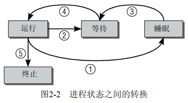

### 僵尸进程

内存此外有一种特殊的进程状态是所谓的“僵尸”状态。这样的进程已经死亡，但任然以某种方式活着。这些进程的资源（内存、与外设的连接等）已经释放，因此它们也绝不会再运行，但是进程表中仍然有其对应的表项。

僵尸进程的产生原因在于UNIX操作系统下进程创建和销毁的方式。有两种事件发生时，程序将终止运行。第一，程序必须由另一个进程或一个应用杀死（通常是通过发送SIGTERM或SIGKILL信号来完成，这等价于正常地终止线程）：进程的父进程在子进程终止时必须调用或已经调用wait4（wait for)系统调用，这相当与向内核证实父进程已经确认子进程的终结。该系统调用使得内核可以释放为子进程保留的资源。

只有在第一个条件发生（程序终止）而第二个条件不成立（wait4），才会出现“僵尸”状态。在进程终止后，其数据尚未从进程表删除之前，进程总是暂时处于“僵尸”状态。有时候僵尸进程可能稳定寄生于进程状态表中，直至下一次系统重启。从进程工具（ps或top等）的输出，可以看到僵尸进程。因为残余的数据在内核总所占用的空间极小，所以问题不大。

### 抢占式多任务处理

Linux进程管理的结构中还需要另外两种进程状态选项：用户态和核心态。这反映了所有现代CPU都至少有两种不同执行 状态，其中一种有无限的权利，而另一种会受限制。

进程通常处于用户态，只能访问自身的数据，无法干扰系统中的其他应用程序，甚至也不会注意到自身以外的其他程序的存在。

如果进程想要访问系统数据或功能，则必须切换到和心态。显然这只能在受控情况下完成，否则建立的所有保护机制都是多余的，而这种访问必须经由明确定义的路径。包括系统调用、中断。

从用户态切换到核心态可以通过中断，此时切换是自动触发的。系统调用是由用户应用程序有意调用的，中断的发生或多或少是不可预测的。处理中断的操作，通常与中断发生时执行的进程无关。

内核的抢占调度模型建立了一个层次结构，用于判断哪些进程状态可以由其他状态抢占。

- 普通进程总是可能被抢占，甚至是由其他进程抢占。对于实现良好的交互行为和低系统延迟，这种抢占起到了重要作用。
- 如果系统处于核心态并正在处理系统调用，那么系统中的其他进程是无法夺取其CPU时间的。调度器必须等到系统调用执行结束，才能选择另一个进程执行，但中断可以终止系统调用。
- 中断可以暂停处于用户态和核心态的进程。中断具有最高优先级，因为在中断触发后需要尽快处理。

在内核2.5中，内核抢占`kernel preemption`的选型被添加进内核。该选项支持在紧急情况下切换到另一个线程，甚至当前是处于核心态执行系统调用（中断处理期间是不行的）。尽管内核会试图尽快执行系统调用，但对于依赖恒定数据流的应用程序来说，系统调用所需的时间仍是太长。内核抢占可以减少这样的等待时间，因而保证“更平滑”的程序执行。但该特性的代价是增加内核的复杂度，因为接下来有许多数据结构 需要针对并发访问进行保护，即使在单处理器系统上也是如此。

## 进程表示

### task_struct

Linux内核涉及进程和程序的所有算法都围绕一个名为`task_struct`的数据结构建立。这是系统中主要的一个数据机构。在阐述调度器实现之前，了解一下Linux管理进程方式是必要的。

task_struct包含很多成员，将进程与各个内核子系统联系起来。

```C
<sched.h>
struct task_struct {
    volatile long  state;				// 进程状态, -1表示不可运行, 0表示可运行, >0表示停止
    
    int prio, static_prio, normal_prio;	//prio
    
    const struct sched_entity *sched_class;//调度类 / 调度策略(算法)
    struct sched_entity se;				//调度实体
    
    struct mm_struct *mm;				// 虚拟内存结构体 
    
    pid_t  pid;							// 进程号
    
    struct task_struct *parent;			// 指向父进程的指针
    
    struct list_head  children;			// 子进程链表
    
    uid_t uid, euid, suid, fsuid;
    
    struct fs_struct  *fs;				// 存放文件系统信息的指针
    
    struct files_struct *files;			// 一个数组，包含该进程打开的文件指针
};
```

task_struct中的许多成员并非简单类型变量，而是指向其他数据结构的指针。

task_struct中对进程管理的实现一些非常重要的成员包括：

> `state`指定进程当前的状态，可使用以下值（预处理常数，定义于`<sched.h>`中）
>
> - `TASK_RUNNING`  处于可运行状态。该状态确保进程可以立即执行，而无需等待外部事件。
> - `TASK_INTERRUPTIBLE` 针对某时间或其他资源的睡眠进程上。在内核发送信号给该进程表明事件已发生，进程状态切换为`TASK_RUNNING`。
> - `TASK_UNINTERRUPTIBLE` 用于因内核指示而停用的睡眠进程，只能由内核亲自唤醒
> - `TASK_STOPPED` 进程特意停止运行，例如，由调试器暂停

下列常量可以用于`struct task_struct`的进程状态字段，也可以用与`exit_state`字段，后者明确用于退出进程

- `EXIT_ZOMBIT` 僵尸状态
- `EXIT_DEAD` 指wait系统调用已发出，而进程完全从系统移除之前的状态。只有多个线程对同一个进程发出wait调用时，该状态才有意义。

Linux提供资源限制`resource limit，rlimit`机制，对进程使用系统资源施加某些限制。该机制利用了`task_struct`中的`rlim`数组，数组项类型为`struct rlimit`。

```C
<resource.h>
struct rlimit{
    unsigned long rlim_cur;		//进程当前的资源限制，也称之为软限制
    unsigned long rlim_max;		//该限制的最大容许值，也称之为硬限制
}
```

系统调用`setrlimit`来增减当前限制，但不能超出`rlim_max`的限制。`getrlimits`用于检查当前限制。

### 进程类型

典型的UNIX进程包括：由二进制代码组成的应用功能程序、单线程、分配给应用程序的一组资源（内存、文件等）。新进程是使用fork和exec系统调用产生的。

- fork生成当前进程的一个相同副本，即子进程。原进程的所有资源都以适当的方式复制到子进程，因此该系统调用之后，原来的进程就有了两个独立的实例。这两个实例的联系包括：同一组打开文件、同样的工作目录、内存中同样的数据等。
- exec从一个可执行的二进制文件加载另一个应用程序，来代替当前运行的程序。换句话说，加载了一个新程序。因为exec并不创建新进程，所以必须首先使用fork复制一个旧的程序，然后调用exec在系统上创建另一个应用程序。

Linux还提供了clone系统调用。clone的工作原理基本上与fork相同，但新进程不是独立于父进程的，而可以与其共享某些资源。可以执行需要共享和复制的资源种类，例如父进程的内存数据、打开的文件等。

clone用于实现线程，但仅仅该系统调用不足以实现这一点，还需要用户空间库才能提供完整的实现。

### 命名空间

命名空间提供了一种虚拟化的一种轻量级形式，是的可以从不同方面来查看运行系统的全局属性。该机制类似于Solaris中的zone或FreeBSD中的jail。

Linux的命名空间机制提供了一种资源隔离的解决方案。PID,IPC,Network等系统资源不再是全局性的，而是属于特定的Namespace。Namespace是对全局系统资源的一种封装隔离，使得处于不同namespace的进程拥有独立的全局系统资源，改变一个namespace中的系统资源只会影响当前namespace里的进程，对其他namespace中的进程没有影响。

#### 概念

在虚拟化系统中，一台物理机可以运行多个内核，可能是并行的多个不同的操作系统。而命名空间则只使用一个内核在一台物理机上运作，所有全局资源通过命名空间抽象起来。这使得可以将一组进程放到容器中，各个容器彼此隔离。隔离可以是容器的成员与其他容器毫无关系。但也可以通过允许容器进行一定的共享，来降低容器之间的隔离。例如，容器可以设置为使用自身的PID集合，但仍然与其他容器共享部分文件系统。

本质上，命名空间建立了系统的不同视图。此前的每一项全局资源都必须包装到容器数据结构中，只有资源和包含资源的命名空间构成的二元组仍然是全局唯一的。虽然在给定容器内部资源是自足的，但无法提供在容器外部具有唯一性的ID。

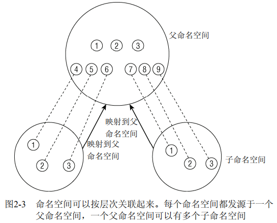


考虑系统上有3个不同命名空间的情况。一个命名空间是父命名空间，衍生两个子命名空间。假定容器用于虚拟主机配置中，其中的每个容器必须看起来像是单独的一台Linux计算机。因此其中每一个都有自身的init进程，PID为0，其他进程的PID以递增次序分配。两个子命名空间都有PID为0的init进程，以及PID分别为2和3的两个进程。由于相同的PID在系统中出现多次，PID号不是全局唯一的。

新的命名空间可以用下面两种方法创建。

(1) 在用fork或clone系统调用创建新进程时，有特定的选项可以控制是与父进程共享命名空间，还是建立新的命名空间。

(2) `unshare`系统调用将进程的某些部分从父进程分离，其中也包括命名空间。更多信息参见手册`unshare(2)`。

在进程已经使用上述的两种机制之一从父进程命名空间分离后，从该进程的角度来看，改变全局属性不会传播到父进程命名空间，而父进程的修改也不会传播到子进程，至少对于简单的量是这样。

#### 实现

命名空间的实现需要两个部分：每个子系统的命名空间结构，将此前所有的全局组件包装到命名空间中；将给定进程关联到所属各个命名空间的机制。

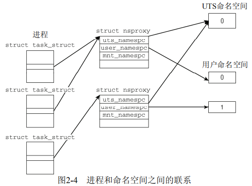

子系统此前的全局属性现在封装再命名空间中，每个进程关联到一个选定的命名空间。每个可以感知命名空间的内核子系统都必须提供一个数据结构，将所有通过命名空间形式提供的对象集中起来。`struct nsproxy`用于汇集指向与特定子系统的命名空间包装器的指针：

```C
<nsproxy.h>
struct nsproxy{
  	atomic_t count;
    struct uts_namespace *uts_ns;
    struct ipc_namespace *ipc_ns;
    struct mnt_namespace *mnt_ns;
    struct pid_namespace *pid_ns;
    struct user_namespace *user_ns;
    struct net *net_ns;
};
```

当前内核的以下范围可以感知到命名空间：

- UTS命名空间包含了运行内核的名称、版本、底层体系结构类型等信息。`UTS, UNIX Timesharing System`
- 保存在`struct ipc_namespace`中的所有与进程间通信`IPC`有关的信息
- 已经装载的文件系统的视图，在`struct mnt_namespace`中给出
- 有关进程ID的信息，由`struct pid_namespace`提供
- `struct user_namespace`保存的用于限制每个用户资源使用的信息
- `struct net_ns`包含所有网络相关的命名空间参数

每个命名空间都有一个对应的标志

```C
<sched.h> 
#define CLONE_NEWUTS 0x04000000 /* 创建新的utsname组 */ 
#define CLONE_NEWIPC 0x08000000 /* 创建新的IPC命名空间 */ 
#define CLONE_NEWUSER 0x10000000 /* 创建新的用户命名空间 */ 
#define CLONE_NEWPID 0x20000000 /* 创建新的PID命名空间 */ 
#define CLONE_NEWNET 0x40000000 /* 创建新的网络命名空间 */
```

每个进程都关联到自身的命名空间视图：

```C
<sched.h>
struct task_struct{
...
/*命名空间*/
	struct nsproxy *nsproxy;
...
}
```

因为使用了指针，多个进程可以共享一组子命名空间。这样修改给定的命名空间，对于所有属于该命名空间的进程都是可见的。

对命名空间的支持必须在编译时启用，而且必须逐一指定需要支持的命名空间。但对命名空间的一般性支持总会编译到内核中。

init_nsproxy定义了初始的全局命名空间，其中维护了指向各子系统初始的命名空间对象的指针：

```C
<kernel/nsproxy.c>
struct nsproxy init_nsproxy = INIT_NSPROXY(init_sproxy);

<init_task.h>
#define INIT_NSPROXY(nsproxy){ \
		.pid_ns = &init_pid_ns, \
		.count = ATOMIC_INIT(1), \
		.uts_ns = &init_uts_ns, \
		.mnt_ns = NULL, \
		INIT_NET_NS(net_ns) \
		INIT_IPC_NS(ipc_ns) \
		.user_ns = &init_user_ns, \
}
```

#### UTS命名空间

UTS命名空间几乎不需要特别的处理，因为它只需要简单量，没有层次组织。所有相关信息都汇集到下列结构的一个实例中

```C
<utsname.h>
struct uts_namespace{
    struct kref kref;		//嵌入的引用计数器，可用于跟踪内核中有多少地方使用了uts_namespace的实例
    struct new_utsname name;//包含uts_namespace所提供的属性信息本身
};

struct new_utsname {  
    char sysname[65]; 		//系统名称
    char nodename[65]; 		//
    char release[65]; 
    char version[65]; 		//内核发布版本
    char machine[65]; 		//机器名
    char domainname[65]; 
};
```

使用`uname`工具可以获取`uts_namespace`属性的值，也可以在/proc/sys/kernel/中看到.

#### 用户命名空间

用于隔离用户。用户命名空间在数据结构管理方面类似UTS：要求在创建新的用户命名空间时，则生成当前用户命名空间的一个副本，并关联到当前进程的`nsproxy`实例。

```C
<user_namespace.h> 
struct user_namespace { 
    struct kref kref; 		//引用计数器，跟踪多少地方需要使用user_namespace实例
    struct hlist_head uidhash_table[UIDHASH_SZ]; //通过散列表uidhash_table访问各个实例
    struct user_struct *root_user; 	//命名空间的每个用户，都有一个user_struct实例记录其资源消耗
};
```

### 进程ID号

UNIX进程总会分配一个号码用于其在命名空间内唯一标识它们。该号码被称作进程ID，简称PID。用fork或clone产生的每个进程都由内核自动地分配一个新的唯一的PID值。

#### 进程ID

每个进程除了PID还有其他ID：

- 处于某个线程组中的所有进程都用统一的线程组ID(TGID)。如果进程没有使用线程，则其PID余TGID相同。线程组中的主进程被称为组长。通过clone创建的所有线程的`task_struct`的`group_leader`成员，会指向组长的`task_struct`实例。
- 独立进程可以合并成线程组（使用setpgrp系统调用）。进程组成员的`task_struct`的`pgrp`属性值都是相同的，即进程组组长的PID。注意，用管道连接的进程包含在同一个进程组中。
- 几个进程组可以合并成一个会话。会话中的所有进程都有同样的会话ID，保存在`task_struct`的`session`成员中。SID可以使用setsid系统调用设置。

## 进程管理相关的系统调用

### 进程复制

传统UNIX中用于复制进程的系统调用是fork。但并不是Linux为此实现的唯一调用：

- fork是重量级调用，因为它建立父进程的一个完整副本，然后作为子进程执行。为减少与该调用相关的工作量，Linux使用了写时复制`copy-on-write`技术。
- vfork类似于fork，但并不创建父进程数据的副本。相反，父子进程之间共享数据。vfork设计用于子进程形成后立即执行execve系统调用加载新程序的情形。在子进程退出或开始新程序之前，内核保证父进程处于堵塞状态。由于fork使用了写时复制，vfork速度不在有优势，应该避免使用。
- clone产生线程，可对父子进程之间的共享、复制进行精确控制

#### 写时复制

内核使用了写时复制`copy-on-write, COW`技术，以防止在fork执行时将父进程的所有数据复制到子进程。

使用了写时复制后，进程通常只使用了其内存页的一小部分。在调用fork时，内核通常对父进程的每个内存页，都为子进程创建一个相同的副本。会导致大量的内存使用以及耗费很长时间进行复制操作。

如果应用程序在进程复制之后使用exec立即加载新程序，那么负面效应会更严重。这意味着在之前的复制操作时多余的，因为进程地址空间会重新初始化，复制的数据不再需要了。

内核选择不复制整个地址空间，只复制其页表。这样就建立了虚拟地址空间和物理内存页之间的联系。因此fork之后父子进程的地址空间指向相同的物理页。

当然父子进程不能修改彼此的页，这也是两个进程的页表对页标记了只读访问的原因，即使普通环境下允许写入也是如此。

如果页表将一页标记为“只读”，但通常情况下该页应该是可写的，内核可以根据此条件来判断该页实际上的COW页。因此内核会创建该页专用于当前进程的副本，当然也可用于写操作。

COW机制使得内核尽可能延迟内存页的复制，更重要的是，再很多情况下不需要复制。节省了大量时间。

#### 执行系统调用

fork、vfork、clone系统调用的入口点分别是sys_fork、sys_vfork、sys_clone函数。其定义依赖于具体的体系函数，因为在用户空间和内核空间之间传递参数的方法因体系结构而异。上述函数的任务是从处理器寄存器中提取用户空间提供的信息，调用体系无关的do_fork函数，后者负责进程复制。该函数实现原型为

```C
kernel/fork.c
long do_fork(unsigned long clone_flags, //标志集合，用来指定控制复制过程的一些属性
             unsigned long stack_start,	//用户状态下栈的起始地址
             struct pt_regs *regs, 		//指向寄存器集合的指针，以原始形式保存了调用参数
             unsigned long stack_size, 	//用户状态下栈的大小。通常是不需要的，设置为0
             int __user *parent_tidptr, //指向用户空间中地址的指针，指向父进程PID
             int __user *child_tidptr)	//指向子进程PID
```

不同fork变体，主要通过标志集合区分。在大多数体系结构上，典型的fork调用的实现方式与IA-32处理器相同

```C
arch/x86/kernel/process_32.c 
asmlinkage int sys_fork(struct pt_regs regs) 
{ 
	return do_fork(SIGCHLD, regs.esp, &regs, 0, NULL, NULL); 
}
```

唯一使用的标志是SIGCHLD。这意味着在子进程终止后发送SIGCHLD信号通知父进程。最初，父子进程的栈地址相同（起始地址保存在IA-32系统的esp寄存器中）。但如果操作栈地址并写入数据，则COW机制会为每个进程分别创建一个栈副本。

如果do_fork成功，则新建进程的PID作为系统调用的返回结果，否则返回错误码。

sys_vfork的实现与sys_fork只是略微不同，前者使用了额外的标志（CLONE_VFORK和CLONE_ VM）

sys_clone的实现方式与上述调用相似，差别在于do_fork如下调用

```C
arch/x86/kernel/process_32.c 
asmlinkage int sys_clone(struct pt_regs regs) 
{ 
    unsigned long clone_flags; 
    unsigned long newsp; 
    int __user *parent_tidptr, *child_tidptr; 
    clone_flags = regs.ebx; 
    newsp = regs.ecx; 
    parent_tidptr = (int __user *)regs.edx; 
    child_tidptr = (int __user *)regs.edi; 
    if (!newsp) 
    newsp = regs.esp; 
    return do_fork(clone_flags, newsp, &regs, 0, parent_tidptr, child_tidptr); 
}
```

标志不再是硬编码的，而是可以通过各个寄存器参数传递到系统调用。因而该函数的第一部分负责提取这些参数。另外，也不再复制父进程的栈，而是可以指定新的栈地址（newsp）。在生成线程时，可能需要这样做，线程可能与父进程共享地址空间，但线程自身的栈可能在另一个地址空间。另外还指定了用户空间中的两个指针（`parent_tidptr`和`child_tidptr`），用于与线程库通信。

#### do_fork实现

所有3个fork机制最终都调用了kernel/fork.c中的do_fork（一个体系结构无关的函数），其代码流程如下

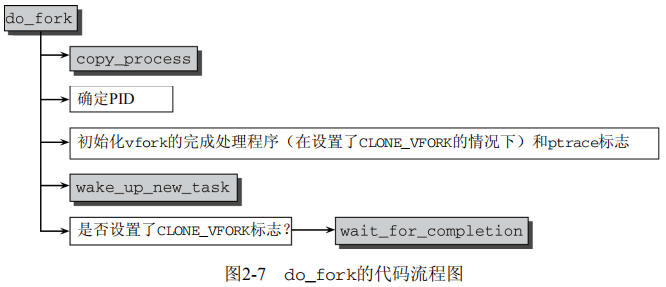

do_fork以调用copy_process开始，后者执行生成新进程的实际工作，并根据指定的标志重用父进程的数据。

#### 复制进程

在do_fork中大多数工作是由copy_process函数完成的，其代码流程如图所示。请注意，该函数必须处理3个系统调用（fork、vfork和clone）的主要工作。

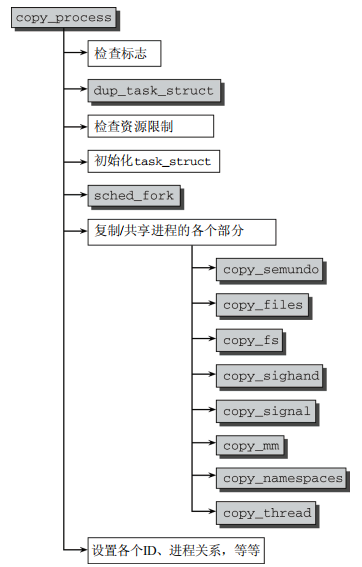

### 内核线程

内核线程是直接由内核本身启动的进程。内核线程实际上是将内核函数委托给独立的进程，与系统中其他进程“并行”执行（实际上，也并行于内核自身的执行）。内核线程常称为（内核）守护进程。用于执行以下任务：

-  周期性地将修改的内存页与页来源块设备同步（例如，使用mmap的文件映射）。
- 如果内存页很少使用，则写入交换区。
- 管理延时动作（deferred action）。
- 实现文件系统的事务日志。

基本上，有两种类型的内核线程

- 类型1：线程启动后一直等待，直至内核请求线程执行某一特定操作。
- 类型2：线程启动后按周期性间隔运行，检测特定资源的使用，在用量超出或低于预置的限制值时采取行动。内核使用这类线程用于连续检测任务。

调用kernel_thread函数可启动一个内核线程。其定义是特定于体系结构的，但原型总是相同的。

```C
<asm-arch/processor.h> 
int kernel_thread(int (*fn)(void *), void * arg, unsigned long flags)
```

产生的线程执行用fn指针传递的函数，而用arg指定的参数将自动传递给该函数。flags中可指定CLONE标志。

### 启动新程序

通过新代码替换现存程序，即可启动新程序。Linux提供的execve系统调用可完成新程序的启动。

#### execve实现

该系统调用的入口点是体系结构相关的sys_execve函数。该函数很快将其工作委托给系统无关的do_execve例程

```C
kernel/exec.c
int do_execve(char * filename, 			 //可执行文件的名称
              char __user *__user *argv, //指向程序的参数
              char __user *__user *envp, //指向环境的指针
              struct pt_regs * regs)	 //寄存器集合
```

argv和envp都是指针数组，而且指向两个数组自身的指针以及数组中的所有指针都位于虚拟地址空间的用户空间部分。

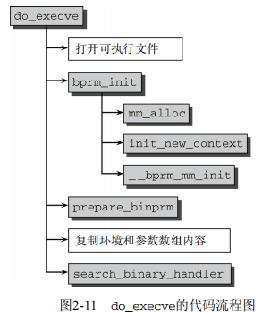

首先打开要执行的文件，即内核找到相关的inode并生成一个文件描述符，用于寻址该文件。

`bprm_init`接下来处理若干管理性任务：`mm_alloc`生成一个新的`mm_struct`实例来管理进程地址空间。`init_new_context`是一个特定于体系结构的函数，用于初始化该实例，而`__bprm_mm_init`则建立初始的栈。

### 退出进程

进程必须用exit系统调用终止。这使得内核有机会将该进程使用的资源释放回系统。该调用的入口点是`sys_exit`函数，需要一个错误码作为其参数，以便退出进程。其定义是体系结构无关的，见`kernel/exit.c`。然后很快将工作委托给`do_exit`。

简而言之，该函数的实现就是将各个引用计数器减一，如果引用计数器归0而没有进程再使用对应的结构，那么将相应的内存区域返还给内存管理模块。


## 调度器的实现

内存中保存了对每个进程的唯一描述，并通过若干数据结构与其他进程连接起来。调度器面对的情形就是这样，其任务是在程序之间共享CPU时间，创造并行执行的错觉。该任务分为两个不同部分：一个涉及调度策略，另一个涉及上下文切换。

### 概观

内核必须要提供一种方法，在各个进程之间尽可能公平地共享CPU时间。

schedule函数是理解调度操作的起点。该函数定义在`kernel/sched.c`中，是内核代码中最常调用的函数之一。调度器的实现受若干因素的影响而稍显模糊。

- 在多处理器上，必须注意几个细节，避免调度器自相干扰
- 不仅实现优先调度，还实现了`POSIX`标准需要的其他两种软实时策略
- 使用goto以生成最优的汇编语言代码。

Linux调度器的一个杰出特性是，它不需要时间片概念，至少不需要传统的时间片。

调度器的一般原理是，按所能分配的计算能力，向系统中的每个进程提供最大的公平性。

每次调用调度器时，它会挑选具有最高等待时间的进程，把CPU提供给该进程。如果经常发生这种情况，那么进程的不公平待遇不会累积，不公平会均匀分布到系统中的所有进程。
下图说明了调度器如何记录哪个进程已经等待了多长时间。由于可运行进程是排队的，该结构称之为就绪队列。

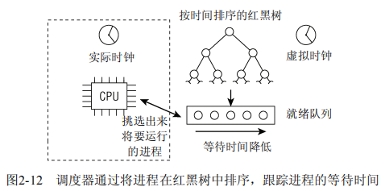

所有可运行进程都按照时间在一个红黑树中排序，所谓时间即其等待时间。等待CPU时间最长的进程如果是最左侧的项，调度器下一次会考虑该进程。等待时间稍短的进程在该树上从左至右排序。

红黑树对所包含的项提供了高效的管理，该树管理的进程数目增加时，查找、插入、删除操作需要的时间只会适度地增加。红黑树是内核的标准数据结构。

除了红黑树外，就绪队列还装备了虚拟时钟，该时钟的流逝速度慢于实际的时钟，精确的速度依赖于当前调度器挑选的进程的数目。假定该队列上有4个进程，那么虚拟时钟将以实际时钟四分之一的速度运行。如果以完全公平的方式分享计算能力，那么该时钟是判断等待进程将获得多少CPU时间的基准。在就绪队列等待实际的2-秒，相当于虚拟时间5秒。4个进程分别执行5秒，即可使CPU被实际占用20秒。

假定就绪队列的虚拟时钟由fair_clock给出，而进程的等待时间保存在wait_runtime。为排序红黑树上的进程，内核使用插值fair_clock - wait_runtime。fair_clock是完全公平调度的情况下进程将会得到的CPU时间的度量，而wait_runtime直接度量了实际系统的不足造成的不公平。

在线程允许运行时，将从wait_runtime减去它已经允许的时间。这样，在按时间排序的树中它会向右移动到某一点，另一进程将成为最左边，下一次会被调度器选择。但注意，在进程运行时fair_clock中的虚拟时钟会增加。这实际上意味着，进程在完全公平的系统中接收的CPU时间份额，是在推演自在实际的CPU上会花费的时间。这减缓了削弱不公平状况的过程：减少wait_runtime等价于降低进程受到的不公平对待的数量，但内核无论如何不能忘记，用于降低不公平性的一部分时间，实际上属于处于完全公平世界中的进程。再次假定就绪队列上有4个进程，而一个进程实际上已经等待了20秒。现在它允许运行10秒：此后的wait_runtime是10，但由于该进程无论如何都会得到该时间段中的10/4 = 2秒，因此实际上只有8秒对该进程在就绪队列中的新位置起了作用。

实际上，还要考虑一些其他实际问题：

- 进程的不同优先级（即nice值）必须考虑，更重要的进程必须比次要进程更多的CPU时间份额
- 进程不能切换得太频繁，会有很大的上下文切换开销

### 数据结构

调度器使用一系列数据结构，来排序和管理系统中的进程。调度器的工作方式与这些结构的设计密切相关。

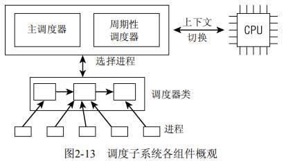

可以用两种方法激活调度。一种是直接的，进程主动休眠或放弃CPU；另一种是通过周期性检查调度。调度器称为通用调度器`generic scheduler`或核心调度器`core scheduler`。本质上，通用调度器是一个分配器，与其他两个组件交互。

每个进程都刚好属于某一调度类，各个调度类负责管理所属的进程。通用调度器自身完全不涉及进程管理，其工作都委托给调度器类。

#### task_struct成员

```c
<sched.h> 
struct task_struct { 
    ... 
    int prio, static_prio, normal_prio; 
    unsigned int rt_priority; 
    struct list_head run_list; 
    const struct sched_class *sched_class; 
    struct sched_entity se; 
    unsigned int policy; 
    cpumask_t cpus_allowed; 
    unsigned int time_slice; 
    ... 
}
```

- `task_struct`采用了3个成员来表示进程的优先级：`prio`、`normal_prio`表示动态优先级，`static_prio`表示进程的静态优先级。静态优先级是进程启动时分配的优先级。可以用`nice`和`sched_setscheduler`系统调用修改，否则在进程运行期间会一直保持不变。

- `normal_prority`表示基于进程的静态优先级和调度策略计算出来的优先级。因此，即使普通进程和实时进程具有相同的静态优先级，其普通优先级也是不同的。进程分支时，子进程会继承普通优先级。

- 调度器优先考虑的优先级保存在`prio`。由于在某些情下内核需要暂时提高进程的优先级，因此需要第三个成员来表示。

- `rt_priority`表示实时进程的优先级。该值不会替代前面的优先级。实时优先级为0-99，越大优先级越高。

- `sched_class`表示该进程所属的调度器类。
- 调度器不限于调度进程，可以处理更大的实体。调度器设计为处理可调度的实体，在`task_struct`中内嵌一个`sched_entity`实例se，即为调度实体，调度器可据此操作各个`task_struct`(这里se不是指针)。
- `policy`保存了对该进程应用的调度策略。
  - `SCHED_NORMAL` 普通进程，通过完全公平调度器来处理
  - `SCHED_BATCH` 用于非交互、CPU使用密集的批处理进程。可通过CFS调度。调度决策对此类进程给予“冷处理”：它们决不会抢占CFS调度器处理的另一个进程，因此不会干扰交互式进程。如果不打算用nice降低进程的静态优先级，同时又不希望该进程影响系统的交互性，此时最适合使用该调度类。
  - `SCHED_IDLE` 优先级较低的进程。其相对权重总是最小的。
  - `SCHED_RR` 用于实现软实时进程。实现了一种循环算法，即时间片轮转。不是由CFS调度，而是由实时调度器类处理。
  - `SCHED_FIFO` 用于实现软实时进程。使用先进先出机制。由实时调度器处理。辅助函数`rt_policy`用于判断给出的调度策略是否属于实施类（`SCHED_RR`和`SCHED_FIFO`）。`task_has_rt_policy`用于对给定进程判断该性质。
- `cpus_allowed`是一个位域，在多处理器系统上使用，用来限制进程可以在哪些CPU上运行。
- `run_list`和`time_slice`是循环实时调度器需要使用的，但不用于CFS。`run_list`是一个表头，用于维护一个包含各进程的一个运行表，`time_slice`则指定进程可使用CPU剩余时间段

#### 调度器类

调度器类提供了通用调度器和各个调度方法之间的关联。调度器类由特定的数据结构中汇集的几个函数指针表示。全局调度器请求的各个操作都可以由一个指针来表示。这使得无需了解不同调度器内部工作原理，即可创建通用调度器。

调度器类定义：

```C
<sched.h> 
struct sched_class { 
    const struct sched_class *next; 
    void (*enqueue_task) (struct rq *rq, struct task_struct *p, int wakeup); 
    void (*dequeue_task) (struct rq *rq, struct task_struct *p, int sleep); 
    void (*yield_task) (struct rq *rq); 
    void (*check_preempt_curr) (struct rq *rq, struct task_struct *p); 
    struct task_struct * (*pick_next_task) (struct rq *rq); 
    void (*put_prev_task) (struct rq *rq, struct task_struct *p); 
    void (*set_curr_task) (struct rq *rq); 
    void (*task_tick) (struct rq *rq, struct task_struct *p); 
    void (*task_new) (struct rq *rq, struct task_struct *p); 
};
```

对于各个调度类，都必须提供一个struct `sched_class`的一个实例。调度类之间的层次结构是平坦的：实时进程最重要，在完全公平进程之前处理；而完全公平进程则优于空闲进程；空闲进程只有CPU无事可做时才可处于活动状态。`next`成员将不同调度类的`sched_class`实例，按照上述顺序连起来。这个层次结构在编译时已建立：没有在运行时动态增加新调度器类的机制。

各个调度类可以提供的操作有

> `enqueue_task` 向就绪队列添加一个新进程。进程从睡眠态转变为可运行态时，即发生该操作。
>
> `dequeue_task` 提供逆向操作，将一个进程从就绪队列里去除。进程从可运行状态到不可运行状态时发生。
>
> `sched_yeild` 系统调用，进程资源放弃对处理器的控制权。导致内核调用`yield_task`。
>
> `check_preempt_curr` 用一个新唤醒的进程来抢占该进程。例如用`wake_up_new_task`唤醒新线程时使用。
>
> `set_cur_task` 进程调度策略发生变化。
>
> `task_tick` 每次激活周期性调度器时，由周期性调度器调用。
>
> `new_task` 用于建立fork系统调用和调度器之间的关联。每次新线程建立后，则用`new_task`通知调度器。 

用户层应用程序无法直接与调度类交互。它们只知道上文定义的常量`SCHED_xxx`。在这些常量和可用的调度类之间提供适当的映射，这是内核的工作。`SCHED_NORMAL`、`SCHED_BATCH`和`SCHED_IDLE`映射到`fair_sched_class`，而`SCHED_RR`和`SCHED_FIFO`与`rt_sched_class`关联。`fair_sched_class`和`rt_sched_class`都是`struct sched_class`的实例，分别表示完全公平调度器和实时调度器。

#### 就绪队列

核心调度器用于管理活动进程的主要数据结构为就绪队列。每个CPU都有自身的就绪队列，各个活动进程只出现在一个就绪队列中。在多个CPU上同时运行一个进程是不可能的。

就绪队列是全局调度器许多操作的起点。但注意进程并不是由就绪队列的成员直接管理的。这是各个调度器的职责，因此在各个就绪队列中嵌入特定于调度器类的子就绪队列。

就绪队列用下述数据结构实现

```C
kernel/sched.c 
struct rq { 
    unsigned long nr_running;  //指定队列上可运行线程的数目，不考虑其优先级或调度器
    #define CPU_LOAD_IDX_MAX 5 
    unsigned long cpu_load[CPU_LOAD_IDX_MAX];  //用于跟踪此前的符合状态
    ... 
    struct load_weight load; //提供就绪队列当前复核的度量。与当前活动进程数目成正比，各进程优先级为权重
    struct cfs_rq cfs; 	//公平调度器队列，嵌入的就绪子队列
    struct rt_rq rt; 	//实时调度器队列，嵌入的就绪子队列
    struct task_struct *curr, *idle;  //curr指向当前运行的进程的task_struct实例
    								//idle指向idle进程的task_struct实例，该进程亦为idle线程
    u64 clock;  //用于实现就绪队列自身的时钟。每次调用周期性调度器时，都会更新clock值。
    ... 
};
```

系统中所有就绪队列都在`runqueues`数组中，该数组每个元素分别对应于系统中的一个CPU。

```C
kernel/sched.c
static DEFINE_PRE_CPU_SHARED_ALIGNED(struct rq, runqueues);
```

内核中还定义有一些其他的宏使用

```C
kernel/sched.c 
#define cpu_rq(cpu) (&per_cpu(runqueues, (cpu))) 
#define this_rq() (&__get_cpu_var(runqueues)) 
#define task_rq(p) cpu_rq(task_cpu(p)) 
#define cpu_curr(cpu) (cpu_rq(cpu)->curr)
```

#### 调度实体

由于调度器可以操作比进程更一般的实体，因此需要一个适当的数据结构来描述此类实体。定义为:

```C
<sched.h> 
struct sched_entity { 
    struct load_weight load; //用于负载均衡，指定权重，决定了各个实体占
    struct rb_node run_node; //标准的树节点，使得实体可以在红黑树上排序
    unsigned int on_rq; 	//表示该实体现在是否在就绪队列上接受调度
    u64 exec_start; 	//
    u64 sum_exec_runtime; //记录消耗的CPU时间，以用于完全公平调度
    u64 vruntime; //在进程执行期间虚拟时钟上流逝的时间数量由vruntime统计
    u64 prev_sum_exec_runtime; //在进程被撤销CPU时，当前sum_exec_runtime值保存到		
    							//pre_sum_exec_tuntime。此后在进程抢占是还需要改数据
    ... 
}
```

如果编译内核时启用了调度器统计，那么该结构也会包含许多统计的成员。如果启动组调度，会增加一些成员。

在进程运行时，我们需要记录消耗的CPU时间，以用于完全公平调度器。`sum_exec_runtime`即用于该目的。跟踪运行时间是由`update_curr`不断累积完成的。调度器中许多地方都会调用该函数，例如，新进程加入就绪队列时，或者周期性调度器中。每次调用时，会计算当前时间和`exec_start`之间的差值，exec_start则更新到当前时间。差值则被加到`sum_exec_runtime`。

由于每个task_struct都嵌入一个`sched_entity`实例，所以所有进程是可调度实体。可调度实体不一定是进程。

### 处理优先级

#### 优先级的内核表示

在用户空间可以通过nice命令设置进程的静态优先级，这在内部会调用nice系统调用。进程的nice值在[-20,19]。值越低，表明优先级越高。

内核使用一个简单些的数值范围，[0,139]，用来表示内部优先级。值越低，优先级越高。从0到99的范围专供实时进程使用。nice值[-20,19]映射到范围[100,139]。实时进程的优先级总是比普通进程高。

下列宏用于在不同表示形式之间转换（MAX_RT_PRIO指定实时进程的最大优先级，而MAX_PRIO则是普通进程）

```C
#define MAX_USER_RT_PRIO 100 
#define MAX_RT_PRIO MAX_USER_RT_PRIO 
#define MAX_PRIO (MAX_RT_PRIO + 40) 
#define DEFAULT_PRIO (MAX_RT_PRIO + 20) 

kernel/sched.c 
#define NICE_TO_PRIO(nice) (MAX_RT_PRIO + (nice) + 20) 
#define PRIO_TO_NICE(prio) ((prio) -MAX_RT_PRIO -20) 
#define TASK_NICE(p) PRIO_TO_NICE((p)->static_prio)
```

#### 计算优先级

只考虑静态优先级是不够的，还必须考虑下面三个优先级。即动态优先级`task_struct->prio`、普通优先级`task_struct->normal_prio`和静态优先级`task_struct->static_prio`。这些优先级按一定方式彼此关联。

`task_struct->static_prio`是计算的起点。假定已设置好，内核计算其他优先级，只需

```c
p->prio = effective_prio(p);
//辅助函数effective_prio执行下列操作
kernel/sched.c 
static int effective_prio(struct task_struct *p) 
{ 
    p->normal_prio = normal_prio(p); 
    /* 
    * 如果是实时进程或已经提高到实时优先级，则保持优先级不变。否则，返回普通优先级：
    */ 
    if (!rt_prio(p->prio)) 
    	return p->normal_prio; 
    return p->prio; 
}
```

这里首先计算了普通优先级，并保存在`normal_priority`。这一个函数调用设置了两个优先级prio和normal_prio。另一个辅助函数rt_prio，会检测普通优先级是否在实时范围中，即是否小于`MAX_RT_PRIO`。

假定在处理普通进程，不涉及实时调度。在这种情况下，`normal_prio`只是返回静态优先级。结果很简单：所有3个优先级都是同一个值，即静态优先级！
实时进程的情况有所不同。注意普通优先级的计算方法

```C
kernel/sched.c 
static inline int normal_prio(struct task_struct *p){ 
    int prio; 
    if (task_has_rt_policy(p)) 
    	prio = MAX_RT_PRIO-1 -p->rt_priority; 
    else 
    	prio = __normal_prio(p); 
    return prio; 
}

static inline int __normal_prio(struct task_struct *p) { 
	return p->static_prio; 
}
```

普通优先级要根据普通进程和实时进程进行不同计算。`__normal_prio`的计算只适用于普通进程。实时进程需要根据`rt_priority`设置。由于更高的`rt_priority`值表示更高的实时优先级，内核内部优先级的表示则相反，越低的值表示的优先级越高。因此实时进程在内核内部的优先级数值，应该是`MAX_RT_PRIO-1 -p->rt_priority`.

与`effective_prio`相比，实时进程的检测不再基于优先级数值，而是通过task_struct中设置的调度策略来检测。

为什么对此增加一个额外的函数。这是有历史原因的：在原来的O(1)调度器中，普通优先级的计算涉及相当多技巧性的工作。必须检测交互式进程并提高其优先级，而必须“惩罚”非交互进程，以便使系统获得良好的交互体验。这需要大量的启发式计算，它们可能完成得很好，也可能不工作。感谢新的调度器，已经不再需要此类魔法式计算。

为什么内核在`effective_prio`中检测实时进程是基于优先级数值，而非`task_ has_rt_policy`？对于临时提高至实时优先级的非实时进程来说，这是必要的，这种情况可能发生在使用实时互斥量`RT-Mutex`时。

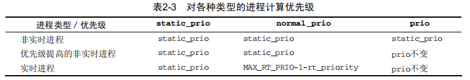

在新建进程用`wake_up_new_task`唤醒时，或使用`nice`系统调用改变静态优先级时，则使用上文给出的方法设置`p->prio`。

请注意，在进程分支出子进程时，子进程的静态优先级继承自父进程。子进程的动态优先级，即`task_struct->prio`，则设置为父进程的普通优先级。这确保了实时互斥量引起的优先级提高不会传递到子进程。

#### 计算负荷权重

进程的重要性不仅是由优先级指定的，还需要考虑保存在`task_struct->se.load`的负荷权重。`set_load_weight`负责根据进程类型及其静态优先级计算负荷权重。

负荷权重包含在数据结构load_weight中

```C
<sched.h>
struct load_weight{
    unsigned long weight, inv_weight;
};
```

内核不仅维护了负荷权重自身，而且还有另一个数值，用于计算被负荷权重除的结果。

一般进程每降低一个nice值，则多获得10%的CPU的时间，每升高一个nice值，则放弃10%的CPU时间。为执行该策略，内核将优先级转换为权重值。转换表为：

```C
kernel/sched.c 
static const int prio_to_weight[40] = { 
    /* -20 */ 88761, 71755, 56483, 46273, 36291, 
    /* -15 */ 29154, 23254, 18705, 14949, 11916, 
    /* -10 */ 9548, 7620, 6100, 4904, 3906, 
    /* -5 */ 3121, 2501, 1991, 1586, 1277, 
    /* 0 */ 1024, 820, 655, 526, 423, 
    /* 5 */ 335, 272, 215, 172, 137, 
    /* 10 */ 110, 87, 70, 56, 45, 
    /* 15 */ 36, 29, 23, 18, 15, 
};
```

对内核使用的范围[0,39]中的每个nice级别，该数组中有一个对应项。各数组之间的乘数因子是1.25。

> 例：两个进程A和B在nice级别0运行，因此两个进程的CPU份额相同，即都是50%。nice级别为0的进程，其权重查表可知为1024。每个进程的份额是1024/（1024+1024）=0.5，即50%。
>
> 如果进程B的优先级加1，那么其CPU份额应该减少10%。换句话说，这意味着进程A得到总的CPU时间的55%，而进程B得到45%。优先级增加1导致权重减少，即1024/1.25≈820。因此进程A现在将得到的CPU份额是1024/(1024+820)≈0.55，而进程B的份额则是820/(1024+820)≈0.45，这样就产生了10%的差值。

执行转换的代码也需要考虑实时进程。实时进程的权重是普通进程的两倍。另一方面，SCHED_IDLE进程的权重总是非常小：

```C
kernel/sched.c 
#define WEIGHT_IDLEPRIO 2 
#define WMULT_IDLEPRIO (1 << 31) 
static void set_load_weight(struct task_struct *p) 
{ 
    if (task_has_rt_policy(p)) { 
        p->se.load.weight = prio_to_weight[0] * 2; 
        p->se.load.inv_weight = prio_to_wmult[0] >> 1; 
        return; 
    } 
    /*
    * SCHED_IDLE进程得到的权重最小：
    */ 
    if (p->policy == SCHED_IDLE) { 
        p->se.load.weight = WEIGHT_IDLEPRIO; 
        p->se.load.inv_weight = WMULT_IDLEPRIO; 
        return; 
    } 
    p->se.load.weight = prio_to_weight[p->static_prio -MAX_RT_PRIO]; 
    p->se.load.inv_weight = prio_to_wmult[p->static_prio -MAX_RT_PRIO]; 
}
```

内核不仅计算出权重本身，还存储了用除法的值。 请注意，每个优先级变化关联10%的CPU时间的特征，导致了权重（和相关的CPU时间）的指数特征。

不仅进程，就绪队列也关联到一个符合权重。每次进程被加到就绪队列时，内核会调用`inc_nr_running`。这样不仅确保就绪队列能够跟踪记录有多少进程在运行，而且将进程的权重添加到就绪队列的权重中。

```C
kernel/sched.c 
static inline void update_load_add(struct load_weight *lw, unsigned long inc) 
{ 
	lw->weight += inc; 
}
static inline void inc_load(struct rq *rq, const struct task_struct *p) 
{ 
	update_load_add(&rq->load, p->se.load.weight); 
} 
static void inc_nr_running(struct task_struct *p, struct rq *rq) 
{ 
    rq->nr_running++; 
    inc_load(rq, p); 
}
```

在进程从就绪队列移除时，会调用对应的函数（dec_nr_running、dec_load、update_ load_sub）。

### 核心调度器

调度器实现基于两个函数：周期性调度器函数和主调度器函数。这些函数根据现有进程的优先级分配CPU时间。

#### 周期性调度器

周期性调度器在`scheduler_tick`中实现，。如果系统正在活动中，内核会按频率HZ自动调用该函数。如果没有进程在等待调度，那么系统可以关闭该调度器以减少消耗。该函数主要有两个任务：

- 管理内核中与整个系统和各个进程的调度相关的统计量。其间执行的主要操作时对各种计数器加一。。
- 激活负责当前进程的调度类的周期性调度方法。

```C
kernel/sched.c 
void scheduler_tick(void) 
{ 
    int cpu = smp_processor_id(); 
    struct rq *rq = cpu_rq(cpu); 
    struct task_struct *curr = rq->curr; 
    ... 
    __update_rq_clock(rq)  //处理就绪队列时钟的更新，本质上就是增加struct rq当前实例的时钟时间戳
    update_cpu_load(rq);  //更新就绪队列的cpu_load[]数组。本质上相当于将数组先存储负荷值向后移动一个位置，将当前就绪队列的负责记入数组的第一个位置。另外，该函数还引入了一些取平均值的技巧，以确保负荷数组的内容不会呈现出太多的不连续跳变。
    
    if (curr != rq->idle) 
		curr->sched_class->task_tick(rq, curr); //调度器类
//task_tick的实现方式取决于底层的调度器类。例如CFS会在该方法中检测是否进程已经运行太长时间，以避免过长延迟
}
```

如果当前进程应该被重新调度，那么调度器类方法会在`task_struct`中设置`TIF_NEED_RESCHED`标志，以表示该请求，而内核会在接下来的适当时机完成该请求。

#### 主调度器

在内核中的许多地方，如果要将CPU分配给与当前活动进程不同的另一个进程，都会直接调用主调度器函数`schedule`。

主调度器`schedule`的实现首先确定当前就绪队列，并在prev中保存一个指向（仍然）活动进程的`task_struct`的指针。

```C
kernel/sched.c 
asmlinkage void __sched schedule(void) 
{ 
    struct task_struct *prev, *next; 
    struct rq *rq; 
    int cpu; 
need_resched: 
    cpu = smp_processor_id(); 
    rq = cpu_rq(cpu); 
    prev = rq->curr; 
...
    //类似周期性调度器，内核利用该时机来更新就绪队列的时钟，并清除当前运行进程task_struct中的重调度标志
    __update_rq_clock(rq);
    clear_tsk_need_resched(prev);
...
    //调度器的模块化结构，大多数工作都可以委托给调度类
	if(unlikely((prev->state & TASK_INTERRUPTIBLE) &&
                unlikely(signal_pending(prev)))) {
        prev->state = TASK_RUNNING; //被信号唤醒，提升为运行进程
    } else {
        deactivate_task(rq, prev, 1); 
        //用相应调度器类的方法使进程停止活动, 实质最终调用sched_class->dqueue_task
    }
    
    prev->sched_class->put_prev_task(rq, prev); //通知调度器类当前运行的进程将要被另一个进程代替
    next = pick_next_task(rq, prev); //选择下一个应该执行的进程
    
    if(likely(prev != next)){ //选择的是一个新进程
        rq->curr = next;
        context_switch(rq, prev, next); //准备并执行硬件级的进程切换
        //context_switch一个接口，供访问特定于体系结构的方法，后者负责执行底层上下文切换。
    }
    
    if(unlikely(test_thread_flag(TIF_NEED_RESCHED)))
        goto need_resched;
    //检测当前进程的重调度位是否设置，并跳转到如上所述的标号，重新开始搜索一个新进程
}
```


#### 与fork的交互

每当使用fork系统调用或其变体之一建立新进程时，调度器有机会用sched_fork函数挂钩到该进程。在单处理器系统上，该函数实质上执行3个操作：初始化新进程与调度相关的字段、建立数据结构（相当简单直接）、确定进程的动态优先级。

```C
kernel/sched.c
/*
* fork()/clone()时的设置：
*/
void sched_fork(struct task_struct *p, int clone_flags)
{
	/* 初始化数据结构 */
...
	/*
    * 确认没有将提高的优先级泄漏到子进程
	*/
    p->prio = current->normal_prio;
    if (!rt_prio(p->prio))
    	p->sched_class = &fair_sched_class;
...
}
```

通过使用父进程的普通优先级作为子进程的动态优先级，内核确保父进程优先级的临时提高不会被子进程继承。

在使用wake_up_new_task唤醒新进程时，则是调度器与进程创建逻辑交互的第二个时机：内核会调用调度类的task_new函数。这提供了一个时机，将新进程加入到相应类的就绪队列中。

#### 上下文切换

内核选择新进程之后，必须处理与多任务相关的技术细节。这些细节总称为上下文切换（context switching）。辅助函数context_switch是个分配器，它会调用所需的特定于体系结构的方法。

```C
kernel/sched.c
static inline void
context_switch(struct rq *rq, struct task_struct *prev,
               struct task_struct *next)
{
    struct mm_struct *mm, *oldmm;
    //进程切换之前，prepare_task_switch会调用每个体系结构都必须定义的prepare_arch_switch挂钩
    prepare_task_switch(rq, prev, next); 
    mm = next->mm;
    oldmm = prev->active_mm;
..
```

上下文切换本身通过调用两个特定于处理器的函数完成：

- switch_mm更换通过task_struct->mm描述的内存管理上下文。该工作的细节取决于处理器，主要包括加载页表、刷出地址转换后备缓冲器（部分或全部）、向内存管理单元（MMU）提供新的信息。
- switch_to切换处理器寄存器内容和内核栈（虚拟地址空间的用户部分在第一步已经变更，其中也包括了用户状态下的栈，因此用户栈就不需要显式变更了）。此项工作在不同的体系结构下可能差别很大，代码通常都使用汇编语言编写。

由于用户空间进程的寄存器内容在进入核心态时保存在内核栈上，在上下文切换期间无需显式操作。而因为每个进程首先都是从核心态开始执行（在调度期间控制权传递到新进程），在返回用户空间时，会使用内核栈上保存的值自动恢复寄存器数据。

但要记住，内核线程没有自身的用户空间内存上下文，可能在某个随机进程地址空间的上部执行。其task_struct->mm为NULL。从当前进程“借来”的地址空间记录在active_mm中：

```C
kernel/sched.c
if (unlikely(!mm)) {
    next->active_mm = oldmm;
    atomic_inc(&oldmm->mm_count);
    enter_lazy_tlb(oldmm, next);
} else
	switch_mm(oldmm, mm, next);
...
```

`enter_lazy_tlb`通知底层体系结构不需要切换虚拟地址空间的用户空间部分。这种加速上下文切换的技术称之为惰性TLB。

如果前一进程是内核线程（即prev->mm为NULL），则其active_mm指针必须重置为NULL，以断开与借用的地址空间的联系：

```c
kernel/sched.c
    if (unlikely(!prev->mm)) {
    	prev->active_mm = NULL;
    	rq->prev_mm = oldmm;
}
...
```

最后用switch_to完成进程切换，该函数切换寄存器状态和栈，新进程在该调用之后开始执行：

```C
kernel/sched.c
    /* 这里我们只是切换寄存器状态和栈。 */
    switch_to(prev, next, prev);
    barrier(); //确保switch_to和finish_task_switch语句的执行顺序不会因为任何可能的优化而改变
    /*
    * this_rq必须重新计算，因为在调用schedule()之后prev可能已经移动到其他CPU，
    * 因此其栈帧上的rq可能是无效的。
    */
    finish_task_switch(this_rq(), prev);//完成一些清理工作，使得能够正确地释放锁
}
```

## 完全公平调度类

核心调度器必须知道的有关完全公平调度器的所有信息，都包含在`fair_sched_class`中：

```C
kernel/sched_fair.c
static const struct sched_class fair_sched_class = {
    .next = &idle_sched_class,
    .enqueue_task = enqueue_task_fair,
    .dequeue_task = dequeue_task_fair,
    .yield_task = yield_task_fair,
    .check_preempt_curr = check_preempt_wakeup,
    .pick_next_task = pick_next_task_fair,
    .put_prev_task = put_prev_task_fair,
    ...
    .set_curr_task = set_curr_task_fair,
    .task_tick = task_tick_fair,
    .task_new = task_new_fair,
};
```

### 数据结构

 CFS就绪队列。主调度器的每个就绪队列中都嵌入了一个该结构的实例：

```C
kernel/sched.c
struct cfs_rq {
    struct load_weight load;  //维护了所有这些进程的累计负荷值
    unsigned long nr_running; //计算了队列上可运行进程的数目
    u64 min_vruntime;	//跟踪记录队列上所有进程的最小虚拟运行时间
    struct rb_root tasks_timeline; //基本成员，用于在按时间排序的红黑树中管理所有进程
    struct rb_node *rb_leftmost;  //总是设置为指向树最左边的节点，即最需要被调度的进程
    struct sched_entity *curr;	//当前执行进程的可调度实体
}
```

### CFS操作

如何实现CFS调度器提供的调度方法

#### 虚拟时钟

完全公平调度算法依赖于虚拟时钟，用以度量等待进程在完全公平系统中所能得到的CPU时间。但数据结构中没有虚拟试种。这是由于所有的必要信息都可以根据现存的实际时钟与每个进程相关的符合权重推算出来。所有与虚拟时钟有关的计算都在`update_curr`中执行。

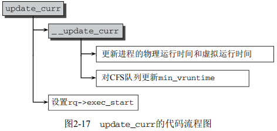

首先该函数确定就绪队列的当前执行线程，并获取主调度器就绪队列的实际时钟值，该值在每个调度周期都会更新（`rq_of`是一个辅助函数，用于确定与CFS就绪队列相关的`struct rq`实例）

```C
kernel/sched_fair.c
static void update_curr(struct cfs_rq *cfs_rq){
    struct sched_entity *curr = cfs_rq->curr;
    u64 now = rq_of(cfs_rq)->clock;
    unsigned long delta_exec;
    
    if(unlikely(!curr))
        return; //就绪队列没有进程在执行
    //计算当前和上一次更新符合统计量时两次的时间差，并将其他工作委托给__update_curr
    delta_exec = (unsigned long)(now - curr->exec_start);
    
    __update_curr(cfs_rq, curr, delta_exec);
    curr->exec_start = now;
}
```

根据这些信息，`__update_curr`需要更新当前进程在CPU上执行花费的物理时间和虚拟时间。物理时间更新比较简单，只要将时间差加到之间统计的时间即可

```C
kernel/sched_fair.c
static inline void
__update_curr(struct cfs_rq *cfs_rq, struct sched_entity *curr, unsigned long delta_exec){
    unsigned long delta_exec_weighted;
    u64 vruntime;
    
    curr->sum_exec_runtime += delta_exec;
    
    //计算虚拟时钟。对于运行在nice级别0的进程来说，根据定义虚拟时间和物理时间是相等的
    //在使用不同优先级时，必须根据进程的负荷权重重新衡定时间
    delta_exec_weighted = delta_exec;
    if(unlikely(curr->load.weight != NICE_0_LOAD)){
        delta_exec_weighted = calc_delta_fair(delta_exec_weighted, &curr->load);
    }
    curr->vruntime += delta_exec_weighted;
    //忽略舍入和溢出检查，calc_delta_fair按照公式计算：
    // delta_exec_weighted = delta_exec * NICE_0_LOAD/curr->load.weight
    
    //设置min_vruntime。必须小心保证该值是单调递增的
    /*
    *跟踪树最左边的结点的vruntime，维护cfs_rq->min_vruntime的单调性
    */
    if(first_fair(cfs_rq)) {
        vruntime = min_vruntime(curr->vruntime, __pick_next_entity(cfs_rq)->vruntime);
    } else 
        vruntime = curr->vruntime;
    cfs_rq->min_vruntime = max_vruntime(cfs_rq->min_vruntime, vruntime);//保证单调增
}
```

`first_fair`是一个辅助函数，检测树是否有最左边的结点，即是否有进程在树上等待调度。倘若如此，则内核获取其`vruntime`，即树中所有结点最小的`vruntime`值。如果因为树是空的而没有最左结点，则使用当前进程的虚拟运行时间。

单调递增意味着每个队列的`min_vruntime`只有被树上某个结点的`vruntime`超出时才更新。

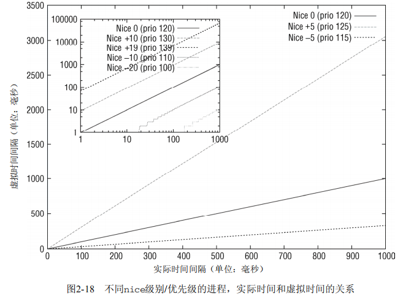

CFS调度器的真正关键点是，红黑树的排序过程是根据下列键进行的

```C
kernel/sched_fair.c
static inline s64 entity_key(struct cfs_rq *cfs_rq, struct sched_entity *se){
    return se->vruntime - cfs_rq->min_vruntime;
}
```

键值较小的点，排序位置就更靠左，会被更快调度。用这种方法，内核实现了下面两种对立的机制。

- 在进程运行过程中，其`vruntime`稳定地增加，它在红黑树中总是向右移动。因为越重要的进程`vruntime`增加越慢，因为他们向右移动的速度也越慢。
- 如果进程进入睡眠，则其`vruntime`保持不变。

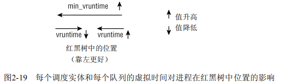

#### 延迟跟踪

内核有一个固有概念，称之为良好的调度延迟，即保证每个可运行的进程都应该至少运行一次的某个时间间隔。它在`sysctl_sched_latency`给出，可通过`/proc/sys/kernel/sched_latency_ns`控制，默认值为20毫秒。第二个控制参数`sched_nr_latency`，控制在一个延迟中期中处理的最大活动进程数目。如果活动进程的数目超出该上限，则延迟周期也成比例地线性扩展。

`__sched_period`确定延迟周期的长度，通常是`sysctl_sched_latency`，如果有更多进程在运行，其值有可能按比例线性扩展。这种情况下，周期长度是
$$
sysctl\_sched\_latency*{{nr\_running} \over {sched\_nr\_latency}}
$$
考虑各个进程的相对权重，将一个延迟周期的活动时间在活动进程之间进程分配。对于由某个调度实体表示的给定进程，分配到的时间如下计算

```C
kernel/sched_fair.c
static u64 sched_slice(struct cfs_rq *cfs_rq, struct sched_entity *se)
{
    u64 slice = __sched_period(cfs_rq->nr_running);
    
    slice *= se->load.weight;
    do_div(slice, cfs_rq->load.weight);
    
    return slice;
}
```


对权重weight的进程来说，实际时间段time对应的虚拟时间长度为
$$
time * {{NICE\_0\_LOAD} \over {weight}}
$$
该公式也可用于转换分配到的延迟时间间隔。

### 队列操作

有两个函数可以来增删就绪队列的成员：`enqueue_task_fair`和`dequeue_task_fair`.

除了指向所述的就绪队列和task_struct的指针外，该函数还有一个参数wakeup。这使得可以指定入队的进程是否最近才被唤醒并转换为运行状态（wakeup为1），还是此前就是可运行的（wakeup为0）。enqueue_task_fair流程为：

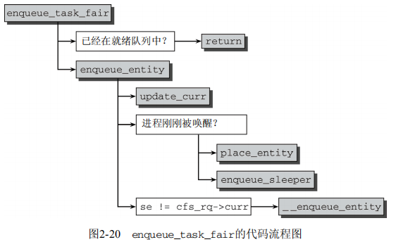

如果通过`struct  sched_entity`的`on_rq`成员判断进程已经在就绪队列上，则无事可做。否则，具体工作委托给`enqueue_entity`完成，其中内核会借机用`updater_curr`更新统计量。

### 选择下一个进程

选择下一个将要运行的进程由`pick_next_task_fair`执行。

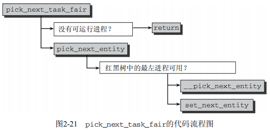

- 没有可运行进程：使用辅助函数first_fair
- __pick_next_entity ：从红黑树中提取出sched_entity实例。使用container_of机制完成
- set_next_entity：将选择的进程标记为运行进程

### 处理周期性调度器

在处理周期调度时，前述的差值很重要。形式上由函数`task_tick_fair`负责，但实际工作由`entity_tick`完成。

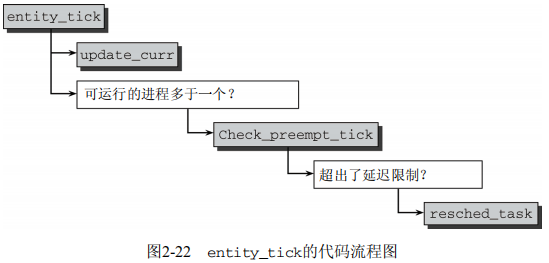

使用`update_curr`更新统计量。

如果进程数目不少于两个，则由`check_preempt_tick`做出决策

```C
kernel/sched_fair.c
static void 
check_preempt_tick(struct cfs_rq *cfs_rq, struct sched_entity *curr){
    unsigned long ideal_runtime, delta_exec;
    
    ideal_runtime = sched_slice(cfs_rq, curr);
    delta_exec = curr->sum_exec_runtime - curr->prev_sum_exec_runtime;
    if(delta_exec > ideal_runtime)
        resched_tast(rq_of(vfs_rq)->curr);
}
```

该函数的目的在于，确保没有哪个进程能够比延迟周期中确定的份额运行得更长。该份额对于的实际时间长度在`sched_slice`中计算，进程在CPU上运行的实际时间间隔由`sum_exec_runtime - prev_sum_exec_runtime`给出。因此抢占决策很容易做出：如果进程运行时间比期望的间隔时间长，那么通过`resched_task`发出重调度请求。这会在`task_struct`中设置`TIF_NEED_RESCHED`标志，核心调度器会在下一个适当的时机发起重调度。

### 唤醒抢占

当在try_to_wake_up和wake_up_new_task中唤醒进程时，内核使用check_preempt_curr看是否新进程可以强制当前进程。注意该过程不涉及核心调度器。对完全公平调度器处理的进程，则由check_preempt_wakeup函数执行该检测。

新唤醒的进程不一定完全由公平调度器处理。如果是一个实时进程，则会立即请求重调度，因为实时进程总会抢占CFS进程。

当运行线程被新进程抢占时，内核确保被抢占者至少已经运行了某一最小时间限额。该最小值存在sysctl_sched_wakeup_granularity。

如果新进程的虚拟运行时间，加上最小时间限额，仍然小于当前执行进程的虚拟运行时间，则请求重调度。

增加的时间“缓冲”确保了进程不至于切换得太频繁，避免了花费过多时间用于上下文切换，而非实际工作。

### 处理新进程

对CFS需要考虑的最后操作时创建新进程时调用的挂钩函数：`task_new_fair`。该函数行为可使用参数`sysctl_sched_child_runs_first`控制。该参数用于判断新建子线程是否在该父进程之前运行。

该函数先用`update_curr`进行通常的统计量更新，然后调用此的`place_entity`

```C
kernel/sched_fair.c
static void task_new_fair(struct rq *rq, struct task_struct *p){
    struct cfs_rq *cfs_rq = task_cfs_rq(p);
    struct sched_entity *se = &p->se, *curr = cfs_rq->curr;
    int this_cpu = smp_processor_id();
    
    update_curr(cfs_rq);
    place_entity(cfs_rq, se, 1);
    //initial参数设置为1，以便用sched_vslice_add计算初始化的vruntime
    ...
    if(sysctl_sched_child_runs_first && curr->vruntime < se->vruntime){
        swap(curr->vruntime, se->vruntime);
    }
    
    enqueue_task_fair(rq, p, 0); //子进程加入就绪队列
    resched_task(rq->curr); //请求重调度
}
```

父进程的虚拟运行时间(curr)小于子进程的虚拟运行时间，则意味着父进程将在子进程之前调度。


## 实时调度类

除普通进程外，Linux还支持两种实时调度类。调度器结构使得实时进程可以平滑的集成到内核中，而无需修改核心调度器。

实时进程的特点在于其优先级比普通进程高，对应地其`static_prio`值总是比普通进程低。`rt_task`宏通过检查其优先级来证实给定进程是否是实时进程，而`task_has_rt_policy`则检测进程是否关联到实时调度策略。

### 性质

实时与普通进程有一个根本的不同之处：如果系统中有一个实时进程且可运行，那么调度器总是会选中它允许，除非有另一个优先级更高的实时进程。

Linux支持两种实时类：

- `SCHED_RR` 循环进程，有时间片，其值在进程运行时会减少。在所有时间段都到期后，则该值重置为初始值，而进程则置于队列的末位。
- `SCHED_FIFO` 先进先出进程没有时间片，在被调度器选择执行后，可以运行任意长时间。

### 数据结构

```C
kernel/sched-rt.c
const struct sched_class rt_sched_class = {
    .next = &fair_sched_class,
    .enqueue_task = enqueue_task_rt,
    .dequeue_task = dequeue_task_rt,
    .yield_task = yield_task_rt,
    .check_preempt_curr = check_preempt_curr_rt,
    .pick_next_task = pick_next_task_rt,
    .put_prev_task = put_prev_task_rt,
    .set_curr_task = set_curr_task_rt,
    .task_tick = task_tick_rt,
};
```

实时调度类的实现比完全公平调度简单。

核心调度器的就绪队列也包含了用于实时进程的子就绪队列，是一个嵌入的`struct rt_rq`实例

```C
struct rq{
	t_rq rt;
    ...
}
```

就绪队列用链表实现。

具有相同优先级的所有实时进程都保存在一个链表中，表头为`active.queue[prio]`，而`active.bitmap`位图中每隔比特位对应于一个链表，凡包含了进程的链表，对应的比特位则置位。如果链表中没有进程，则对应的比特位不置位。

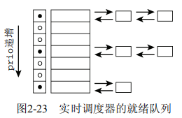

实时调度类中对应于update_cur的是update_curr_rt，该函数将当前进程在CPU上执行花费的时间记录在`sum_exec_runtime`中。所有计算的单位都是实际时间，不需要虚拟时间。

### 调度器操作

进程的入队离队。

只需以`p->prio`为索引访问`queue`数组`queue[p->prio]`，即可获得正确的链表，将进程加链表或从链表删除即可。如果队列中至少有一个进程，则将位图中对应的比特位置位；如果队列中没有进程，则清除位图中对应的比特位。新进程总是排在每个链表的末尾。


为将进程转换为实时进程，必须使用`sched_setscheduler`系统调用。它执行下列任务：

- 使用deactivate_task将进程从当前队列移除
- 在task_struct中设置实时优先级和调度类
- 重新激活此线程

如果此进程此前不在任何就绪队列上，那么只需要设置调度类和新的优先级数值。停止进程活动和重激活则是不必要。只有有root权限的进程才能修改调度器类或优先级。


## 附录

### taskt_struct 完整定义：

```C
<sched.h> 
struct task_struct { 
    volatile long state; /* -1表示不可运行，0表示可运行，>0表示停止 */ 
    void *stack; 
    atomic_t usage; 
    unsigned long flags; /* 每进程标志，下文定义 */ 
    unsigned long ptrace; 
    int lock_depth; /* 大内核锁深度 */ 
    
    int prio, static_prio, normal_prio; 
    struct list_head run_list; 
    const struct sched_class *sched_class; 
    struct sched_entity se; 
    
    unsigned short ioprio; 
    
    unsigned long policy; 
    cpumask_t cpus_allowed; 
    unsigned int time_slice; 
    
#if defined(CONFIG_SCHEDSTATS) || defined(CONFIG_TASK_DELAY_ACCT) 
    struct sched_info sched_info; 
#endif 

    struct list_head tasks; 
    /* 
    * ptrace_list/ptrace_children链表是ptrace能够看到的当前进程的子进程列表。
    */ 
    struct list_head ptrace_children; 
    
    struct list_head ptrace_list; 
    
    struct mm_struct *mm, *active_mm; 
/* 进程状态 */ 
    struct linux_binfmt *binfmt; 
    long exit_state; 
    int exit_code, exit_signal; 
    int pdeath_signal; /* 在父进程终止时发送的信号 */ 
    
    unsigned int personality; 
    unsigned did_exec:1; 
    pid_t pid; 
    pid_t tgid; 
    /* 
    * 分别是指向（原）父进程、最年轻的子进程、年幼的兄弟进程、年长的兄弟进程的指针。
    *（p->father可以替换为p->parent->pid）
    */ 
    struct task_struct *real_parent; /* 真正的父进程（在被调试的情况下） */ 
    struct task_struct *parent; /* 父进程 */ 
    /* 
    * children/sibling链表外加当前调试的进程，构成了当前进程的所有子进程
    */ 
    struct list_head children; /* 子进程链表 */ 
    struct list_head sibling; /* 连接到父进程的子进程链表 */ 
    struct task_struct *group_leader; /* 线程组组长 */ 
    
    /* PID与PID散列表的联系。 */ 
    struct pid_link pids[PIDTYPE_MAX]; 
    struct list_head thread_group; 
    
    struct completion *vfork_done; /* 用于vfork() */ 
    int __user *set_child_tid; /* CLONE_CHILD_SETTID */ 
    int __user *clear_child_tid; /* CLONE_CHILD_CLEARTID */ 
    
    unsigned long rt_priority; 
    cputime_t utime, stime, utimescaled, stimescaled; 
    unsigned long nvcsw, nivcsw; /* 上下文切换计数 */ 
    struct timespec start_time; /* 单调时间 */ 
    struct timespec real_start_time; /* 启动以来的时间 */ 
    /* 内存管理器失效和页交换信息，这个有一点争论。它既可以看作是特定于内存管理器的，
    也可以看作是特定于线程的 */ 
    unsigned long min_flt, maj_flt; 
    
    cputime_t it_prof_expires, it_virt_expires; 
    unsigned long long it_sched_expires; 
    struct list_head cpu_timers[3]; 
/* 进程身份凭据 */ 
    uid_t uid,euid,suid,fsuid; 
    gid_t gid,egid,sgid,fsgid; 
    struct group_info *group_info; 
    kernel_cap_t cap_effective, cap_inheritable, cap_permitted; 
    
    unsigned keep_capabilities:1; 
    struct user_struct *user;
    char comm[TASK_COMM_LEN]; /* 除去路径后的可执行文件名称
                             -用[gs]et_task_comm访问（其中用task_lock()锁定它）
                             -通常由flush_old_exec初始化 */ 
/* 文件系统信息 */ 
    int link_count, total_link_count; 
/* ipc相关 */ 
    struct sysv_sem sysvsem; 
/* 当前进程特定于CPU的状态信息 */ 
    struct thread_struct thread; 
/* 文件系统信息 */ 
    struct fs_struct *fs; 
/* 打开文件信息 */ 
    struct files_struct *files; 
/* 命名空间 */ 
    struct nsproxy *nsproxy; 
/* 信号处理程序 */ 
    struct signal_struct *signal; 
    struct sighand_struct *sighand; 
    
    sigset_t blocked, real_blocked; 
    sigset_t saved_sigmask; /* 用TIF_RESTORE_SIGMASK恢复 */ 
    struct sigpending pending; 
    
    unsigned long sas_ss_sp; 
    size_t sas_ss_size; 
    int (*notifier)(void *priv); 
    void *notifier_data; 
    sigset_t *notifier_mask; 
    
#ifdef CONFIG_SECURITY 
    void *security; 
#endif 
    
/* 线程组跟踪 */ 
    u32 parent_exec_id; 
    u32 self_exec_id; 
    
/* 日志文件系统信息 */ 
    void *journal_info; 
    
/* 虚拟内存状态 */ 
    struct reclaim_state *reclaim_state; 
    
    struct backing_dev_info *backing_dev_info; 
    
    struct io_context *io_context;
    
    unsigned long ptrace_message; 
    siginfo_t *last_siginfo; /* 由ptrace使用。*/ 
... 
};
```

## 