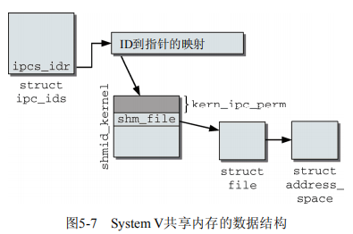
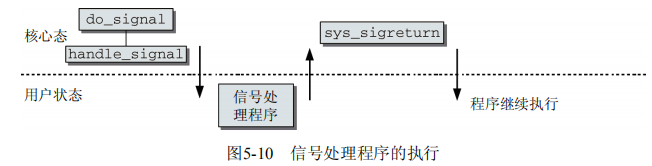

# 操作系统锁与进程间通信

锁与IPC, interprocess communication

## 概述

Linux作为多任务系统，能够同时运行几个进程。多个应用程序有彼此通信的需求：

- 一个进程生成的数据传输到另一个进程时；
- 数据由多个进程共享时；
- 进程必须彼此等待时；
- 需要协调资源的使用时。

## 控制机制

相互通信的进程彼此干扰的可能，以及如何防止。

### 竞态条件

几个进程在访问资源时彼此干扰的情况通常称之为竞态条件race condition。对分布式应用编程时，这种情况是一个主要的问题，因为竞态条件无法通过系统的试错法检测。相反，只有彻底研究源代码（深入了解各种可能发生的代码路径）并通过敏锐的直觉，才能找到并消除竞态条件。

由于导致竞态条件的情况非常罕见，因此需要提出一个问题：是否值得做出一些或者大量的工作来保护代码避免静态条件。

### 临界区

这个问题的本质是：进程的执行在不应该的地方被中断，从而导致进程工作得不正确。

对应的解决方案为互斥。

## 内核锁机制

内核可以不受限地访问整个地址空间。在多处理器系统上，这会引起一些问题。如果几个处理器同时处于核心态，则理论上它们可以同时访问同一个数据结构，这刚好造成了竞态问题和访问临界区的问题。

内核为此提供了各种锁选型，分别优化不同的内核数据使用模式。

- **原子操作** 这些是最简单的锁操作。它们保证简单的操作，诸如加一之类，可以不中断地原子执行。即使操作由几个汇编语句组成，也可以保证。
- **自旋锁** 这些事最常用的锁选项。它们用于短期保护某段代码，以防止其他处理器的访问。在内核等待自旋锁释放时，会重复检查是否能获取锁，而不会进入睡眠状态（忙等待）。当然，等待时间比较长，则效率显然不高。
- **信号量** 这些是用经典方法实现的。在等待信号量释放时，内核进入睡眠状态，直至被唤醒。唤醒后，内核才重新尝试获取信号量。互斥量是信号量的特例，互斥量保护的临界区，每次只能有一个用户进入。
- **读者/写者锁** 这些锁会区分对数据结构的两种不同类型的访问。任意数目的处理器都可以对数据结构进行并发读访问，但只有一个处理器能进行写访问。事实上，在进行写访问时，读访问是无法进行的。

### 原子操作

内核定义了atomic_t数据类型(<asm-arch/atomic.h>中)，用作对整数计数器的原子操作的基础。从内核的角度来看，这些操作的执行仿佛是一条汇编语句。

将计数器加一操作中，通常分为3个执行步骤：

1. 将计数器值从内存复制到处理器寄存器；
2. 将其值加1；
3. 将寄存器数据回写到内存。

如果有另一个处理器同时执行该操作，则会发送竞态问题。

内核支持的所有处理器，都提供了原子执行此类操作的手段。一般来说，可使用特殊的锁指令阻止系统中其他处理器工作，直到当前处理器完成下一操作位置。也可以使用效果相同的等价机制（lock指令等）。

为使内核中平台独立的部分能够使用原子操作，特定于体系结构的代码必须提供下表列出的用于操纵atomic_t类型变量的操作。在某些系统上，这些操作与C语言中对应的普通操作相比要慢得多，因此只有在确实必要的情况下才使用这些操作。


### 自旋锁

自旋锁用于保护短的代码段，其中只包含少量C语句，因此会很快执行完毕。大多数内核数据结构都有自身的自旋锁，在处理数据结构中的关键成员时，必须获得相应的自旋锁。

**数据结构和用法**

自旋锁通过`spinlock_t`数据结构实现，基本上可使用`spin_lock`和`spin_unlock`操纵。还有其他一些自旋锁操纵：`spin_lock_irqsave`不仅获得自旋锁，还停用本地CPU的中断，而`spin_lock_bh`则停用`softIRQ`。用这两个操纵获得自旋锁必须用对应的接口释放。同样，自旋锁的实现也几乎完全是汇编语言（与体系结构相关）。

用法为：

```C
spinlock_t lock = SPIN_LOCK_UNLOCKER;
...
spin_lock(&lock);
/*临界区*/
spin_unlock(&lock);
```

初始化自旋锁时，必须使用SPIN_LOCK_UNLOCKED将其设置为未锁定状态。spin_lock会考虑下面两种情况：

- 如果内核中其他地方尚未获得lock，则由当前处理器获取。其他处理器不能再进入lock保护的代码范围
- 如果lock已经由另一个处理器获得，spin_lock进入一个无限循环，重复地检查lock是否已经由spin_unlock释放（自旋锁因此得名）。如果已释放，则获得lock，并进入临界区。

spin_lock定义为一个原子操作，在获得自旋锁的情况下可防止竞态条件出现。

内核还提供了spin_trylock和spin_trylock_bh两种方法。它们尝试获取锁，但在锁无法立即获取时不会阻塞。在锁操作成功时，它们返回零值（代码由自旋锁保护），否则返回0。后一种情况下，代码没有锁保护。

注意点：

- 如果获得锁之后不释放，系统将变得不可用。所有的处理器（包括获得锁在内的），迟早需要进入锁对应的临界区。他们会进入无限循环等待锁，但等不到。这产生了死锁。
- 自旋锁决不应该长期持有，因为所有等待锁释放的处理器都会处于不可用的状态，无法用于其他工作。

在单处理器系统上，自旋锁定义为空，因为不存在几个CPU同时进入临界区的情况。但如果启用了内核抢占，这种说法就是不适用了。如果内核在临界区被中断，这于SMP系统上多个处理器同时在临界区执行的情况是一样的。可以通过在内核进入到自旋锁保护的临界区内时停用内核抢占避免该问题。

### 信号量

内核使用的信号量定义如下。用户间的信号量实现有所不同

```C
<asm-arch/semaphore.h> 
struct semaphore { 
    atomic_t count; 
    int sleepers; 
    wait_queue_head_t wait; 
};
```

与自旋锁相比，信号量适合于保护更长的临界区，以防止并行访问。但它们不应该用于保护较短的代码范围，因为竞争信号量时需要使进程睡眠和在此唤醒，代价很高。

### RCU机制

`RCU, read-copy-update` 是一种相当新的同步机制，在内核2.5开发期间被添加，并且非常顺利地被内核社区接纳。现在它的使用已经遍布内核。

RCU的原理很简单：该机制记录了指向共享数据结构的指针的所有使用者。在该结构将要改变时，则首先创建一个副本（或一个新的实例，填充适当的内容），在副本中修改。在所有进行读写访问的使用者结束对旧副本的读取后，指针指向新的、修改后的副本。

RCU对潜在使用者提出的约束：

- 对共享资源的访问大部分时间应该是只读的，写访问相对很少
- 在RCU保护的代码范围内，内核不能进入睡眠状态
- 受保护的资源必须通过指针范文

### 内存和优化屏障

### 读者/写者锁

### 大内核锁

### 互斥量

## Sytem V进程间通信机制

Linux使用System V（SysV）引入的机制，来支持用户进程的进程间通信和同步。内核通过系统调用提供了各种例程，使得用户库（通常是C标准库）能够实现所需的操作。
除了信号量之外，SysV的进程间通信方案还包括进程间的消息交换和共享内存区域。

### System V机制

System V UNIX的3中进程间通信IPC机制（信号量、消息队列、共享内存）反映了3种不同的概念，却又一个共同点：它们都使用了全系统范围的资源，可以由几个进程同时共享。该机制最初的设计目标，可能是为了让程序的各个线程或fork产生的结构能够访问共享的SysV对象。

在各个独立进程能访问SysV IPC对象前，IPC对象必须在系统内唯一标识。为此每种IPC结构在创建时分配了一个号码。凡知道这个魔数的各个程序，都能够访问对于的结构。

### 信号量

System V信号量在sem/sem.c实现，对应的头文件是<sem.h>。这种信号量与内核信号量没有任何关系。

#### 使用

一个System V信号量是指一整套信号量，可以允许几个操作同时进行（尽管用户看上去它们是原子的）。当然可以请求只有一个信号量的信号量集合，并定义模拟原始信号量的简单操作。

```C
#include<stdio.h> 
#include<sys/types.h> 
#include<sys/ipc.h> 
#include<sys/sem.h>
#define SEMKEY 1234L /* 标识符 */ 
#define PERMS 0666 /* 访问权限： rwrwrw */ 
struct sembuf op_down[1] = { 0, -1 , 0 }; 
struct sembuf op_up[1] = { 0, 1 , 0 }; 
int semid = -1; /* 信号量 ID */ 
int res; /* 信号量操作的结果 */ 
void init_sem() { 
 /* 测试信号量是否已经存在 */ 
    semid = semget(SEMKEY, 0, IPC_CREAT | PERMS); //测试对应的信号量是否已存在
    //semid变量在内核中小时了该信号量
    if (semid < 0) { //不存在，则创建信号量
        printf("Create the semaphore\n"); 
        semid = semget(SEMKEY, 1, IPC_CREAT | PERMS); //用一个持久定义的魔数创建一个新的信号量，以便在系统内建立标识。参数：魔数SEMKEY，集合中信号量的数目，所需要的访问权限
        if (semid < 0) { 
            printf("Couldn't create semaphore!\n"); 
            exit(-1); 
        }
    	/* 初始化为1 */ 
    	res = semctl(semid, 0, SETVAL, 1); //将信号量集合中唯一的信号量值初始化为1 
 	} 
} 
void down() { 
 	/* 执行down操作 */ 
	res = semop(semid, &op_down[0], 1); //semop系统调用，第一个变量smeid，第二个变量是一个指向数组的指针，数组元素
} 
void up() { 
     /* 执行up操作 */ 
    res = semop(semid, &op_up[0], 1); 
} 
int main(){ 
     init_sem(); 
     /* 正常的程序代码 */ 
    
    printf("Before critical code\n"); 
     down(); 
     /* 临界区代码 */ 
    printf("In critical code\n"); 
     sleep(10); 
     up(); 
    
     /* 其余代码 */ 
     return 0; 
}
```

#### 数据结构

内核使用了几个数据结构来描述所有注册信号量的当前状态，并建立了一种网状结构。它们不仅负责管理信号量及其特征（值、读写权限等），还负责通过等待列表将信号量与等待进程关联起来。


### 消息队列

进程之间通信的另一个方法是交换消息。这里使用消息队列机制完成的，其实现基于System V模型。

消息队列的功能原理相对简单，如图


产生消息并将其写到队列的进程通常称之为发送者，而一个或多个其他进程（逻辑称之为接收者）则从队列获取信息。各个消息包含消息正文和一个（正）数，以便在消息队列内实现几种类型的消息。接受者可以根据该数字检索消息。在消息已经读取后，内核将其从队列删除。即使几个进程在同一信道上监听，每个消息仍然只能由一个进程读取。

同一编号的消息按先进先出次序处理。放置在队列开始的消息将首先读取。如果有选择地读取消息，则先进先出次序不再适用。

```C
<msg.h> 
struct msg_queue { 
    struct kern_ipc_perm q_perm; 
    time_t q_stime; /* 上一次调用msgsnd发送消息的时间 */ 
    time_t q_rtime; /* 上一次调用msgrcv接收消息的时间 */ 
    time_t q_ctime; /* 上一次修改的时间 */ 
    unsigned long q_cbytes; /* 队列上当前字节数目 */ 
    unsigned long q_qnum; /* 队列中的消息数目 */ 
    unsigned long q_qbytes; /* 队列上最大字节数目 */ 
    pid_t q_lspid; /* 上一次调用msgsnd的pid */ 
    pid_t q_lrpid; /* 上一次接收消息的pid */
    struct list_head q_messages; 
    struct list_head q_receivers; 
    struct list_head q_senders; 
};
```


### 共享内存

从用户和内核的角度来看，它的实现使用了与信号量、消息队列类似的结构。与信号量和消息队列相比，共享内存没有本质性的不同。

- 应用程序请求的IPC对象，可以通过魔数和当前的命名空间的内核内部ID访问
- 对内存的访问，可能受到权限系统的限制
- 可以使用系统调用分配与IPC对象关联的内存，具备适当授权的所有进程，都可以访问该内存

内核的试下采用了与上述两种对象非常类似的概念。简要数据结构描述如下：



在`smd_ids`全局变量的`entries`数组中保存了`kern_ipc_perm`和`shmid_kernel`的组合，以便管理IPC对象的访问权限。对每个共享内存对象都创建一个伪文件，通过`sham_file`连接到`shmid_kernel`的实例。内核使用`shm_file->f_mapping`指针访问地址空间对象`struct address_space`，用于创建匿名映射。还需要设置所涉及各个进程的页表，使得各个进程都能够访问与该IPC对象相关的内存区域。

## 其他IPC机制

### 信号

与SysV机制相比，信号是一种比较原始的通信机制。

其底层概念非常简单，`kill`命令根据PID向进程发送信号。信号通过`-s sig`指定，是一个正整数，最大长度取决于处理器类型。



### 管道

管道分为匿名管道(即管道)和有名管道。

#### 管道

管道实际是用于进程间通信的一段共享内存，创建管道的进程称为管道服务器，连接到一个管道的进程为管道客户机。一个进程在向管道写入数据后，另一进程就可以从管道的另一端将其读取出来。

特点：

- 管道是半双工的，数据只能向一个方向流动；需要双向通信时，需要建立两个管道
- 只能用于父子进程或者兄弟进程之间（具有亲缘关系的进程）。在使用exec创建新进程时，需要将管道的文件描述符作为参数传递给exec创建的新进程。当父进程与使用fork创建的子进程直接通信时，发送数据的进程关闭读端，接受数据的进程关闭写端
- 单独构成一种独立的文件系统：管道对于两端的进程而言，就是一个文件，一种特殊的文件，只存在与内存中
- 数据的读出和写入：一个进程向管道中写的内容被管道另一端的进程读出。写入的内容每次都添加在管道缓冲区的末尾，并且，每次都是从缓冲区的头部读出数据

**实现机制**

管道是由内核管理的一个缓冲区。一个缓冲区不需要很大，他被设置为环形的数据结构，以便管道可以被循环利用。当管道中没有信息的时候，从管道中读取的进程会等待，直到另一端的进程放入信息。当管道被放满信息的时候，尝试放入信息的进程会等待，直到另一端的进程读取出信息。当两个进程都终结的时候，管道也自动消失。

**编程实例**

```C
#include <unistd.h>
#include <sys/types.h>
#include <errno.h>
#include <stdlib.h>
#include <stdio.h>
#include <string.h>

int main(){
    int pipe_fd[2];
    pid_t pid;
    char r_buf[10];
    char w_buf[4];
    int r_num;

    memset(r_buf,0,sizeof(r_buf));
    memset(w_buf,0,sizeof(w_buf));
    if(pipe(pipe_fd)<0){
        printf("pipe create error\n");
        return -1;
    }

    if((pid=fork())==0){
        printf("\n");
        close(pipe_fd[1]);
        sleep(3);//确保父进程关闭写端
        r_num=read(pipe_fd[0],r_buf,10);
        printf(    "read num is %d the data read from the pipe is %d\n",r_num,atoi(r_buf));

        close(pipe_fd[0]);
        exit(1);
    }
    else if(pid>0) {
        close(pipe_fd[0]);//close read
        strcpy(w_buf,"111");
        if(write(pipe_fd[1],w_buf,4)!=-1)
            printf("parent write over\n");
        printf("parent close fd[1] over\n");
        close(pipe_fd[1]);//write
        sleep(10);
    }
    return 0;
}
```

#### 命名管道

命名管道是一种特殊类型的文件，它在系统中以文件形式存在。这样克服了无名管道的弊端，他可以允许没有亲缘关系的进程间通信。

> **与无名管道区别**
>
> 对于命名管道FIFO来说，IO操作和普通管道IO操作基本一样，但是两者有一个主要的区别，在命名管道中，管道可以是事先已经创建好的，比如在命令行下执行mkfifo myfifo就是创建一个命名通道，必须用open函数来显示地建立连接到管道的通道，而在管道中，管道已经在主进程里创建好了，然后在fork时直接复制相关数据或者是用exec创建的新进程时把管道的文件描述符当参数传递进去。

**编程实例**

```C
//writing
#include <stdio.h>
#include <stdlib.h>
#include <unistd.h>
#include <string.h>
#include <sys/types.h>
#include <sys/stat.h>
#include <errno.h>
#include <fcntl.h>

#define N 80

int main() {
    int out_file;
    int nbyte;
    char buf[N];
    if((mkfifo("myfifo",0666))<0)    //创建有名管道
    {
        if(errno==EEXIST)
        {
            printf("The fifo is exist.\n");
        }
        else{
            perror("creat myfifo failed!\n");
            exit(-1);
        }
    }else{
        printf("created by this process.\n");
    }
    out_file = open("myfifo",O_WRONLY);
    if (out_file < 0) {
        printf("Error opening fifo.");
        exit(1);
    }
    printf("please input something:\n");
    while((nbyte = read(0,buf,N))){
        write(out_file,buf,nbyte);
        printf("please input something:\n");
    }
    close(out_file);
    return 0;
}
```

```C
//reading
#include <stdio.h>
#include <stdlib.h>
#include <unistd.h>
#include <sys/types.h>
#include <sys/stat.h>
#include <errno.h>
#include <fcntl.h>
#define N 80

int main(void) {
    int in_file;
    int count = 1;
    char buf[N];
    if((mkfifo("myfifo",0666))<0)//创建有名管道
    {
        if(errno==EEXIST)//管道已经存在
        {
            printf("The fifo is exist.\n");
        }
        else{
            printf("creat myfifo failed!\n");
            exit(-1);
        }
    }
    else
    {
        printf("created by this process.\n");
    }
    in_file = open("myfifo",O_RDONLY);
    if (in_file < 0) {
        printf("Error in opening.\n");
        exit(1);
    }

    while ((count = read(in_file,buf,N)) > 0)
    {
        printf("received from fifo: %s\n", buf);
        memset(buf,0,N);
    }
    close(in_file);
    return 0;
}
```


### 套接字

