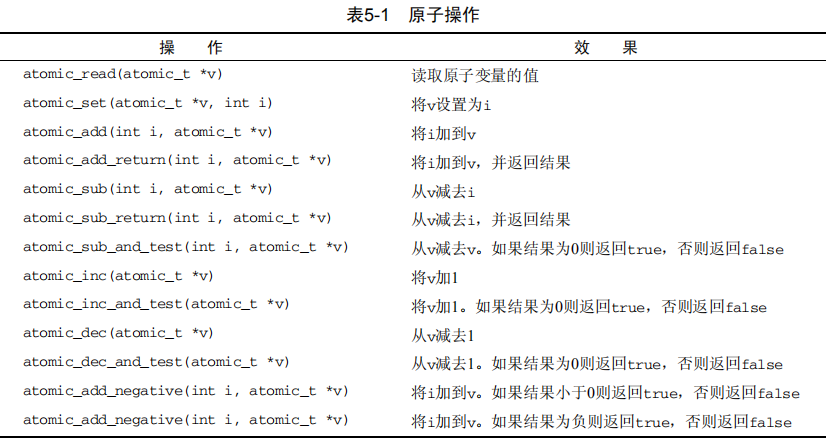
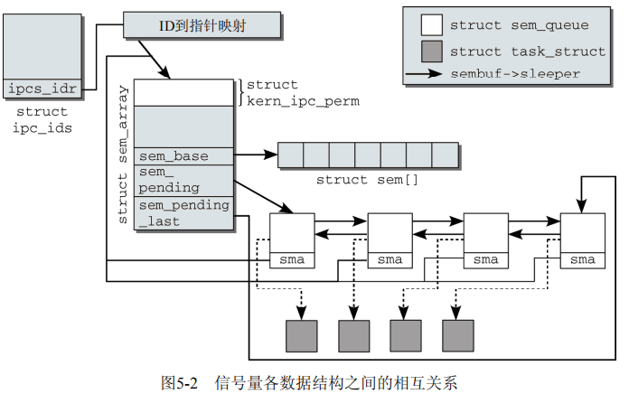
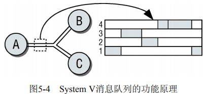
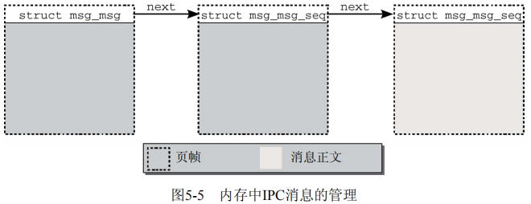
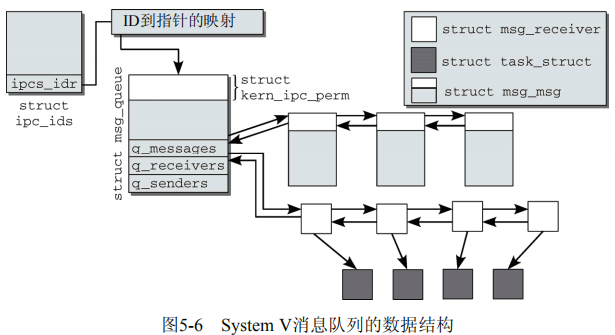

# 操作系统锁与进程间通信

锁与IPC, interprocess communication

## 概述

Linux作为多任务系统，能够同时运行几个进程。多个应用程序有彼此通信的需求：

- 一个进程生成的数据传输到另一个进程时；
- 数据由多个进程共享时；
- 进程必须彼此等待时；
- 需要协调资源的使用时。

## 控制机制

相互通信的进程彼此干扰的可能，以及如何防止。

### 竞态条件

几个进程在访问资源时彼此干扰的情况通常称之为竞态条件race condition。对分布式应用编程时，这种情况是一个主要的问题，因为竞态条件无法通过系统的试错法检测。相反，只有彻底研究源代码（深入了解各种可能发生的代码路径）并通过敏锐的直觉，才能找到并消除竞态条件。

由于导致竞态条件的情况非常罕见，因此需要提出一个问题：是否值得做出一些或者大量的工作来保护代码避免静态条件。

### 临界区

这个问题的本质是：进程的执行在不应该的地方被中断，从而导致进程工作得不正确。

对应的解决方案为互斥。

## 内核锁机制

内核可以不受限地访问整个地址空间。在多处理器系统上，这会引起一些问题。如果几个处理器同时处于核心态，则理论上它们可以同时访问同一个数据结构，这刚好造成了竞态问题和访问临界区的问题。

内核为此提供了各种锁选型，分别优化不同的内核数据使用模式。

- **原子操作** 这些是最简单的锁操作。它们保证简单的操作，诸如加一之类，可以不中断地原子执行。即使操作由几个汇编语句组成，也可以保证。
- **自旋锁** 这些事最常用的锁选项。它们用于短期保护某段代码，以防止其他处理器的访问。在内核等待自旋锁释放时，会重复检查是否能获取锁，而不会进入睡眠状态（忙等待）。当然，等待时间比较长，则效率显然不高。
- **信号量** 这些是用经典方法实现的。在等待信号量释放时，内核进入睡眠状态，直至被唤醒。唤醒后，内核才重新尝试获取信号量。互斥量是信号量的特例，互斥量保护的临界区，每次只能有一个用户进入。
- **读者/写者锁** 这些锁会区分对数据结构的两种不同类型的访问。任意数目的处理器都可以对数据结构进行并发读访问，但只有一个处理器能进行写访问。事实上，在进行写访问时，读访问是无法进行的。

### 原子操作

内核定义了atomic_t数据类型(<asm-arch/atomic.h>中)，用作对整数计数器的原子操作的基础。从内核的角度来看，这些操作的执行仿佛是一条汇编语句。

将计数器加一操作中，通常分为3个执行步骤：

1. 将计数器值从内存复制到处理器寄存器；
2. 将其值加1；
3. 将寄存器数据回写到内存。

如果有另一个处理器同时执行该操作，则会发送竞态问题。

内核支持的所有处理器，都提供了原子执行此类操作的手段。一般来说，可使用特殊的锁指令阻止系统中其他处理器工作，直到当前处理器完成下一操作位置。也可以使用效果相同的等价机制（lock指令等）。

为使内核中平台独立的部分能够使用原子操作，特定于体系结构的代码必须提供下表列出的用于操纵atomic_t类型变量的操作。在某些系统上，这些操作与C语言中对应的普通操作相比要慢得多，因此只有在确实必要的情况下才使用这些操作。



### 自旋锁

自旋锁用于保护短的代码段，其中只包含少量C语句，因此会很快执行完毕。大多数内核数据结构都有自身的自旋锁，在处理数据结构中的关键成员时，必须获得相应的自旋锁。

**数据结构和用法**

自旋锁通过`spinlock_t`数据结构实现，基本上可使用`spin_lock`和`spin_unlock`操纵。还有其他一些自旋锁操纵：`spin_lock_irqsave`不仅获得自旋锁，还停用本地CPU的中断，而`spin_lock_bh`则停用`softIRQ`。用这两个操纵获得自旋锁必须用对应的接口释放。同样，自旋锁的实现也几乎完全是汇编语言（与体系结构相关）。

用法为：

```C
spinlock_t lock = SPIN_LOCK_UNLOCKER;
...
spin_lock(&lock);
/*临界区*/
spin_unlock(&lock);
```

初始化自旋锁时，必须使用SPIN_LOCK_UNLOCKED将其设置为未锁定状态。spin_lock会考虑下面两种情况：

- 如果内核中其他地方尚未获得lock，则由当前处理器获取。其他处理器不能再进入lock保护的代码范围
- 如果lock已经由另一个处理器获得，spin_lock进入一个无限循环，重复地检查lock是否已经由spin_unlock释放（自旋锁因此得名）。如果已释放，则获得lock，并进入临界区。

spin_lock定义为一个原子操作，在获得自旋锁的情况下可防止竞态条件出现。

内核还提供了spin_trylock和spin_trylock_bh两种方法。它们尝试获取锁，但在锁无法立即获取时不会阻塞。在锁操作成功时，它们返回零值（代码由自旋锁保护），否则返回0。后一种情况下，代码没有锁保护。

注意点：

- 如果获得锁之后不释放，系统将变得不可用。所有的处理器（包括获得锁在内的），迟早需要进入锁对应的临界区。他们会进入无限循环等待锁，但等不到。这产生了死锁。
- 自旋锁决不应该长期持有，因为所有等待锁释放的处理器都会处于不可用的状态，无法用于其他工作。

在单处理器系统上，自旋锁定义为空，因为不存在几个CPU同时进入临界区的情况。但如果启用了内核抢占，这种说法就是不适用了。如果内核在临界区被中断，这于SMP系统上多个处理器同时在临界区执行的情况是一样的。可以通过在内核进入到自旋锁保护的临界区内时停用内核抢占避免该问题。

### 信号量

内核使用的信号量定义如下。用户间的信号量实现有所不同

```C
<asm-arch/semaphore.h> 
struct semaphore { 
    atomic_t count; 
    int sleepers; 
    wait_queue_head_t wait; 
};
```

与自旋锁相比，信号量适合于保护更长的临界区，以防止并行访问。但它们不应该用于保护较短的代码范围，因为竞争信号量时需要使进程睡眠和在此唤醒，代价很高。

### RCU机制

`RCU, read-copy-update` 是一种相当新的同步机制，在内核2.5开发期间被添加，并且非常顺利地被内核社区接纳。现在它的使用已经遍布内核。

RCU的原理很简单：该机制记录了指向共享数据结构的指针的所有使用者。在该结构将要改变时，则首先创建一个副本（或一个新的实例，填充适当的内容），在副本中修改。在所有进行读写访问的使用者结束对旧副本的读取后，指针指向新的、修改后的副本。

RCU对潜在使用者提出的约束：

- 对共享资源的访问大部分时间应该是只读的，写访问相对很少
- 在RCU保护的代码范围内，内核不能进入睡眠状态
- 受保护的资源必须通过指针范文

### 内存和优化屏障

### 读者/写者锁

### 大内核锁

### 互斥量

## Sytem V进程间通信机制

Linux使用System V（SysV）引入的机制，来支持用户进程的进程间通信和同步。内核通过系统调用提供了各种例程，使得用户库（通常是C标准库）能够实现所需的操作。
除了信号量之外，SysV的进程间通信方案还包括进程间的消息交换和共享内存区域。

### System V机制

System V UNIX的3中进程间通信IPC机制（信号量、消息队列、共享内存）反映了3种不同的概念，却又一个共同点：它们都使用了全系统范围的资源，可以由几个进程同时共享。该机制最初的设计目标，可能是为了让程序的各个线程或fork产生的结构能够访问共享的SysV对象。

在各个独立进程能访问SysV IPC对象前，IPC对象必须在系统内唯一标识。为此每种IPC结构在创建时分配了一个号码。凡知道这个魔数的各个程序，都能够访问对于的结构。

### 信号量

System V信号量在sem/sem.c实现，对应的头文件是<sem.h>。这种信号量与内核信号量没有任何关系。

#### 使用

一个System V信号量是指一整套信号量，可以允许几个操作同时进行（尽管用户看上去它们是原子的）。当然可以请求只有一个信号量的信号量集合，并定义模拟原始信号量的简单操作。

```C
#include<stdio.h> 
#include<sys/types.h> 
#include<sys/ipc.h> 
#include<sys/sem.h>
#define SEMKEY 1234L /* 标识符 */ 
#define PERMS 0666 /* 访问权限： rwrwrw */ 
struct sembuf op_down[1] = { 0, -1 , 0 }; 
struct sembuf op_up[1] = { 0, 1 , 0 }; 
int semid = -1; /* 信号量 ID */ 
int res; /* 信号量操作的结果 */ 
void init_sem() { 
 /* 测试信号量是否已经存在 */ 
    semid = semget(SEMKEY, 0, IPC_CREAT | PERMS); //测试对应的信号量是否已存在
    //semid变量在内核中小时了该信号量
    if (semid < 0) { //不存在，则创建信号量
        printf("Create the semaphore\n"); 
        semid = semget(SEMKEY, 1, IPC_CREAT | PERMS); //用一个持久定义的魔数创建一个新的信号量，以便在系统内建立标识。参数：魔数SEMKEY，集合中信号量的数目，所需要的访问权限
        if (semid < 0) { 
            printf("Couldn't create semaphore!\n"); 
            exit(-1); 
        }
    	/* 初始化为1 */ 
    	res = semctl(semid, 0, SETVAL, 1); //将信号量集合中唯一的信号量值初始化为1 
 	} 
} 
void down() { 
 	/* 执行down操作 */ 
	res = semop(semid, &op_down[0], 1); //semop系统调用，第一个变量smeid，第二个变量是一个指向数组的指针，数组元素
} 
void up() { 
     /* 执行up操作 */ 
    res = semop(semid, &op_up[0], 1); 
} 
int main(){ 
     init_sem(); 
     /* 正常的程序代码 */ 
    
    printf("Before critical code\n"); 
     down(); 
     /* 临界区代码 */ 
    printf("In critical code\n"); 
     sleep(10); 
     up(); 
    
     /* 其余代码 */ 
     return 0; 
}
```

#### 数据结构

内核使用了几个数据结构来描述所有注册信号量的当前状态，并建立了一种网状结构。它们不仅负责管理信号量及其特征（值、读写权限等），还负责通过等待列表将信号量与等待进程关联起来。



### 消息队列

进程之间通信的另一个方法是交换消息。这里使用消息队列机制完成的，其实现基于System V模型。

消息队列的功能原理相对简单，如图



产生消息并将其写到队列的进程通常称之为发送者，而一个或多个其他进程（逻辑称之为接收者）则从队列获取信息。各个消息包含消息正文和一个（正）数，以便在消息队列内实现几种类型的消息。接受者可以根据该数字检索消息。在消息已经读取后，内核将其从队列删除。即使几个进程在同一信道上监听，每个消息仍然只能由一个进程读取。

同一编号的消息按先进先出次序处理。放置在队列开始的消息将首先读取。如果有选择地读取消息，则先进先出次序不再适用。

```C
<msg.h> 
struct msg_queue { 
    struct kern_ipc_perm q_perm; 
    time_t q_stime; /* 上一次调用msgsnd发送消息的时间 */ 
    time_t q_rtime; /* 上一次调用msgrcv接收消息的时间 */ 
    time_t q_ctime; /* 上一次修改的时间 */ 
    unsigned long q_cbytes; /* 队列上当前字节数目 */ 
    unsigned long q_qnum; /* 队列中的消息数目 */ 
    unsigned long q_qbytes; /* 队列上最大字节数目 */ 
    pid_t q_lspid; /* 上一次调用msgsnd的pid */ 
    pid_t q_lrpid; /* 上一次接收消息的pid */
    struct list_head q_messages; 
    struct list_head q_receivers; 
    struct list_head q_senders; 
};
```





### 共享内存

