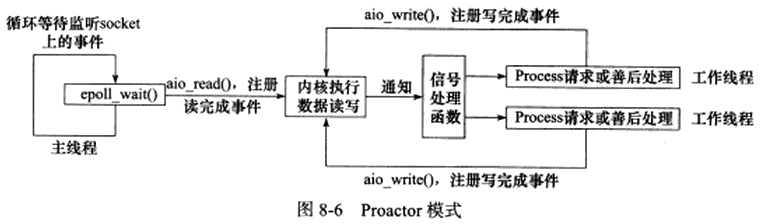
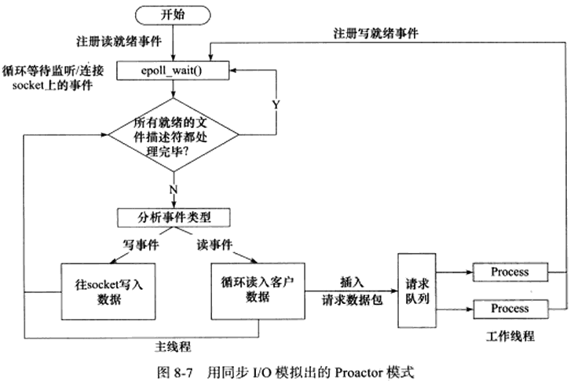
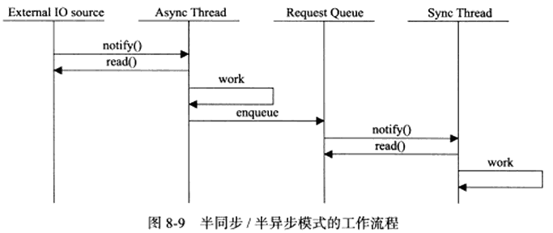
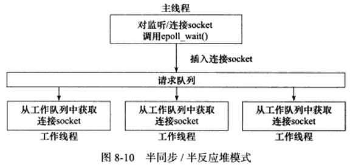
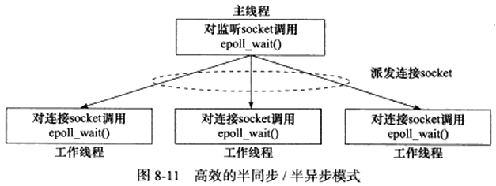
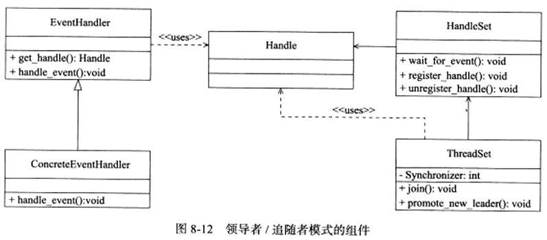
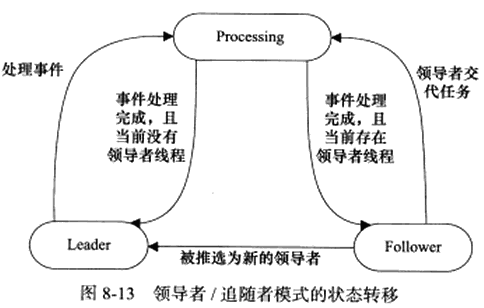
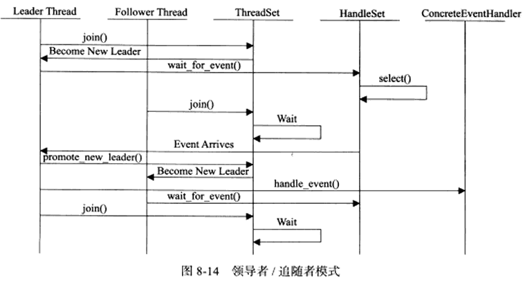

# 高性能服务器程序框架

## 两种高效的事件处理方式

随着网络设计模式的兴起，Reactor和Proactor事件处理模式应运而生。同步I/O模型通常用于实现Reactor模式，异步I/O模型则用于实现Proactor模式。也有使用同步I/O方式模拟出Proactor模式。

### Reactor模式

Reactor模式，它要求主线程（I/O处理单元）只负责监听文件描述符上是否有事件发生，有的话立即将该事件通知工作线程（逻辑单元）。除此之外，主线程不做任何其他实质性的工作。读写数据、接收新的连接以及处理客户请求均在工作线程中完成。

使用同步I/O模型（以epoll_wait为例）实现的Reactor模式的工作流程是：

1. 主线程往epoll内核事件表中注册socket上的读就绪信息
2. 主线程调用epoll_wait等待socket上有数据可读
3. 当socket上有数据可读时，epoll_wait通知主线程。主线程则将socket可读事件放入请求队列
4. 睡眠在请求队列上的某个工作线程被唤醒，它从socket读取数据，并处理客户请求，然后往epoll内核事件表中注册该socket上的写就绪事件
5. 主线程调用epoll_wait等待socket可写
6. 当socket可写时，epoll_wait通知主线程。主线程将socket事件放入请求队列
7. 睡眠在请求队列上的某个工作线程被唤醒，它往socket上写入服务器处理客户请求的结果

### Proactor模式

与Reactor模式不同，Proactor模式将所有I/O操作都交给主线程和内核来处理，工作线程仅仅负责业务逻辑。

使用异步I/O模型(以aio_read和aio_write为例)实现的Proactor模式的工作流程是：

1. 主线程调用aio_read函数向内核注册socket上的读完成事件，并告诉内核用户读缓冲区的位置，以及读操作完成时如何通知应用程序（以信号为例，参考sigevent）
2. 主线程继续处理其他逻辑
3. 当socket上的数据被读入用户缓冲区后，内核向应用程序发送一个信号，以通知应用程序数据已可用
4. 应用程序预先定义好的信号处理函数选择一个工作线程来处理客户请求。工作线程处理完客户请求之后，调用aio_write函数向内核注册socket上的写完成事件，并告诉内核用户写缓冲区的位置，以及写操作完成时如何通知应用程序（以信号为例）
5. 主线程继续处理其他逻辑
6. 当用户缓冲区的数据被写入socket之后，内核将向应用程序发送一个信号，以通知应用程序数据已发送完毕。
7. 应用程序预先定义好的信号处理函数选择一个工作线程来做善后处理，比如决定是否关闭socket

连接socket上的读写事件是通过aio_read/aio_write向内核注册的，因此内核将通过信号来向应用程序报告连接socket上的读写事件。所以，主线程中的epoll_wait调用仅能用来监听socket上的连接请求事件，而不能用来检测连接socket上的读写事件。

### 模拟Proactor模式

使用同步I/O方式模拟出Proactor模式的一种方法。其原理是：主线程执行数据读写操作，读写完成之后，主线程向工作线程通知这一“完成事件”。那么从工作线程角度来看，它们就直接获得了数据读写的结果，接下来要做的只是对读写的结果进行逻辑处理。

使用同步I/O模型（以epoll_wait为例）模拟出的Proactor模式的工作流程为：

1. 主线程往epoll内核事件表中注册socket上的读就绪事件
2. 主线程调用epoll_wait等待socket上有数据可读
3. 当socket上有数据可读时，epoll_wait通知主线程。主线程从socket循环读取数据，直到没有更多数据可读，然后将读取到的数据封装成一个请求对象并插入队列
4. 睡眠在请求队列上的某个工作线程被唤醒，它获得请求对象并处理客户请求，然后往epoll内核事件表中注册socket上的写就绪事件
5. 主线程调用epoll_wait等待socket可写
6. 当socket可写时，epoll_wait通知主线程。主线程往socket上写入服务器处理客户请求的结果

## 两种高效的并发模式

并发编程的目的是让程序“同时”执行多个任务。如果程序是计算密集型的，并发编程并没有优势，反而由于任务的切换使效率降低。但如果程序是I/O密集型的，比如经常读写文件，访问数据库等，则情况就不同了。由于I/O操作的速度远没有CPU的计算速度快，所以让程序阻塞于I/O操作将浪费大量的CPU时间。

如果程序有多个执行线程，则当前被I/O操作所阻塞的执行线程可以主动放弃CPU（或由操作系统来调度），并将执行权转移到其他线程。这样一来，CPU就可以用来做更加有意义的事，而不是等待I/O操作完成，因此CPU的利用率显著提升。

实现上来说，并发编程主要有多线程和多进程两种方式。

并发模式是指I/O处理单元和多个逻辑单元之间协调完成任务的方法。服务器主要有两种并发编程模式：半同步/半异步(half-sync/half-async)模式和领导者/追随者(Leader/Followers)模式。

### 半同步/半异步模式

在并发模式中，“同步”指的是程序完全按照代码序列的顺序执行；“异步”指的是程序的执行需要由系统事件来驱动。常见的系统事件包括中断、信号等。

按同步方式运行的线程为同步线程，按异步方式运行的线程为异步线程。显然，异步线程的执行效率高，实时性强。但编写异步方式执行的程序相对复杂，难于调试和扩展，而且不适合于大量的并发。而同步线程则相反，它虽然效率相对较低，实时性较差，但逻辑简单。因此，对于像服务器这种既要求较好的实时性，又要求能同时处理多个客户请求的应用程序，就应同时使用同步线程和异步线程来实现，即采用半同步/半异步模式来实现。

半同步/半异步模式中，同步线程用于处理客户逻辑；异步线程用于处理I/O事件。异步线程监听到客户请求后，就将其封装成对象并插入请求队列中。请求队列将通知某个工作在同步模式的工作线程来读取并处理该请求对象。具体选择哪个工作线程来作为新的客户请求服务，则取决于请求队列设计。比如最简单的轮转选取工作线程的Round Robin算法，也可以通过条件变量或信号量来随机选择一个工作线程。

在服务器程序中，如果结合考虑两种事件处理模式和几种I/O模型，则半同步/半异步模式就存在多种变体。其中有一种变体成为半同步/半反应堆(half-sync/half-reactive)模式，如下图

上图中，异步线程只有一个，由主线程来充当。它负责监听所有socket上的事件。如果监听socket上有可读事件发生，即有新的连接请求到来，主线程就接收之已得到新的连接socket，然后往epoll内核事件表中注册该socket上的读写事件。如果连接socket上有读写事件发生，即有新的客户请求到来或有数据要发送至客户端，主线程就将该连接socket插入到请求队列中。所有工作线程都睡眠在请求队列上，当有任务到来，它们将通过竞争（比如申请互斥锁）获得任务的接管权。这种竞争机制使得只有空闲的工作线程才有机会来处理新任务。

半同步/半反应堆模式采用的事件是Reactor模式：它要求工作线程自己从socket上读取客户端和往socket写入服务器应答。这就是该模式的名称中“half-reactive”的含义。实际上半同步/半反应堆模式也可以使用模拟的Proactor事件处理模式，即由主线程来完成数据的读写。在这种情况下，主线程一般会将应用程序、任务类型等信息封装为一个任务对象，然后将其（或指向该任务对象的一个指针）插入请求队列。工作线程从请求队列中取得任务对象之后，即可直接处理，而无需读写操作了。

#### 缺点

- 主线程和工作线程共享请求队列。主线程往请求队列中添加任务，或者工作线程从请求队列中取出任务，都需要对请求队列加锁保护，从而白白消耗CPU时间。
- 每个工作线程在同一时间只能处理一个客户请求。如果客户数量较多，而工作线程较少，则请求队列中将堆积很多任务队列，客户端的响应速度将越来越慢。如果通过增加工作线程来解决这一问题，则工作线程的切换也将耗费大量CPU时间

#### 更高效的解决方案

下图描述一种相对高效的半同步/半异步模式，它的每个工作线程可以同时处理多个客户连接

主线程只管理监听socket，连接socket由工作线程来管理。当有新的连接到来时，主线程就接收之并将新返回的socket派发给某个工作线程，此后该新socket上的任何I/O操作都由被选中的工作线程来处理，直到客户端关闭连接。主线程向工作线程派发socket的最简单方式，是往它和工作线程之间的管道里写数据。工作线程检测到管道上有数据可读时，就分析是否是一个新的客户连接请求到来。如果是，则把该新socket上的读写事件注册到自己的epoll内核事件表中。

每个线程（主线程和工作线程）都维持自己的事件循环，它们各自独立地监听不同的事件。因此，在这种高效的半同步/半异步模式中，每个线程都工作在异步模式，所以它并非严格意义上的半同步/半异步模式。

### 领导者/追随者模式

领导者/追随者模式是多个工作线程轮流获得事件源集合，轮流监听、分发并处理事件的一种模式。在任意时间点，程序都仅有一个领导者线程，它负责监听I/O事件。而其他线程则都是追随者，他们休眠在线程池中等待成为新的领导者。当前的领导者如果检测到I/O事件，首先要从线程池中推选出新的领导者，然后处理I/O事件。此时， 新的领导者等待新的I/O事件，而原来的领导者则处理I/O事件，二者实现了并发。

领导者/追随者模式包含如下几个组件：句柄集HandleSet、线程集ThreadSet、事件处理器EventHandler和具体的事件处理器ConcreteEventHandler。关系如图

- **句柄集** 句柄Handle用于表示I/O资源，在Linux下通常就是一个文件描述符。句柄集管理众多句柄，它使用wait_for_event方法来监听这些句柄上的I/O事件，并将其中的就绪时间通知给领导者线程。领导者则调用绑定到Handle上的事件处理器来处理事件。领导者则调用绑定到Handle上的事件处理器来处理事件。领导者将Handle和事件处理器绑定是通过调用句柄集中的register_handler方法实现的。

- **线程集** 这个组件是所有工作线程（包括领导者线程和追随者线程）的管理者。它负责各线程之间的同步，以及新领导者线程的推选。线程集中的线程在任一时间必处于如下三种状态：

  - Leader 线程当前处于领导者身份，负责等待句柄集上的I/O事件
  - Processing 线程正在处理事件。领导者检测到I/O事件之后，可以转移到Processing状态来处理该事件，并调用pomote_new_leader方法推选新的领导者；也可以指定其他追随者来处理事件Event Handoff，此时领导者的地位不变。当处于Processing状态的线程处理完事件之后，如果当前线程集中没有领导者，则它将成为新的领导者，否则它就变为追随者。
  - Follower 线程当前处于追随者身份，通过调用线程集的join方法等待成为新的领导者，也可能被当前领导者指定来处理新的任务。

  

  需要注意的是，领导者线程推选新的领导者和追随者等待成为新领导者这两个操作都将修改线程集，因此线程集提供一个成员Synchronizer来同步这两个操作，以避免竞态条件。

- **事件处理器和具体的事件处理器**  事件处理器通常包含一个或多个回调函数handle_event。这些回调函数用于处理事件对应的业务逻辑。事件处理器在使用前需要被绑定到某个句柄上，当该句柄上有事件发生时，领导者就执行与之绑定的事件处理器中的回调函数。具体的事件处理器是事件处理器的派生类。他们必须重新实现基类的handle_event方法，以处理特定的任务。

由于领导者线程自己监听I/O事件并处理客户请求，因而领导者/追随者模式不需要在线程之间传递任何额外耳道数据，也无需像半同步/半反应堆模式那样在线程之间同步对请求队列的访问。但领导者/追随者的一个明显缺点是仅支持一个事件源集合，因此也无法让每个工作线程独立地管理多个客户连接。