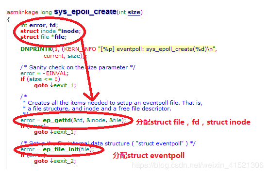
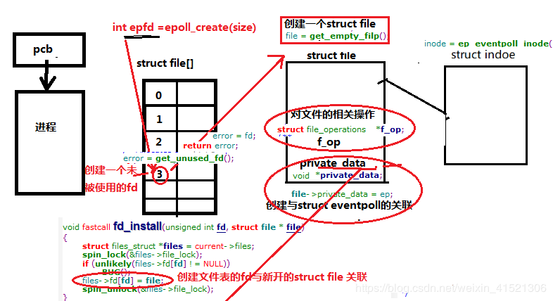
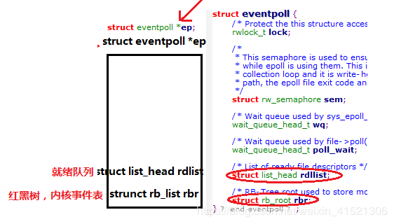
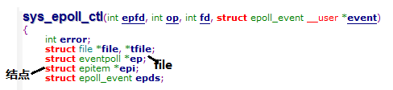
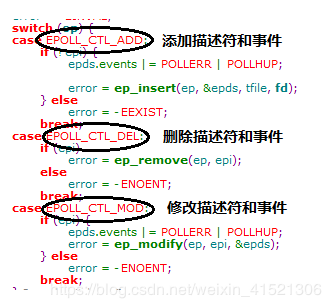
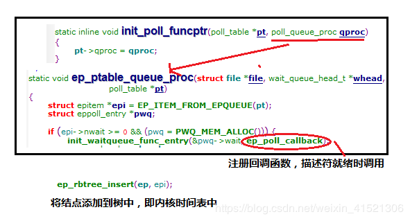
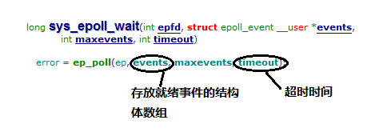
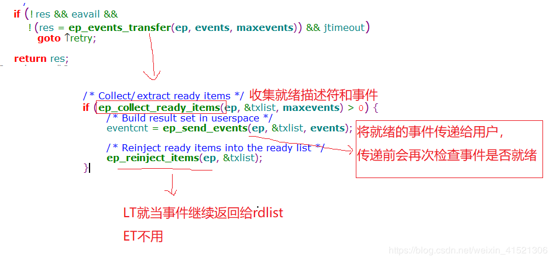

# I/O复用

I/O复用使得程序能同时监听多个文件描述符。通常，网络程序在下列情况下需要使用I/O复用技术：

- 客户端程序要同时处理多个socket。比如非阻塞connect技术
- 客户端程序要同时处理用户输入和网络连接
- TCP服务器要同时处理监听socket和连接socket。这是I/O复用使用最多的场合
- 服务器要同时处理TCP请求和UDP请求。比如回射服务器
- 服务器要同时监听多个端口，或者处理多种服务。

I/O复用虽然能同时监听多个文件描述符，但它本身是阻塞的。并且当多个文件描述符同时就绪时，如果不采取额外的措施，程序就只能按顺序依次处理其中的每一个文件描述符，这使得服务器程序看起来像是串行工作的。如果要会实现并发，只能使用多进程或多线程等编程手段。

Linux下实现I/O复用的系统调用主要有select、poll、epoll。

## select系统调用

select系统调用的用途是：在一段指定时间内，监听用户感兴趣的文件描述符上的可读、可写和异常等事件。

### select API

select系统调用的原型为：

```C
#include <sys/select.h>
int select(int nfds, fd_set* readfds, fd_set* writefds, fd_set* exceptfds, 
           struct timeval* timeout);
/**
param:	nfds 指定被监听的文件描述符的总数。它通常被设置为select监听的所有文件描述符中的最大值加1。
param:	readfds, writefds, exceptfds 分别指向可读、可写和异常等时间对于的文件描述符集合。
		应用程序调用select函数时，通过这3个参数传入自己感兴趣的文件描述符。select调用返回时，内核将修改它		   们来通知应用程序哪些文件描述符已经就绪。
param:	timeout	设置select函数的超时时间。是一个timeval结构类型的指针，采用指针是因为内核将它修改以后可		  以告诉应用程序select等待了多久。
return:	成功时返回就绪（可读、可写、异常）文件描述符的总数。
		如果在超时时间内没有任何文件描述符就绪，select将返回0
		失败时返回-1并设置errno。
		如果select在等待期间，程序接收到信号，则立即返回-1，并设置errno为EINTR
**/

/**
fd_set结构体： fd_set结构体仅包含一个整型数组，该数组的每个元素的每一位标记一个文件描述符。fd_set能容纳的文件描述符的数量由FD_SETSIZE指定，这就限制了select能同时处理的文件描述符的总量。
由于位操作过于频繁，可以使用一些宏来访问fd_set结构体中的位
**/
#include <typesizes.h>
#define __FD_SETSIZE 1024

#include <sys/select.h>
#define FD_SETSIZE __FD_SET_SIZE
typedef long int __fd_mask;
#undef __NFDBITS
#define __NFDBITS { 8 * (int) sizeof (__fd_mask) }
typedef struct{

#ifdef __USE_XOPEN
    __fd_mask fds_bits[ __FD_SIZE / __NFDBITS ];
#define __FDS_BITS(set) {(set)->fds_bits}
#else
    __fd_mask __fds_bits[ __FD_SIZE / __NFDBITS ];
#define __FDS_BITS(set) {(set)->__fds_bits}
#endif
} fd_set;

```

### 文件描述符就绪条件

哪些情况下文件描述符可以被认为是可读、可写或出现异常，对于select的使用非常关键。

**可读**

- socket内核接收缓存区中的字节数大于或等于其低水位标记SO_RCVLOWAT。此时可以无阻塞地读该socket，并且读操作返回的字节数大于0.
- socket通信的对方关闭连接。此时对该socket的读操作返回0
- 监听socket上有新的连接请求
- socket上有未处理的错误。可以使用getsockopt来读取和清除该错误

**可写**

- socket内核发送缓存区中的可用字节数大于或等于其低水位标记SO_SNDLOWAT。此时可以无阻塞地写该socket，并且写操作返回的字节数大于0.
- socket的写操作被关闭。对写操作被关闭的socket执行写操作将触发一个SIGPIPE信号
- socket使用非阻塞connect连接成功或者失败（超时）之后
- socket上有未处理的错位。可以使用getsockopt来读取和清除该错误

网络程序中，select能处理的异常情况只有一种：socket上接收到带外数据。

## poll系统调用

poll调用和select类似，也是在指定时间内轮询一定数量的文件描述符，以测试其中是否有就绪。poll原型：

```C
#include <poll.h>
int poll(struct pollfd* fds, nfds_t nfds, int timeout);
/**
param:	fds	一个pollfd结构类型的数组，它指定所有感兴趣的文件描述符上发生的可读、可写和异常等事件
param:	nfds 指定被监听事件集合fds的大小
param:	timeout	指定poll的超时值，单位是毫秒。
				当timeout为-1时，poll调用将永远阻塞，直到某个事件发生；
				当timeout为0时，poll调用将立即返回
return:	成功时返回就绪（可读、可写、异常）文件描述符的总数。
		如果在超时时间内没有任何文件描述符就绪，select将返回0
		失败时返回-1并设置errno。
		如果select在等待期间，程序接收到信号，则立即返回-1，并设置errno为EINTR
**/

typedef unsigned long int nfds_t;

struct pollfd{
    int fd; 		//指定的文件描述符
    short events;	//注册的事件，告诉poll监听fd上的哪些事件，是一系列事件的按位或
    short revents;	//实际发生的事件，由内核填充，以通知应用程序fd上实际发生了哪些事件
};
```


通常，应用程序需要根据recv调用的返回值来区分socket上接收到的是有效数据还是对方关闭连接的请求，并做相应处理。但内核2.6.17开始，GNU为poll系统调用增加了一个POLLDHUP事件，它在socket上接收到对方关闭连接的请求后触发。这为区分以上两种情况提供了一种更简单的方式。但使用POLLDHUP事件时，需要在代码最开始处定义_GNU_SOURCE。

## epoll系统调用

### 内核事件表

`epoll`是Linux特有的I/O复用函数。它在实现和使用上与select、poll有很大差异。首先，`epoll`使用一组函数来完成任务，而不是单个函数。其次，`epoll`把用户关心的文件描述符上的事件放在内核一个事件表中，从而无需像select和poll那样每次调用都需要重复传入文件描述符集或者事件级。但`epoll`需要一个额外的文件描述符，来唯一标识内核中的这个事件表。

**`epoll_creat`** 创建`epoll`文件描述符

```C
#include <sys/epoll.h>
int epoll_creat( int size );
/**
size参数现在并不起作用，只是给内核一个提示，告诉它事件表需要多大。该函数返回的文件描述符将用作其他所有epoll系统调用的第一个参数，以指定要访问的内核事件表
**/
```

**`epoll_ctl`** 操作内核事件表

```C
#include <sys/epoll.h>
int epoll_ctl(int epfd, int op, int fd, struct epoll_event *event);
/**
param:	epfd	epoll文件描述符
		fd		要操作的文件描述符
		op		指定操作类型，有三种类型EPOLL_CTL_ADD添加\EPOLL_CTL_MOD修改\EPOLL_CTL_DEL删除
		event	指定事件，是epoll_event结构指针类型
return:	成功时返回0，失败时返回-1并设置errno
**/

struct epoll_event{
    __uint32_t events;	//epoll事件，成员描述事件类型，支持的类型和poll基本相同
    epoll_data_t data	//用户数据
};

typedef union epoll_data{
    void* ptr;
    int fd;
    uint32_t u32;
    uint64_t u64;
} epoll_data_t;
/**
epoll_data_t是一个联合体，使用最多的是fd，它指定事件所从属的目标文件描述符。
	ptr成员可以用来指定与fd相关的用户数据
**/
```

epoll有额外两个事件类型： EPOLLET和EPOLLONESHOT。对于epoll的高效运作非常关键

### epoll_wait函数

epoll系统调用的主要接口是epoll_wait函数。它在一段超时时间内等待一组文件描述符上的事件。

```C
#include <sys/epoll.h>
int epoll_wait(int epfd, struct epoll_event* events, int maxevents, int timeout);
/**
return:		成功返回就绪的文件描述符个数
			失败返回-1并设置errno
param:	timeout		指定epoll的超时值，单位是毫秒
		maxevents	指定最多监听多少个事件, 必须大于0
		events		就绪事件表
**/
```

`epoll_wait`函数如果检测到事件，就将所有就绪事件从内核事件表(有epfd指定)中复制到它的第二个参数events指向的数组中。这个数组只用于输出检测到的就绪事件，而不像select和poll的数组参数那样既用于传入用户注册的事件，又用于输出内核检测到的就绪事件。这就极大提高了应用程序索引就绪文件描述符的效率。

### LT和ET模式

epoll对文件描述符的操作模式有两种：LT（Level Trigger, 电平触发）模式和ET（Edge Trigger, 边沿触发）模式。LT模式是默认的工作模式，这种模式下epoll相当于一个效率较高的poll。当往epoll内核事件表中注册一个文件描述符上的EPOLLET事件时，epoll将以ET模式来操作该文件描述符。ET模式是epoll的高效工作模式。

对于采用LT工作模式的文件描述符，当epoll_wait检测到当其上有事件发生并将此事件通知应用程序后，应用程序可以不立即处理该事件。这样，当应用程序下一次调用epoll_wait时，epoll_wait还会再次向应用程序通告次事件，直到该事件被处理。

对于采用ET工作模式的文件描述符，当epoll_wait检测到上有事件发生并将此事件通知应用程序后，应用程序必须立即处理该事件，因为后续的epoll_wait调用将不再向应用程序通知这一事件。ET模式在很大程度上降低了同一个epoll事件被重复触发的次数，因此效率比LT模式更高。

注意，每个使用ET模式的文件描述符都应该是非阻塞的。如果文件描述符是阻塞的，那么读或写操作将会因为没有后续的事件而一直处于阻塞状态。

### EPOLLONESHOT事件

即使使用ET模式，一个socket上的某个事件还是可能被触发多次。这在并发程序中就会引起一个问题。比如一个线程在读取完某个socket上的数据后开始处理这些数据，而在数据的处理过程中，该socket上又有新数据可读（EPOLLIN再次被触发），此时另外一个线程被唤醒来读取这些新的数据。于是就出现了两个线程同时操作一个socket的局面。这当然是不期望的。期望的是一个socket连接任一时刻都只被一个线程处理。这一点可以使用epoll的EPOLLONESHOT事件实现。

对于注册了EPOLLONESHOT事件的文件描述符，操作系统最多触发其上注册的一个可读、可写或者异常事件，且只触发一次，除非使用epoll_ctl函数重置该文件描述符上注册的EPOLLONESHOT事件。这样一个线程在处理socket时，其他线程不可能有机会操作该socket的。

### epoll底层实现机制

[Epoll的本质（内部实现原理）](https://blog.csdn.net/songchuwang1868/article/details/89877739?utm_medium=distribute.pc_relevant_t0.none-task-blog-BlogCommendFromMachineLearnPai2-1.nonecase&depth_1-utm_source=distribute.pc_relevant_t0.none-task-blog-BlogCommendFromMachineLearnPai2-1.nonecase)

epoll_create() //创建内核事件表 容纳事件的容器

epoll_ctl() // 向内核事件表中 添加、修改、移除 事件

epoll_wait() // 检查获取就绪事件

#### epoll_create()

epoll_create()系统调用的入口是sys_epoll_creat()



sys_epoll_create是创建一个新的内核事件表，分别通过ep_getfd()、ep_file_init()函数分配struct file、fd、struct inode,并创立起关联。





进程调用epoll()步骤：首先是为进程在文件表中分配未被使用的fd，在申请一个struct file，并创建fd与struct file 的关联；对strunct inode 进行分配；对struct file里的private_date与struct eventpoll 进行关联，间接的建立fd与struct eventpoll中struct list_head rdlist即就绪队列和struct rb_root rbr 即内核事件表建立关联。

#### epoll_ctl()



epoll_ctl()调用入口为sys_epoll_ctl()，参数为传一个fd，op为对内核事件表的增删改操作的指令。





epoll_ctl()的作用主要是将描述符和事件添加等操作到内核事件表中。关键操作是在添加时等等待队列中注册回调函数，描述符就绪时将其添加到就绪队列中，在添加到内核事件表中。

#### epoll_wait()

epoll_wait()检查并获取就绪队列。





此处重点谈一下ET和LT模式，ET模式是将就绪的事件传给用户的event结构体数组后，在将事件传给一个列表txlist，进而返回给就绪列表，下一次传递会再检测事件用户是否完全接收数据，将未完全接收就绪事件再次传递给用户，重复步骤，直至用户全部接受数据为止。

LT模式为将就绪事件传递给用户之后，不必返回给就绪列表，可能存在丢失数据的可能。

## 三组I/O复用函数的比较

select、poll和epoll三组系统调用都能同时监听多个文件描述符。它们将等待由timeout参数指定的超时时间，直到一个或者多个文件描述符上有事件发生时返回，返回值是就绪的文件描述符的数量。下面从事件集、最大支持文件描述符、工作模式和具体体现等四方面进一步比较它们的异同，以明确在实际应用中如何选择。

| 系统调用                               | select                                                       | poll                                                         | epoll                                                        |
| -------------------------------------- | ------------------------------------------------------------ | ------------------------------------------------------------ | ------------------------------------------------------------ |
| 事件集合                               | 用户通过3个参数分别传入感兴趣的可读、可写及异常等事件，内核通过对这些参数的在线修改来反馈其中的就绪事件，这使得每个用户每次调用都要重置这三个参数 | 统一处理所有时间类型，因此只需要一个事件参数集。用户通过`pollfd.events`传入感兴趣的事件，内核通过修改`pollfd.revents`反馈其中的就绪事件 | 内核通过一个事件表直接管理用户感兴趣的事件。因此每次调用`epoll_wait`时，无需反复传入用户感兴趣的时间。`epoll_wait`系统调用的参数events仅用来反馈就绪的事件 |
| 应用程序索引就绪文件描述符的时间复杂度 | O(n)                                                         | O(n)                                                         | O(1)                                                         |
| 最大支持文件描述符数                   | 一般有最大限制FD_SIZE                                        | 65535                                                        | 65535                                                        |
| 工作模式                               | LT                                                           | LT                                                           | ET                                                           |
| 内核实现和工作效率                     | 采用轮询的方式来检测就绪时间，算法时间复杂度为O(n)           | 采用轮训方式来检测就绪事件，算法时间复杂度为O(n)             | 采用回调方式来检测就绪事件，算法时间复杂度为O(1)             |

epoll_wait采用回调的方式。内核检测到就绪的文件描述符时，将触发回调函数，回调函数就将该文件描述符上对应的事件插入内核就绪事件对了。内核最后在适当的时机将该就绪事件队列中的内容拷贝到用户空间。

但是，当活动连接比较多的时候，epoll_wait的效率未必比select和poll高。因为此时回调函数被触发得过于频繁。所以epoll_wait适用于连接数量多，但活动连接较少的情况。