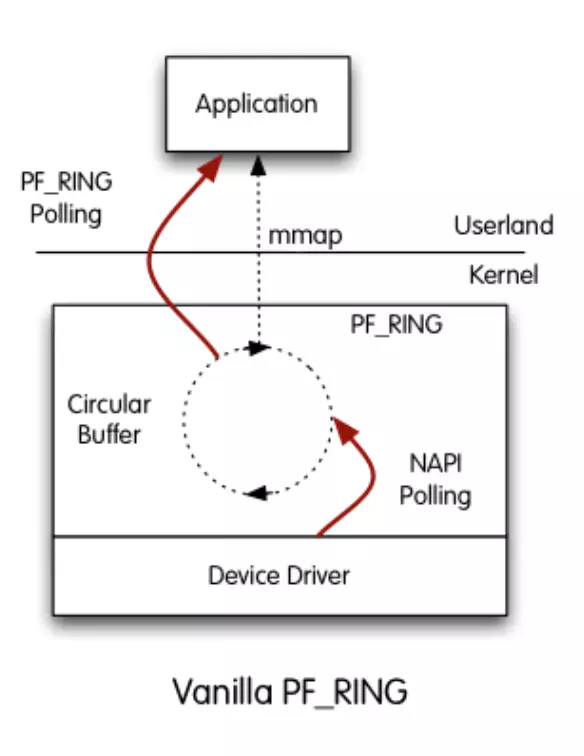

# Linux网络高速捕获技术

## 传统Linux网络协议栈流程和性能分析

### Linux网络协议栈流程

Linux网络协议栈是处理网络数据包的典型系统，它包含了从物理层直到应用层的全过程。


- 数据包到达网卡设备
- 网卡设备依据配置进行DMA操作。（第1次拷贝：网卡寄存器->内核为网卡分配的缓冲区`ring buffer`）
- 网卡发送中断，唤醒处理器
- 驱动软件从`ring buffer`中读取，填充内核`skbuff`结构（第2次拷贝：内核网卡缓冲区`ring buffer`->内核专用数据结构`skbuff`）
- 数据报文达到内核协议栈，进行高层处理。
- socket系统调用将数据从内核搬移到用户态。(第3次拷贝：内核空间->用户空间)

Linux内核协议栈在数据包的收发过程中，内存拷贝操作的时间开销占了整个处理过程时间开销的65%，此外层间传递的系统调用时间也占据了8%～10%。

### 协议栈的主要问题

**1、中断处理。**当网络中大量数据包到来时，会产生频繁的硬件中断请求，这些硬件中断可以打断之前较低优先级的软中断或者系统调用的执行过程，如果这种打断频繁的话，将会产生较高的性能开销。

**2、内存拷贝。**正常情况下，一个网络数据包从网卡到应用程序需要经过如下的过程：数据从网卡通过 DMA 等方式传到内核开辟的缓冲区，然后从内核空间拷贝到用户态空间，在 Linux 内核协议栈中，这个耗时操作甚至占到了数据包整个处理流程的 57.1%。

**3、上下文切换。**频繁到达的硬件中断和软中断都可能随时抢占系统调用的运行，这会产生大量的上下文切换开销。另外，在基于多线程的服务器设计框架中，线程间的调度也会产生频繁的上下文切换开销，同样，锁竞争的耗能也是一个非常严重的问题。

**4、局部性失效。**如今主流的处理器都是多个核心的，这意味着一个数据包的处理可能跨多个 CPU 核心，比如一个数据包可能中断在 cpu0，内核态处理在 cpu1，用户态处理在 cpu2，这样跨多个核心，容易造成 CPU 缓存失效，造成局部性失效。如果是 NUMA 架构，更会造成跨 NUMA 访问内存，性能受到很大影响。

**5、内存管理。**传统服务器内存页为 4K，为了提高内存的访问速度，避免 cache miss，可以增加 cache 中映射表的条目，但这又会影响 CPU 的检索效率。

综合以上问题，可以看出内核本身就是一个非常大的瓶颈所在。那很明显解决方案就是想办法绕过内核。


**针对单个数据包级别的资源分配和释放**
		每当一个数据包到达网卡，系统就会分配一个分组描述符用于存储数据包的信息和头部，直到分组传送到用户态空间，其描述符才被释放。此外，`sk_buff`庞大的数据结构中的大部分信息对于大多数网络任务而言都是无用的.

**流量的串行访问**
		现代网卡包括多个硬件的接收端扩展`receiver-side scaling, RSS`队列可以将分组按照五元组散列函数分配到不同的接收队列。使用这种技术，分组的捕获过程可以被并行化，因为每个RSS队列可以映射到一个特定的CPU核，并且可以对应相应的NAPI线程。这样整个捕获过程就可以做到并行化。
		但是问题出现在之上的层次，Linux中的协议栈在网络层和传输层需要分析合并的所有数据包
		①所有流量在一个单一模块中被处理，产生性能瓶颈；
		②用户进程不能够从一个单一的RSS队列接收消息.
		这就造成了上层应用无法利用现代硬件的并行化处理能力，这种在用户态分配流量先后序列的过程降低了系统的性能，丢失了驱动层面所获得的加速.
		此外，从不同队列合并的流量可能会产生额外的乱序分组

**从驱动到用户态的数据拷贝**
		从网卡收到数据包到应用取走数据的过程中，存在至少2次数据包的复制

**内核到用户空间的上下文切换**
		从应用程序的视角来看，它需要执行系统调用来接收每个分组.每个系统调用包含一次从用户态到内核态的上下文切换，随之而来的是大量的CPU时间消耗.在每个数据包上执行系统调用时产生的上下文切换可能消耗近1 000个CPU周期.

**跨内存访问**
		例如，当接收一个64 B分组时，cache未命中造成了额外13.8%的CPU周期的消耗.另外，在一个基于NUMA的系统中，内存访问的时间取决于访问的存储节点.因此，cache未命中在跨内存块访问环境下会产生更大的内存访问延迟，从而导致性能下降

## 提高捕获效率的技术

目前高性能报文捕获引擎中常用的提高捕获效率的技术，这些技术能够克服之前架构的性能限制.

针对以上弊端，分别提出以下技术点进行探讨。

**1、控制层和数据层分离。**将数据包处理、内存管理、处理器调度等任务转移到用户空间去完成，而内核仅仅负责部分控制指令的处理。这样就不存在上述所说的系统中断、上下文切换、系统调用、系统调度等等问题。

**2、使用多核编程技术代替多线程技术，**并设置 CPU 的亲和性，将线程和 CPU 核进行一比一绑定，减少彼此之间调度切换。

**3、针对 NUMA 系统**，尽量使 CPU 核使用所在 NUMA 节点的内存，避免跨内存访问。

**4、使用大页内存**代替普通的内存，减少 cache-miss。

**5、采用无锁技术**解决资源竞争问题。

### 预分配和重用内存资源

这种技术包括：
开始分组接收之前，预先分配好将要到达的数据包所需的内存空间用来存储数据和元数据(分组描述符).尤其体现在，在加载网卡驱动程序时就分配好 N 个描述符队列(每个硬件队列和设备一个).

同样，当一个数据包被传送到用户空间，其对应的描述符也不会被释放，而是重新用于存储新到达的分组.得益于这一策略，在每个数据包分配/释放所产生的性能瓶颈得到了消除.此外，也可以通过简化sk_buff的数据结构来减少内存开销.

### 数据包采用并行直接通道传递

为了解决序列化的访问流量，需要建立从RSS队列到应用之间的直接并行数据通道.这种技术通过特定的RSS队列、特定的CPU核和应用三者的绑定来实现性能的提升.

这种技术也存在一些缺点:
①数据包可能会乱序地到达用户态，从而影响某些应用的性能;
②RSS使用Hash函数在每个接收队列间分配流量.当不同核的数据包间没有相互关联时，它们可以被独立地分析，但如果同一条流的往返数据包被分配到不同的CPU核上时，就会造成低效的跨核访问.

### 内存映射

使用这种方法，应用程序的内存区域可以映射到内核态的内存区域，应用能够在没有中间副本的情况下读写这片内存区域.
用这种方式我们可以使应用直接访问网卡的DMA内存区域，这种技术被称为零拷贝.但零拷贝也存在潜在的安全问题，向应用暴露出网卡环形队列和寄存器会影响系统的安全性和稳定性 .

### 数据包的批处理

为了避免对每个数据包的重复操作的开销，可以使用对数据包的批量处理.

这个策略将数据包划分为组，按组分配缓冲区，将它们一起复制到内核/用户内存.运用这种技术减少了系统调用以及随之而来的上下文切换的次数;同时也减少了拷贝的次数，从而减少了平摊到处理和复制每个数据包的开销.
但由于分组必须等到一个批次已满或定时器期满才会递交给上层，批处理技术的主要问题是延迟抖动以及接收报文时间戳误差的增加.

### 亲和性与预取

由于程序运行的局部性原理，为进程分配的内存必须与正在执行它的处理器操作的内存块一致，这种技术被称为内存的亲和性.
CPU亲和性是一种技术，它允许进程或线程在指定的处理器核心上运行.
在内核与驱动层面，软件和硬件中断可以用同样的方法指定具体的CPU核或处理器来处理，称为中断亲和力.每当一个线程希望访问所接收的数据，如果先前这些数据已被分配到相同CPU核的中断处理程序接收，则它们在本地cache能够更容易被访问到.

## 典型分包技术

### DPDK

参考：[DPDK 全面分析](https://www.cnblogs.com/bakari/p/8404650.html)

DPDK为 Intel 处理器架构下用户空间高效的数据包处理提供了库函数和驱动的支持，它不同于 Linux 系统以通用性设计为目的，而是专注于网络应用中数据包的高性能处理。

也就是 dpdk 绕过了 Linux 内核协议栈对数据包的处理过程，在用户空间实现了一套数据平面来进行数据包的收发与处理。在内核看来，dpdk 就是一个普通的用户态进程，它的编译、连接和加载方式和普通程序没有什么两样。

**传统 Linux 内核网络数据流程：**

> 硬件中断--->取包分发至内核线程--->软件中断--->内核线程在协议栈中处理包--->处理完毕通知用户层 
>
> 用户层收包-->网络层--->逻辑层--->业务层

**dpdk 网络数据流程：**

> 硬件中断--->放弃中断流程 用户层通过设备映射取包--->进入用户层协议栈--->逻辑层--->业务层

#### DPDK实现技术


左边是原来的方式数据从 网卡 -> 驱动 -> 协议栈 -> Socket接口 -> 业务

右边是DPDK的方式，基于UIO（Userspace I/O）旁路数据。数据从 网卡 -> DPDK轮询模式-> DPDK基础库 -> 业务

用户态的好处是易用开发和维护，灵活性好。并且Crash也不影响内核运行，鲁棒性强。

DPDK支持的CPU体系架构：x86、ARM、PowerPC（PPC）。DPDK支持的网卡列表：https://core.dpdk.org/supported/。

**1、DPDK的基石UIO(Userspace  I/O)**

​		dpdk 能够绕过内核协议栈，本质上是得益于 UIO 技术，通过 UIO 能够拦截中断，并重设中断回调行为，从而绕过内核协议栈后续的处理流程。

​		UIO 设备的实现机制其实是对用户空间暴露文件接口，比如当注册一个 UIO 设备 uioX，就会出现文件 /dev/uioX，对该文件的读写就是对设备内存的读写。除此之外，对设备的控制还可以通过 /sys/class/uio 下的各个文件的读写来完成。


**2、内存池技术**

dpdk 在用户空间实现了一套精巧的内存池技术，内核空间和用户空间的内存交互不进行拷贝，只做控制权转移。这样，当收发数据包时，就减少了内存拷贝的开销。

**3、大页内存管理**

dpdk 实现了一组大页内存分配、使用和释放的 API，上层应用可以很方便使用 API 申请使用大页内存，同时也兼容普通的内存申请。

**4、无锁环形队列**

dpdk 基于 Linux 内核的无锁环形缓冲 kfifo 实现了自己的一套无锁机制。支持单生产者入列/单消费者出列和多生产者入列/多消费者出列操作，在数据传输的时候，降低性能的同时还能保证数据的同步。

**5、poll-mode网卡驱动**

DPDK网卡驱动完全抛弃中断模式，基于轮询方式收包，避免了中断开销。

**6、NUMA **

dpdk 内存分配上通过 proc 提供的内存信息，使 CPU 核心尽量使用靠近其所在节点的内存，避免了跨 NUMA 节点远程访问内存的性能问题。

**7、CPU 亲和性**

dpdk 利用 CPU 的亲和性将一个线程或多个线程绑定到一个或多个 CPU 上，这样在线程执行过程中，就不会被随意调度，一方面减少了线程间的频繁切换带来的开销，另一方面避免了 CPU 缓存的局部失效性，增加了 CPU 缓存的命中率。

**8、多核调度框架**

dpdk 基于多核架构，一般会有主从核之分，主核负责完成各个模块的初始化，从核负责具体的业务处理。

### [NetMap](http://info.iet.unipi.it/~luigi/netmap/)

​		Netmap是一款高性能网络IO框架，由意大利比萨大学信息工程系副教授Luigi Rizzo编写。

​		Netmap 使用多种技术比如：内存映射、环形队列、批量处理等来减少内核空间以及用户空间内存申请和释放、避免内存在内核空间和用户空间的拷贝以及减少系统调用。


​		Netmap是基于零拷贝思想的高速网络I/O架构，它能够在千兆或万兆网卡上达到网卡的线速收发包速率。并且能够有效地节省cpu等计算机资源。

​		网卡通过循环队列（即NIC环）来管理数据包的传输，每个网卡至少维护一对NIC环，分别用以管理发送和接收两个方向的数据包。每一个环被划分为很多槽，每一个槽都包含存储数据包的缓冲区的信息：缓冲区长度、缓冲区的物理地址等。在通常情况下，主机网络堆栈可以访问NIC环上指定的槽，也就可以访问到存放数据包的缓冲区，实现数据包的发送和接收。

​		netmap也是一个基于零拷贝思想的高速网络I/O架构，netmap的架构如上图所示。当网卡运行在netmap模式下，NIC环会与主机协议栈进行断开，netmap会拷贝一份NIC环，被称作netmap环。同时，netmap还会维护一对环，用于与主机协议栈进行交互。这些环所指向的用于存储数据包内容的缓存位于共享空间，网卡直接将数据包存入这些缓存。应用程序可以通过调用netmap API访问netmap环中的数据包内容，也就可以访问用于存储数据包的缓存，也就是说，当应用程序需要访问数据包内容时，无需从内核空间到用户空间的拷贝，可以直接访问，从而实现了网络数据包的零拷贝。此外，netmap并不会将网卡寄存器和内核的关键内存区域暴露给应用程序，因而用户态的应用程序并不会导致操作系统崩溃，所以相对一些其他的零拷贝架构，netmap更为安全。

​		netmap还会通过以下几种手段来增加网络I/O的速度：1）预分配固定大小的数据包存储空间，以消除每个数据包存储时动态分配内存所导致的系统开销；2）让用户态程序直接访问到网络数据包缓冲区，以减少数据拷贝的开销；3）使用一个轻量级的元数据表示，以屏蔽硬件相关的一些特性。该元数据表示支持在一次系统调用中处理大量数据包，从而可以减少系统调用的开销。

**NetMap存在几个问题：**

> 1.Netmap需要驱动的支持，即需要网卡厂商认可这个方案。
>
> 2.Netmap仍然依赖中断通知机制，没完全解决瓶颈。
>
> 3.Netmap更像是几个系统调用，实现用户态直接收发包，功能太过原始，没形成依赖的网络开发框架，社区不完善。

### [PF_RING](https://www.ntop.org/products/packet-capture/pf_ring/)

参考：https://www.jianshu.com/p/6d3f3cdc2411?from=timeline

> PF_RING是Luca研究出来的基于Linux内核级的高效数据包捕获技术。简单来说PF_RING 是一个高速数据包捕获库,通过它可以实现将通用 PC 计算机变成一个有效且便宜的网络测量工具箱,进行数据包和现网流量的分析和操作。同时支持调用用户级别的API来创建更有效的应用程序。


​		`PF_RING`是拥有一套完整开发接口的高速数据包捕捉库，与我们熟知的`libpcap`十分相似，但其性能要优于`libpcap`。关于`libpcap`的实现机制可以参考[`libpcap`实现机制及接口函数](https://www.jianshu.com/p/ed6db49a3428)。

#### 问题

​		在传统数据包捕获的过程中， CPU的多数时间都被用在把网卡接收到的数据包经过内核的数据结构队列发送到用户空间的过程中。也就是说是从网卡-->内核， 再从内核-->用户空间，这两个步骤，花去了大量CPU时间，从而导致没有其他时间用来进行数据包的进一步处理。
​		在传输过程中`sk_buff`结构的多次拷贝，以及涉及用户空间和内核空间的反复系统调用极大的限制了接收报文的效率，尤其是对小报文的接收影响更为明显。

#### 解决方案

​		**PF_RING提出的核心解决方案便是减少报文在传输过程中的拷贝次数**。由下图我们可以直观的看到不同技术下对数据拷贝的优化是不同的。接下来将围绕这张图的实现路径解释PF_RING和PF_RING ZC库的实现机制。


<center>
    <div style="color:orange; border-bottom: 1px solid #d9d9d9;
    display: inline-block;
    color: #999;
    padding: 2px;">libpcap、PF_RING、PF_RING ZC方案对比</div>
</center>


网卡接收报文的前面的流程就是libpcap实现机制及接口函数中讲解的NAPI

#### PF_RING noZC

> 1、PF_RING socket 针对轮询机制的不足，在轮询机制的基础上提出一种新的包捕获套接字模型，基于环形缓冲区的新的套接字 PF_RING
> 2、每创建一个PF _RING套接字便分配一个环形缓冲区，当这个套接字结束时释放这个缓冲区
> 3、PF_RING套接字绑定到某一网卡上时，这个网卡在套接字结束之前处于制度状态，当数据包到达网卡时，将其放入到环形缓冲区。如果缓冲区已经满，则将其丢弃。
> 4、用户空间可以直接访问这个环形缓冲区中的数据
> 5、当有新的数据包到来的时候，可以直接覆盖掉已经被用户空间读取过的那个数据包的空间



#### PF_RING ZC

> ​		PF_RING ZC 实现了PF_RING™ DNA（Direct NIC Access 直接网卡访问）技术。是一种映射网卡内存和寄存器到用户态的方法。
> ​		因此除了由网卡的网络处理单元完成DMA传输之外，没有任何额外的数据包复制，进一步节省了一次数据拷贝操作
> ​		这将性能更好，因为CPU周期的仅用于操作数据包，而不是把数据包从网卡挪走。
> 其缺点是，只有一个应用可以在某个时间打开DMA ring（请注意，现在的网卡可以具有多个RX / TX队列，从而就可以在每个队列上同时一个应用程序），换而言之，用户态的多个应用需要彼此沟通才能分发数据包。


用户空间创建PF_RING套接字时

```C
fd = socket(PF_RING, SOCK_RAW, htons(ETH_P_ALL));
```

和基于PF_PACKET套接字的libpcap不同的是，PF_RING机制更为灵活：

1.PF_RING采用mmap的方式将网络裸数据放在一个用户态可以直接access的地方，而不是通过socket read/write机制的内存拷贝；

2.PF_RING支持下面1到3三种方式将裸数据放到mmap到用户态的环形缓冲区以及4的DNA方式：

> 1. 按照PACKET套接字的方式从netif_receive_skb函数中抓取数据包，这是一种和PACKET套接字兼容的方式，所不同的是数据包不再通过socket IO进入用户态，而是通过mmap；(transparent_mode 0)
> 2. 直接在NAPI层次将数据包置入到所谓的环形缓冲区，同时NAPI Polling到skb对列，对于这两个路径中的第一个而言，这是一种比2.1介绍的方式更加有效的方式，因为减少了数据包在内核路径的处理长度，但是要求网卡支持NAPI以及PF_RING接口(一般而言，NAPI会将数据包Polling到一个skb队列)。(transparent_mode 1)
> 3. 和2相同，只是不再执行NAPI Polling。这就意味着，数据包将不会进入内核，而是直接被mmap到了用户态，这特别适合于用户态的完全处理而不仅仅是网络审计，既然内核不需要处理网络数据了，那么CPU将被节省下来用于用户态的网络处理。这可能会将内核串行的网络处理变为用户态并行的处理。(transparent_mode 2)
> 4. 这是一种更猛的方式，唤作DNA支持的模式，直接绕过内核协议栈的所有路径，也就是说直接在网卡的芯片中将数据包传输到(DMA的方式)所谓环形缓冲区，内核将看不到任何数据包，这种方式和Intel的万兆猛卡结合将是多么令人激动的事啊；(DNA技术)

### raw socket

[Linux raw socket](https://blog.csdn.net/qq_30736309/article/details/91792335)

### libcap

