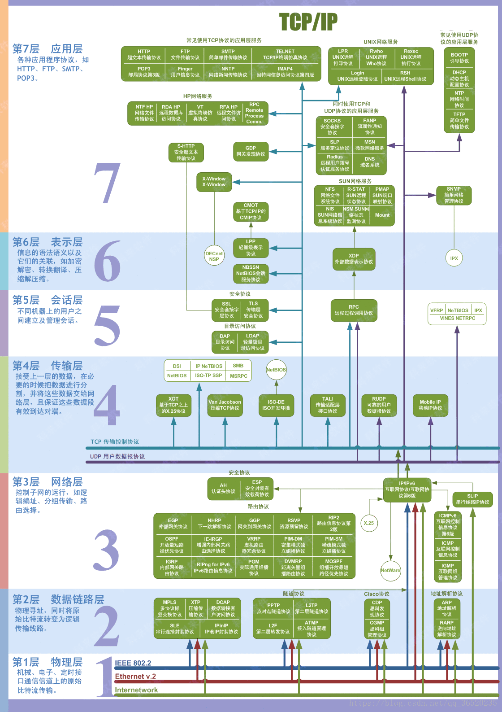

# TCP协议

## 考察点

-  OSI网络体系结构与TCP/IP协议模型，及各层协议举例

- [TCP与UDP之间的区别](https://link.zhihu.com/?target=http%3A//blog.csdn.net/shanghairuoxiao/article/details/68927070)
            (1) IP首部，TCP首部，UDP首部
            (2) TCP和UDP区别
            (3) TCP和UDP应用场景，为什么各自适用这些场景
            ~~(4) 如何实现可靠的UDP~~

- [TCP三次握手与四次挥手](https://link.zhihu.com/?target=http%3A//blog.csdn.net/shanghairuoxiao/article/details/68927100)

- [详细说明TCP状态迁移过程](https://link.zhihu.com/?target=http%3A//blog.csdn.net/shanghairuoxiao/article/details/68927100)
            (1) 三次握手和四次挥手状态变化；
            (2) 2MSL是什么状态？作用是什么？
            (3)三次握手为什么不是两次或者四次？

- [TCP相关技术](https://link.zhihu.com/?target=http%3A//blog.csdn.net/shanghairuoxiao/article/details/68927100) / TCP协议如何保证传输的可靠性

- 1. TCP重发机制，重传的过程与结果，一直重传失败会怎样
  2. TCP的拥塞控制使用的算法和具体过程（拥塞控制）
  3. TCP的窗口滑动（流量控制      flow control）

- [TCP客户与服务器模型，用到哪些函数](https://link.zhihu.com/?target=http%3A//blog.csdn.net/shanghairuoxiao/article/details/69803044)、函数的参数

  - 这些函数如何与TCP协议栈过程对应（三次握手、四次挥手过程）
  - listen()函数和accpet()函数在协议帧底层是完成了什么过程

- [UDP客户与服务器模型，用到哪些函数](https://link.zhihu.com/?target=http%3A//blog.csdn.net/shanghairuoxiao/article/details/69951345)

## 网络模型

### 七层网络模型



七层网络模型在数据的传输过程中会对数据进行封装。


<center>
    <div style="color:orange; border-bottom: 1px solid #d9d9d9;
    display: inline-block;
    color: #999;
    padding: 2px;">ISO七层网络模型的数据封装与解封装</div>
</center>

**发送**

`AH(Application Header)`  应用层的报头，形成应用层协议数据单元`Protocol Data Unit,PDU`。

表示层把整个应用层递交的数据包看成一个整体进行封装，即加上表示层的报头`Presentation Header, PH`。

同样，会话层、传输层、网络层（假设TCP传输，则是TCP数据+IP包头）、数据链路层（上层TCP数据+IP包头统一称为帧数据，即帧头+帧数据+帧尾CRC）也都要分别给上层递交下来的数据加上自己的报头，分别是：会话层报头`Session Header, SH`、传输层报头`Transport Header, TH`、网络层报头`Network Header, NH`和数据链路层报头`Data link Header, DH`。其中，数据链路层还要给网络层递交的数据加上数据链路层报尾`Data link Termination, DT`行程最终的一帧数据。

**接收**

当一帧数据通过物理层传送到目标主机的物理层时，该主机的物理层把它递交到数据链路层。数据链路层负责去掉数据帧的帧头部DH和帧尾部DT（同时还进行数据校验）。如果数据没有出错，则递交到上层网络层。通样，网络层、传输层、会话层、表示层、应用层也要做类似的工作。最终，原始数据被递交到目标主机的具体应用程序中。

### 五层网络模型

**应用层** 	确定进程之间通信的性质以满足用户需求。应用层的协议包括：HTTP、SMTP、FTP等

**传输层**	 负责主机间不同进程的通信。传输层协议主要包括：面向连接的TCP(传输控制协议)、无连接的UDP(用户数据报协议)；数据传输的单位称为报文段或者用户数据报。

**网络层**	 负责分组交换网中不同主机间的通信。作用为：发送数据时，将传输层的报文段或用户数据报封装成IP数据包，并选择合适路由。

**数据链路层** 	负责将网络层的IP数据组装成帧

**物理层**	 透明地传输比特流

### 四层网络模型

​		四层协议为TCP/IP分层模型。TCP/IP协议被组织成四个概念层，其中有三层对用与ISO参考模型中的相应层。TCP/IP协议族并不包含物理层和数据链路层，因此它不能独立地完成整个计算机网络系统的功能，必须与许多其他的协议协同工作。

#### 网络接口层/物理层

​		网络接口层包括用于协作IP数据在已有网络介质上传输的协议。实际上TCP/IP标准并不定义与ISO数据链路层和物理层相对应的功能。相反，它定义了像ARP(Address Resolution Protocol，地址解析协议)这样的协议，提供TCP/IP协议的数据结构和实际物理硬件之间的接口。

#### 网络层

​		网络层包含IP协议、RIP协议（Routing Information Protocol，路由信息协议），负责数据的包装、寻址和路由。同时还包含ICMP（Internet Control Message Protocol，网间控制报文协议）用来提供网络诊断信息。

#### 传输层

​		传输层提供两种端到端的通信服务。其中TCP协议提供可靠的数据流运输服务，UDP协议提供不可靠的数据报服务。

#### 应用层

​		应用层协议包括FTP、HTTP、Telent、SMTP等。

​		在第二层的数据叫Frame，在第三次的数据叫Packet，第四层的数据较Segment。所有程序的数据首先会打包到TCP的Segment中，然后TCP的Segment会打包到IP的Packet中，然后再打包到以太网的Frame中，传到对端后，依层解析自己的协议，然后把数据交给更高层的协议处理。

## TCP如何保证可靠传输

为了保证可靠传输，TCP比UDP多了很多控制协议和算法。

- 连接管理——3次握手和4次握手
- 数据破坏——通过校验和
- 丢包——应答与超时重发机制
- 分片乱序——序列号
- 窗口滑动——提高发送效率，对发送端和接收端流量进行控制
- 加快通信速度——快速重发，三次收到重发消息进行重发
- 流量控制——避免网络流量浪费
- 拥塞控制——慢启动算法，拥塞窗口

## **TCP中的确认应答机制**

在TCP中当发送端的数据达到接受主机时，接受主机端都会返回一个消息，告诉对方我已经收到了。这个消息叫**确认应答**。发送确认应答时，TCP首部中的ACK标志位设1。TCP中的确认应答通过序列号和确认应答号来实现。

**经受时延的确认应答**：为了降低确认应答包的数量，TCP提出了经受时延的确认应答。接受端在收到数据后并不立即发送一个应答数据包，而是等待一段时间，如果有新的数据被接受就更新应答号，如果有其他数据要发送就坐上该数据包的顺风车。在系统的内核中维持了一个定时器，一般是200ms如果定时器溢出，即使没有其他数据到达，也发送该应答数据包。

**Nagle算法**： TCP是基于流的传输协议，在Rlogin和Telnet传输中会出现只有一个字节数据的TCP数据包。而一个TCP数据包的首部加上IP首部就有40个字节，很显然发这样的数据包划不来。为了减少这样的数据包，有人提出了Nagle算法。

Nagle算法简单讲就是，等待服务器应答包到达后，再发送下一个数据包。数据在发送端被缓存，如果缓存到达指定大小就将其发送，或者上一个数据的应答包到达，将缓存区一次性全部发送。

Nagle算法是从发送端角度考虑减少了数据包的个数，时延应答从接收端角度考虑减少了数据包的个数。

## TCP包头

TCP报文头部的格式如下图：


- **16位端口号**：`port number`告知主机该报文是来自哪里（源端口）以及传给那个上层协议或应用程序（目的端口）的。所有知名服务器使用的端口号都定义在/etc/services文件中。
- **32位序列号**：`sequence number` 一次TCP通信（从TCP建立连接到断开）过程中某一个传输方向上的字节流的每个字节的编号。即TCP通信过程中的seq序列号。
- **32位确认号**：`acknowledgement number` 用做对另一方发送来的TCP报文段的响应。其值是收到的TCP报文段的序号值加1。即TCP通信过程中的ACK序列号。
- **4位头部长度**：`header length / offset`数据偏移。标识该TCP头部有多少个4Byte。4位最大表示15，TCP头部最长为60Byte.
- **6位保留区域**：`Reserved`。预留位，目前必须置0.
- **6位控制位**：`control flags / TCP flags`包含

> - URG标志，表示紧急指针`urgent pointer`是否有效
> - ACK标志，表示确认号是否有效，一般携带ACK标志的TCP报文段为“确认报文段”。
> - PSH标志，表示接收端应用程序应该立即从TCP接收缓冲区中读走数据，为接收后续数据腾出空间。
> - RST标志，表示要求对方重新建立连接，一般携带RST标志的TCP报文段为“复位报文段”。
> - SYN标志，表示请求建立一个连接，一般称携带SYN标志的TCP报文段为“同步报文段”。
> - FIN标志，表示通知对方本端要关闭连接了，一般称携带FIN标志的TCP报文段为“结束报文段”。

- **16位窗口大小**：`window size`是TCP流量控制的一个手段。这个窗口，指的是接收通告窗口（Receiver Windows, RWND）。它告诉对方本端的TCP接收缓冲区还能容纳多少字节的数据，这样对方就可以控制发送数据的速度。窗口大小是一个 16bit 字段，因而窗口大小最大为 65535（2^16 - 1）。
- **16位校验和**：`TCP checksum`由发送端填充，接收端对TCP报文段执行CRC算法，以检验TCP报文段在传输过程中是否损坏。该校验不仅包括TCP头部，也包括数据部分。是TCP可靠传输的一个重要保障。
- **16位紧急指针**：`urgent pointer`一个正的偏移量。它和序号字段的值相加表示最后一个紧急数据的下一字节的序号。 TCP 的紧急方式是发送端向另一端发送紧急数据的一种方式。 只有当URG 标志置 1 时紧急指针才有效。
- **选项和填充**：`option and pad` n\*4字节，常见的可选字段是最长报文大小`MSS, Maximum Segment Size `.每个连接方通常都爱同喜你的第一个报文段（为建立连接而设置的SYN标志的那个段）中指明这个选项，它值明本端所能接收的最大长度的报文段。选项长度不一定是32位的整数倍，所以要加填充位，使得报文头长度为整数。
- **数据**：`Data` 不定长度，为上层协议封装好的数据。

**最大报文段长度MSS（Maximum Segment Size）**

> 指明自己期望对方发送TCP报文段时那个数据字段的长度。比如：1460字节。数据字段的长度加上TCP首部的长度才等于整个TCP报文段的长度。MSS不宜设的太大也不宜设的太小。若选择太小，极端情况下，TCP报文段只含有1字节数据，在IP层传输的数据报的开销至少有40字节（包括TCP报文段的首部和IP数据报的首部）。这样，网络的利用率就不会超过1/41。若TCP报文段非常长，那么在IP层传输时就有可能要分解成多个短数据报片。在终点要把收到的各个短数据报片装配成原来的TCP报文段。当传输出错时还要进行重传，这些也都会使开销增大。因此MSS应尽可能大，只要在IP层传输时不需要再分片就行。在连接建立过程中，双方都把自己能够支持的MSS写入这一字段。MSS只出现在SYN报文中。即：MSS出现在SYN=1的报文段中
> MTU和MSS值的关系：`MTU=MSS+IP Header+TCPHeader`
> 通信双方最终的MSS值=较小MTU-IP Header-TCP Header
>
> MTU:数据链路层的最大传送单元

注意：

1）TCP包没有IP地址，由IP层负责，TCP包只有端口。

2）一个TCP连接需要五元组来标明是同一个TCP连接：src_ip、src_port、dst_ip、dst_port、protocol。

3）`sequence number`是包的序号，用来解决乱序问题

4）`acknowledgement number`就是ACK，用于确认收到，用来解决不丢包问题

5）`window`又叫`advertised-window`，也就是著名的滑动窗口`sliding window`，用于解决流控问题

6）`TCP Flag`也就是包的类型，主要用于操控TCP的状态机的

## TCP状态转换

### 三次握手与四次挥手


### 建立连接

TCP/IP协议中，TCP提供可靠的连接服务，采用三次握手建立一个连接。

- **第一次握手**：建立连接时，客户端发送`SYN`包到服务器，数据包中`SYN`位置为1，序列号x，并进入`SYN_SEND`状态，等待服务器确认。
- **第二次握手**：服务器收到SYN包，必须确认客户的`SYN(ACK=x+1)`，同时回复一个`SYN`包，序列号`y`，即`SYN+ACK`包，服务器进入`SYN_RECV`状态。
- **第三次握手**：客户端收到服务器发出的`SYN+ACK`包。向服务器发送确认包`ACK(ACK = y + 1)`，此包发送完毕，客户端进入`ESTABLISHED`状态，服务器端接受到应答数据包后，也变成`ESTABLISHED`状态，完成三次握手。

### 发送数据

客户端发送一个一个字节的数据，因此序列号为x+1；
服务端发送一个应答包，应答号为x+2，告诉客户端下次从x+2开始发；

### 断开连接

- **第一次挥手**：客户端发送请求断开的数据包，告诉服务器：“数据传完了，我要断开了”。发送一个FIN包，序列号x+2。客户端转移到FIN_WAIT_1状态。
- **第二次挥手**：服务器端发送应答包，告诉客户端：“行，我知道了，你断开吧！”。应答号为x+3，服务器进入CLOSE_WAIT状态。客户端收到应答后，转移到FIN_WAIT_2状态。


- 服务器发送一个断开数据包，告诉客户端：“既然传完了，那我这边的开关也准备关了”。序列号为y+1，发送完后服务器进入LAST_ACK状态。
  客户端发送一个应答包，告诉服务器：“好的，我知道你要断开了。”应答号为y+2。客户端进入TIME_WAIT状态。
  TIME_WAIT又称为2MSL等待状态，MSL是系统中定义的最大报文生存时间，任何TCP报文在网络中生存时间超过这个值就必须被丢弃。
  等待MSL的原因是防止最后一个ACK丢失后可以进行重发，如果ACK丢失后，服务器会重发FIN。

### 半关闭状态

TCP有一个特别的概念叫半关闭。也就是说，TCP的连接时全双工（可以同时发送和接收）连接，因此在关闭连接的时候，必须关闭传和送两个方向上的而连接。半关闭（与半打开区别：半打开是连接后的客户端和服务端有一端异常关闭了），所谓半关闭是指可以只关闭从A到B的方向，而B到A的方向还可以继续传输。因此，在客户端和服务器端分别进行关闭。

### 为什么是三次握手与四次挥手

​		对于建立连接的三次握手，主要是初始化`sequence number`的初始值。通信的双方需要互相通知对方自己的初始化的`sequence number`——所以叫SYN，也就是上图的x和y。这个序列号要作为以后的数据通信的序列号，以保证应用层接收到的数据不会因为网络上的传输问题而乱序（TCP会用这个序号来拼接数据）。

​		对于四次挥手，其实仔细看是两次，因为TCP是全双工的，所以发送方和接收方都需要FIN和ACK。只不过，有一方是被动的，看上去就行成了四次挥手。如果两边同时断开连接，那就会进入`CLOSING`状态，然后达到`TIME_WAIT`状态。

### 复位报文段

某些特殊情况下，TCP连接的一端会向另一端发送携带RST标志的报文段，即复位报文段，以通知对方关闭连接或重新建立连接。产生复位报文段主要有以下几种情况：

- **访问不存在的端口**  当客户端访问一个不存在的端口时，目标主机将给它发送一个复位报文段。复位报文段的接收通告窗口大小为0，可以预见：收到复位报文段的一端应该关闭连接或者重新连接，而不能回应报文。

  实际上，当客户端程序向服务器的某个端口发起连接，而该端口仍被处于TIME_WAIT状态的连接所占用时，客户端也将收到复位报文段。

- **异常终止连接** TCP提供了异常终止一个连接的方法，即给对方发送一个复位报文段。一旦发送了复位报文段，发送端所有排队等待发送的数据都将丢弃。应用程序可以使用socket选项SO_LINGER来发送复位报文段，以异常终止一个连接。

- **处理半打开连接** 如果客户端或服务器往处于板打开状态的连接写入数据，则对方将回应一个复位报文段。


### TCP状态流转


- `CLOSED` 表示初始状态
- `LISTEN` 表示服务器端的某个socket处于监听状态，可以接受连接
- `SYN_SENT` 在服务端监听后，客户端`socket`执行`CONNECT`连接时，客户端发送SYN报文，此时客户端进入`SYN_SENT`状态，等待服务端确认
- `SYN_RCVD` 表示服务端接收到了SYN报文，在正常情况下，这个状态是服务器端的`socket`在建立TCP连接时的三次握手会话过程中的一个中间状态，很短暂，基本上用`netstat`工具是很难看到的，除非故意不予发送最后一个ACK报文。这种状态时，当收到客户端的ACK报文后，就进入到`ESTABLISHED`状态
- `ESTABLISHED` 表示连接已建立
- `FIN_WAIT_1` 连接建立以后，其中一方请求终止连接，等待对方的`FIN`报文。该状态是当`socket`在`ESTABLISHED`状态时，想主动关闭连接，想对方发送了`FIN`报文。`FIN_WAIT_1`是一个短暂的状态。
- `FIN_WAIT_2` 实际上该状态下的socket，表示半连接。
- `TIME_WAIT`  表示收到了对方的FIN报文，并发送出了ACK报文，就等`2MSL`后即可会到`CLOSED`可用状态。
- `CLOSING` 这种状态比较特殊，实际情况中很少见，属于一种比较罕见的例外状态。如果双方几乎在同时关闭一个`socket`的话，那么就出现了双方同时发送`FIN`报文的情况，就会出现`CLOSING`状态，表示双方都在关闭`socket`连接。
- `CLOSED_WAIT` 这种状态的含义其实是表示在等待关闭。当对方关闭一个`socket`后发送`FIN`报文给自己时，系统将会回应一个`ACK`报文给对方，此时则进入到`CLOSED_WAIT`状态。在`CLOSED_WAIT`状态下，需要完成的事是等待去关闭连接。
- `LAST_ACK` 被动关闭一方在发送`FIN`报文后，最后等待对方的ACK报文。
- `CLOSED` 当收到ACK报文后，也即可以进入到`CLOSED`可用状态了。

### 2MSL等待状态

`TIME_WAIT`状态，又叫做`2MSL`状态，说的是`TIME_WAIT_2`发送了最后一个`ACK`数据报文后，要进入`TIME_WAIT`状态，这个状态是防止最后一次握手的数据报没有传送到对方那里而准备的。

`2MSL(maximum segment lifetime)`  任何TCP实现都必须为MSL选择一个值。MSL是任何IP数据报能够在因特网中存活的最长时间。
**存在理由**	

> 可靠地实现TCP全双工连接的终止	
> 允许老的重复节点在网络中消逝  ->在TIME_WAIT期间不允许发起新的连接

## TCP定时器

　　TCP中有四种计时器（Timer），分别为：

　　　　1.重传计时器：Retransmission Timer

　　　　2.坚持计时器：Persistent Timer

　　　　3.保活计时器：Keeplive Timer

　　　　4.时间等待计时器：Timer_Wait Timer

### 重传计时器

　　大家都知道TCP是保证数据可靠传输的。怎么保证呢？带确认的重传机制。在滑动窗口协议中，接受窗口会在连续收到的包序列中的最后一个包向接收端发送一个ACK，当网络拥堵的时候，发送端的数据包和接收端的ACK包都有可能丢失。TCP为了保证数据可靠传输，就规定在重传的“时间片”到了以后，如果还没有收到对方的ACK，就重发此包，以避免陷入无限等待中。

　　当TCP发送报文段时，就创建该特定报文的重传计时器。可能发生两种情况：

　　1.若在计时器截止时间到之前收到了对此特定报文段的确认，则撤销此计时器。

　　2.若在收到了对此特定报文段的确认之前计时器截止时间到，则重传此报文段，并将计时器复位。

### 持久计时器

　　先来考虑一下情景：发送端向接收端发送数据包知道接受窗口填满了，然后接受窗口告诉发送方接受窗口填满了停止发送数据。此时的状态称为“零窗口”状态，发送端和接收端窗口大小均为0.直到接受TCP发送确认并宣布一个非零的窗口大小。但这个确认会丢失。我们知道TCP中，对确认是不需要发送确认的。若确认丢失了，接受TCP并不知道，而是会认为他已经完成了任务，并等待着发送TCP接着会发送更多的报文段。但发送TCP由于没有收到确认，就等待对方发送确认来通知窗口大小。双方的TCP都在永远的等待着对方。

　　要打开这种死锁，TCP为每一个链接使用一个持久计时器。当发送TCP收到窗口大小为0的确认时，就坚持启动计时器。当坚持计时器期限到时，发送TCP就发送一个特殊的报文段，叫做探测报文。这个报文段只有一个字节的数据。他有一个序号，但他的序号永远不需要确认；甚至在计算机对其他部分的数据的确认时该序号也被忽略。探测报文段提醒接受TCP：确认已丢失，必须重传。

　　坚持计时器的值设置为重传时间的数值。但是，若没有收到从接收端来的响应，则需发送另一个探测报文段，并将坚持计时器的值加倍和复位。发送端继续发送探测报文段，将坚持计时器设定的值加倍和复位，直到这个值增大到门限值（通常是60秒）为止。在这以后，发送端每个60秒就发送一个探测报文，直到窗口重新打开。

### 保活计时器

　　保活计时器使用在某些实现中，用来防止在两个TCP之间的连接出现长时间的空闲。假定客户打开了到服务器的连接，传送了一些数据，然后就保持静默了。也许这个客户出故障了。在这种情况下，这个连接将永远的处理打开状态。

　　要解决这种问题，在大多数的实现中都是使服务器设置保活计时器。每当服务器收到客户的信息，就将计时器复位。通常设置为两小时。若服务器过了两小时还没有收到客户的信息，他就发送探测报文段。若发送了10个探测报文段（每一个像个75秒）还没有响应，就假定客户除了故障，因而就终止了该连接。

　　这种连接的断开当然不会使用四次握手，而是直接硬性的中断和客户端的TCP连接。

### 时间等待计时器

　　时间等待计时器是在四次握手的时候使用的。四次握手的简单过程是这样的：假设客户端准备中断连接，首先向服务器端发送一个FIN的请求关闭包（FIN=final），然后由established过渡到FIN-WAIT1状态。服务器收到FIN包以后会发送一个ACK，然后自己有established进入CLOSE-WAIT.此时通信进入半双工状态，即留给服务器一个机会将剩余数据传递给客户端，传递完后服务器发送一个FIN+ACK的包，表示我已经发送完数据可以断开连接了，就这便进入LAST_ACK阶段。客户端收到以后，发送一个ACK表示收到并同意请求，接着由FIN-WAIT2进入TIME-WAIT阶段。服务器收到ACK，结束连接。此时（即客户端发送完ACK包之后），客户端还要等待2MSL（MSL=maxinum segment lifetime最长报文生存时间，2MSL就是两倍的MSL）才能真正的关闭连接。

## TCP超时重传

TCP超时讨论在异常网络的转况下（开始出现超时或丢包），TCP如何控制数据传输以保证其承诺的可靠服务。

会有这几种情况：

- 数据顺利到达对端，对端顺利响应ACK
- 数据包中途丢失
- 数据包顺利到达，但ACK报文中途丢失
- 数据包顺利到达对端，但对端异常未响应ACK或被对端丢弃

当出现这些异常情况时，TCP就会超时重传。TCP每发送一个报文段，就对这个报文段设置一次计时器。只要设置计时器设置的重传时间到了，但还没有收到确认，就要重传这一报文段，此即“超时重传”。

TCP是可靠的传输协议，意味着必须按序，无差错的传送数据到目的端。通过校验和，确认应答，重传来保证。重传分为两种：超时重传和快速重传。

### 超时重传

当一个包被发送后，就开启一个定时器，如果定时时间（RTO）到了，还未收到能确认该发送包的应答包，就重传一份数据。注意收到的应答包可能是该包也可能是后面包的，但是只要能确认该包被收到就行。另外如果，是因为网络延时造成重传，则接受端收到重复数据包后丢弃该包。

由于不同的网络情况不一样，不可能设置一样的RTO，实际中RTO是根据网络中的RTT（传输往返时间）来自适应调整的。具体关系参考相关算法。

数据被重发以后若还是收不到应答，则进行再次发送。此时等待确认应答时间会以2倍、4倍的指数函数延长。
 此外，数据也不会被无限、反复的重发。达到一定的重发次数之后，如果仍然没有任何确认应答返回，就会判断为网络或者对端主机发生了异常，强制关闭连接。

> **Linux设置**
>
> 最小重传时间是200ms
> 最大重传时间是120s
> 重传次数为15

### 快速重传

当如果发送端收到一个包的三次应答包后，立即重传，比超时重传更高效。


## TCP滑动窗口

​		TCP窗口在每个传输方向都有两个窗口，发送端窗口和接受端窗口，又因为TCP是全双工通信，因此有四个窗口。	

​		发送端窗口分为已经发送但是未接到回应的部分和可以被发送的部分

​		接收端端口大小 = 被分配缓存区 - 已接受确认等待被进程消耗的区域，发送端窗口的大小由ACK应答包中的窗口大小确认

​		TCP滑动窗口主要有两个作用，一是提供TCP的可靠性；二是提供TCP的流控特性。同时滑动窗口机制还体现了TCP面向字节流的设计思路。TCP段中窗口字段的长度为16bit，它代表的是窗口的字节容量，也就是TCP的标准窗口最大为65535个字节。

​		另外在TCP的选项字段中还包含了一个TCP窗口扩大因子，option-kind为3，option-length为3，option-data取值范围0~14。窗口扩大因子用来扩大TCP窗口，可把原来16bit的窗口扩大为32bit。

​		对于TCP会话的发送方，任何时候在其发送缓存内的数据都可以分为4类：①已经发送并得到对端ACK；②已经发送但还未收到对端ACK；③未发送但对端允许发送；④未发送且对端不允许发送。其中，“已发送但还未接收到对端ACK”和“未发送但对端允许发送”这两部分数据称之为发送窗口。四部分数据如下所示。


​		当收到接收方新的ACK对于发送窗口中后续字节的确认时，滑动窗口原理如下图：


​		对于TCP接收方，在某一时刻它的接收缓存内存在3中状态：①已接收；②未接收准备接收；③未接收并准备接收（由于ACK直接由TCP协议栈回复，默认无应用延迟，不存在“已接收未回复ACK”）。其中“未接收准备接收”称之为接收窗口。

​		TCP是双工的协议，会话的双方都可以同时接收、发送数据。TCP会话的双方都各自维护一个“发送窗口”和一个“接收”窗口。其中各自的“接收窗口”大小取决于应用、系统、硬件的限制（TCP传输速率不能大于应用的数据处理速率）。各自的“发送窗口”则要求取决于对端通告的“接收窗口”，要求相同。

​		滑动窗口实现面向流的可靠性来源于“确认重传”的机制。TCP的滑动窗口的可靠性也是经历在“确认重传”基础上的。发送窗口只有收到对端对于本段发送窗口内字节的ACK确认，才会移动发送窗口的左边界。接收窗口只有在前面所有的段都确认的情况下才会移动左边界；在前面还有字节未接收但收到后面字节的情况下，窗口不会移动，并不会对后续字节确认。以此确保对端会对这些数据重传。

​		TCP的滑动窗口是动态的，应用根据自身的处理变化能力变化，通过本端TCP接收窗口大小控制来对对端的发送窗口进行流量限制。

​		应用程序在需要（如内存不足）时，通过API通知TCP协议栈缩小TCP的接收窗口。然后TCP协议栈在下个时间段发送时包含新的窗口大小通知给对端，对端按通知的窗口来改变发送窗口，以此达到减缓发送速率的目的。

## TCP拥塞控制

​		拥塞控制就是防止过多的数据注入到网络中，可以使网络中的路由器或链路不致过载。拥塞控制是一个全局性的过程，和流量控制不同，流量控制指点对点通信量的控制。

​		TCP的拥塞控制由四个核心算法组成：慢启动`slow start`、拥塞避免`congestion voidance`、快速重传`fast retransmit`、快速恢复`fast recovery`。

### 慢启动和拥塞避免

​		拥塞避免算法需要维持两个变量：**拥塞窗口**和**慢启动阀值**。

​		发送方维持变量**拥塞窗口`cwnd, congestion window`**。拥塞窗口的大小取决于网络的拥塞程度，并且也在动态变化。发送方让自己的发送窗口等于拥塞窗口，另外考虑到接收方的接收能力，发送窗口可能小于拥塞窗口.                      

​		慢开始的思路就是，不要一开始就发送大量的数据，先探测一下网络的拥塞程度，也就是说由小到大逐渐增加拥塞窗口的大小。

​		慢开始的原理大致为：

> ​		在刚刚开始发送报文时可先将拥塞窗口`cwnd`设置为一个最大报文段MSS的数值。在每收到一个对新报文段确认后，将拥塞窗口增加至多一个MSS的数值，当`cwind`足够大的时候，为了防止拥塞窗口`cwind`的增长引起网络拥塞，还需要另一个变量，即慢开始门限`ssthresh`，或叫慢启动阈值。
>
> ​		`ssthresh`用法为：
>
> ​			当`cwnd < ssthresh`时，使用慢启动算法。
>
> ​			当`cwnd > ssthresh`时，使用拥塞避免算法。
>
> ​			当`cwnd = ssthresh`时，慢启动算法与拥塞避免算法任意。

​		拥塞避免算法让拥塞窗口缓慢增长，即每经过一个往返时间RTT，就把发送方的拥塞窗口`cwnd`加1，而不是加倍。

​		拥塞控制的具体过程为：

- TCP连接初始化，将拥塞窗口大小设置为1

- 执行慢启动算法，`cwnd`按指数规律增长，直到`cwnd = ssthresh`时，开始执行拥塞避免算法，`cwnd`按线性规律增长

- 当网络发生拥塞，把`ssthresh`值更新为前`ssthresh`值的一半，`cwnd`重新设置为1，按步骤2执行

  ​	拥塞控制具体过程如下图所示


### 快重传和快恢复

​		快重传要求接收方在收到一个失序的报文段后就立即发出重复确认（为的是使发送方尽早知道报文有没有到达对方），而不要等到自己发送数据时捎带确认，快重传算法规定，发送方只要一连收到三个重复确认就应当立即重传对方尚未手到的报文段，而不必继续等待设置的重传。


快重传配合使用的还有快恢复算法：

- 当发送方连续收到三个重复确认时，就执行“乘法减小”算法，把`ssthresh`门限减半。但接下去并不执行慢开始算法。
- 考虑到如果网络出现拥塞的话就不会收到好几个重复的确认，所以发送方现在认为网络可能没有出现拥塞。所以此时不执行慢启动算法，而是将`cwnd`设置为`ssthresh`的大小，然后执行拥塞避免算法。


从整体上来讲，TCP拥塞控制窗口变化的原则是加法增大、乘法减小。可以看出TCP的该原则可以较好地保证流之间的公平性，因为一旦出现丢包，那么立即减半退让，可以给其他新建流留有足够的空间，从而保证整个的公平性。


## 网络编程API

### socket()函数


​		创建socket对象

```cpp
#include <sys/types.h>          /* See NOTES */
#include <sys/socket.h>

int socket(int domain, int type, int protocol);
//domian: 通信网络的域, 常用: AF_INET -> IPv4
//type: 套接字通信的类型
		SOCKET_STREAM	   ->   流式套接字, TCP连接的
		SOCK_RAW			->   RAW类型,原始网络访问
		SOCK_DGRAM		  ->   支持UDP连接(无连接状态的消息)
//protocol: 定制某个协议的特殊类型.通常设置为0
```
​		当调用`socket`创建一个`socket`时，返回的`socket`描述符存在于协议族（address family, AF_XXX）空间中，但没有一个具体的地址。如果想要赋予其一个地址，就必须调用bind()函数，否则系统就在调用connect()、listen()时自动分配一个端口。

​		如果调用成功就返回新创建的套接字的描述符，如果失败就返回-1(Linux)。套接字描述符是一个整数类型的值。每个进程的进程空间里都有一个套接字描述符表，该表中存放着套接字描述符和套接字数据结构的对应关系。该表中有一个字段存放新创建的套接字的描述符，另一个字段存放着套接字数据结构的地址，因此根据套接字描述符就可以找到其对应的套接字数据结构。每个进程在自己的进程空间里都有一个套接字描述符表，但套接字数据结构都存放在操作系统的内核缓冲里。

### bind()函数

​		`bind()`函数把一个地址族中的特定地址赋给`socket`。

```CPP
#include<sys/types.h>
#incude<sys/socket.h>

int bind(int sockfd, const struct sockaddr *my_addr, socklen_t addrlen);
//sockfd即socket描述符，由socket()函数创建来唯一标识一个socket的，bind()函数就是要将这个描述符绑定一个名字
//my_addr 一个const struct sockaddr*指针，指向要绑定给sockfd的协议地址，里面保存IP地址和端口号
//addrlen 是sockaddr结构的大小
//返回值：成功返回0，失败返回-1，并设置全局变量errno
```

协议族：

#### struct sockadd_in

ipv4地址协议族

```cpp
#include <netinet/in.h>

struct sockaddr_in {
    sa_family_t         sin_family;   // e.g. AF_INET
    in_port_t			sin_port;     // e.g. htons(3490)
    struct in_addr   	sin_addr;     // see struct in_addr, below
    char             	sin_zero[8];  // zero this if you want to
};

struct in_addr {
    uint32_t 	s_addr;  // load with inet_aton()
};
```
#### struct sockadd_in6

ipv6地址协议族

```C
struct sockaddr_in6 {
    sa_family_t         sin6_family;  	 // e.g. AF_INET6
    in_port_t			sin6_port;     	 // e.g. port number
    uint32_t 			sin6_flowinfo;	 //  IPv6 flow information
    struct in6_addr   	sin6_addr;     	 // see struct in_addr6, below  IPv6 address
    uint32_t           	sin6_scope_id;   // scope ID
};

struct in6_addr {
    unsigned char 		s6_addr[16];  // IPv6 address
};
```

### listen()函数

监听一个端口上的连接请求。作为一个服务器，在调用socket()、bind()之后就会调用

```c
#include<sys/socket.h>

int listen(int sockfd, int backlog);
//sockfd 是要监听的socket句柄
//backlog 相应socket可以排队的最大连接个数，默认为20
//返回值：成功返回0，失败返回-1，并设置全局变量errno。
```

处于监听状态的服务器在获得客户机的请求连接后，会将其放置在等待队列中，系统空闲时接收连接请求。

socket()函数创建的socket默认是一个主动类型的，listen函数将socket变为被动类型，等待客户端的连接请求。

### accept()函数

接收客户机的连接请求。TCP服务端依次调用socket()、bind()、listen()之后，就会监听指定的socket地址。TCP客户端依次调用socket()、connect()之后就会向TCP服务器发送一个连接请求。TCP服务器监听到这个请求后，就会调用accept()函数接收请求，这样就建立连接了。

```C
#include<sys/types.h>
#incude<sys/socket.h>

int accept(int sockfd, struct sockaddr *addr, socklen_t *addrlen);
//sockfd 监听的套接字描述符
//addr 指向sockaddr结构的指针，用于返回客户端的协议地址
//addrlen 协议地址的长度
//返回值 调用成功，返回值是由内核自动生成的一个全新的描述符，代表与返回客户端的TCP连接。
//		失败返回-1，并设置全局变量errno。
```

注意`accept()`函数的第一个参数为服务器的socket描述符，是服务器调用socket()函数生成的；而accept函数返回的是已连接的socket描述符。

### connect()函数

客户端调用connect函数来建立与TCP服务器的连接。

```C
#include<sys/types.h>
#incude<sys/socket.h>

int connect(int sockfd, const struct sockaddr *serv_addr, socklen_t addrlen);
//sockfd 客户端的sockfd描述符
//serv_addr 服务器的socket地址
//addrlen 地址长度
```

### read()/write()函数

至此服务器与客户端已经建立好连接了，可以调用网络I/O进行读写操作了，即实现了网络中不同进程之间的通行。网络I/O操作有以下几组：

```C
read()/write()
recv()/send()
readv()/writevv()
recvmsg()/sendmsg()
recvfrom()/sendto()
```

read()/write()原型：

```C
#include<sys/types.h>
#incude<sys/socket.h>

ssize_t read(int fd, void *buf, size_t count);
ssize_t write(int fd, const void *buf, size_t count);

//read()函数负责从fd中读取内容，读取成功时，返回实际所读字节数。返回0说明已经读到文件的结束；小于0表示错误
//socket描述符    缓冲区buf 	缓冲区长度count
//write()函数将buf中的nbytes字节内容写入文件描述符fd，成功时返回写的字节数。失败返回-1，并设置errno变量
```

### close()函数

关闭socket描述符。

```CQL
#include <unistd.h>

int closre(int fd);
```

close一个TCP socket的默认行为时，会把该socket标记为已关闭，然后立即返回调用进程。该进程描述符不能再由调用进程使用，也就是说不能再作为read或write的第一个参数。

close操作知识相应socket描述字的引用计数-1，只有当应用计数为0时，才会触发TCP客户端向服务器发送终止连接请求。

## 网络字节序与主机序

所有网络协议都是采用大端方式来传输数据的，故有时也会把大端序称之为网络字节序。当两台采用不同字节序的主机通信时，在发送数据之前都必须经过字节序的转换成为网络字节序之后再进行传输。

```
ntohs, ntohl, htons,htonl
	ntohs = net to host short int 16位
	htons = host to net short int 16位
	ntohl = net to host long int 32位
	htonl = host to net long int 32位
```

**网络字节顺序NBO（Network Byte Order）**
按从高到低的顺序存储，在网络上使用同一的网络字节顺序，可避免兼容性问题；
**主机字节顺序HBO(Host Byte Order)**
不同的机器HBO不相同，与CPU的设计有关，数据的顺序是由CPU决定的，而与操作系统无关；
如Intel x86结构下，short型数0x1234表示为34 12，int型数0x12345678表示为78 56 34 12；
如IBM power PC结构下，short型数0x1234表示为 12 34，int型数0x12345678表示为 12 34 56 78.
由于这个原因，不同体系结构的机器之间不能直接通信，所以要转换成一种约定的顺序，也就是网络字节顺序，其实就是如同power pc那样的顺序。在PC开发中有ntohl和htonl函数可以用来进行网络字节和主机字节的转换

## 封包与解包——TCP粘包问题

TCP是一个“流”协议，所谓流，就是没有界限的一串数据。但一般通信程序开发是需要定一个一个个相互独立的数据包的。由于“流“的特性以及网络状态，在数据传输时假设连续调用两次send分别发送两个数据包data1和data2，在接收端有以下几种接收情况：

- 先接收到data1，然后接收到data2
- 先接收到data1的部分数据，然后接收到data1余下的部分以及data2的全部
- 先接收到data1的全部数据和data2的部分数据，然后接收到了data2的余下的数据
- 一次性接收到了data1和data2的全部数据

对于后三种情况，就是常说的“粘包”，就需要把接收到的数据进行拆分，拆成一个个独立的数据包；而为了拆包就必须在发送端进行封包。

对于UDP来说不存在拆包问题，因为UDP是个“数据包”协议，也就是两段数据是有界限的，在接收端要么接收不到数据，要么就是接收一段完整的数据，不会少接收也不会多接收。

TCP粘包是指发送方发送的若干包数据到接收方接收时粘成一包, 从接收缓冲区看, 后一包的数据头紧接着前一包尾。

### **为什么会出现"粘包"现象**

**发送方原因**

由Nagle算法造成发送端的粘包。Nagle是一种改善网络传输效率的算法，但也可能造成困扰。当提交一段数据给TCP发送时，TCP并不理科发送此段数据，而是等待一小段时间，看看在等待期内是否还有要发送的数据，若有则会一次把多段数据发送出去。 只有上一个分组得到确认, 才会发送下一个分组;

**接收方原因**

接收端接收不及时造成的接收端粘包。TCP会把接收到的数据存在自己的缓冲区中，然后通知应用层数据。当应用层由于某些原因不能及时提取出TCP数据，就会造成TCP缓冲区存放了多段数据。

如果TCP接收分组的速度大于应用程序读的速度, 多个包就会被存至缓存, 读取就会有粘包。

### **如何解决"粘包"问题**

当每个数据包毫不相干、甚至是并列关系, 就需要处理粘包。

- 关闭Nagle算法, 使用TCP_NODELAY选项来关闭。

- 封包

  封包就是给一段数据加上包头，这样一来数据包就分为包头和包体两部分内容。包头实际就是大小固定的结构体，其中有个结构体成员变量表示包体的长度，其他结构体成员需要自己定义。

  利用底层的缓冲区进行拆包时，由于TCP也维护了一个缓冲区，所以可以利用TCP缓冲区来缓冲发送的数据，这样就不需要为每一个连接分配一个缓冲区了，对于利用缓冲区拆包，也就是循环不停地接收包头给出的数据，知道收够为止，这就是一个完整的TCP包。	